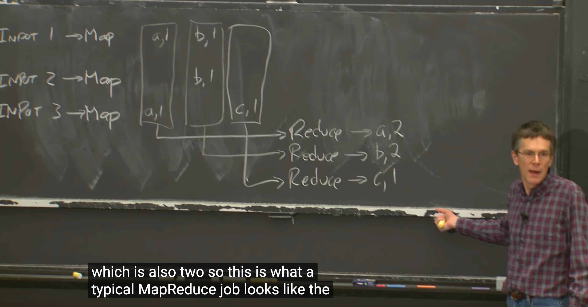

这门课讨论什么？

1. 大型网站的存储问题
2. 大数据的计算比如MapReduce
3. Parallelism  tolerate faults
4. 安全问题，如果代码可能存在漏洞，为什么不分开运行他们？  如果代码存在安全问题，为什么不分开运行？

### 课程挑战

1. 允许部分失败
2. 并发

基础设施

1. storage
2. computations (mapReduce)
3. communications

实现方式

1. RPC (remote procedures call)
2. Threads
3. Locks- concurrency control

性能

通常来说构建一个分布式系统的目的是实现系统的缩放以及快速响应。

什么是缩放？  比如我用两台电脑作为服务器，响应时间减少了一半。

容错

1. Availability, 运行的实例数量越多可用性越好
2. Recovarability, 如果实例停止响应了是否可以快速恢复

重要的话题

1. 数据一致性问题

### MapReduce

为什么谷歌研究mapReduce? 谷歌搜索引擎需要处理全世界的网站数据

INPUT 1 -> Map

INPUT2 -> Map

INPUT3 -> Map

一个最简单的MapReduce模型比如统计字符串中单词出现的次数，map的Key是字符,value就是1，最后把1都加起来就得到数量了。

比如"apple" 经过MapReduce框架得到  （a,1),  (p,1), (p,1), (l,1), (e,1)

"age" 经过MapReduce框架得到  （a,1),  (g,1), (e,1),

最后我们收集所有(a,1)键值对，然后调用另外一个reduce函数

Map(k,v)  k通常是文件名，被忽略掉的部分，v是map input file的内容。  

对于句子中每一个word w, emit(w,1)

Reduce(k,v)   => emit(k,len(v))

