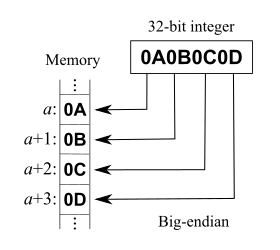

## Big Endian 与 Little Endian 的例子

## Introduction

In computing, endianness is the order or sequence of bytes of a word of digital data in computer memory. Endianness is primarily expressed as big-endian (BE) or little-endian (LE). A big-endian system stores the most significant byte of a word at the smallest memory address and the least significant byte at the largest. A little-endian system, in contrast, stores the least-significant byte at the smallest address.

Endianness may also be used to describe the order in which the bits are transmitted over a communication channel, e.g., **big-endian in a communications channel transmits the most significant bits first.**[1] Bit-endianness is seldom used in other contexts.

Computers store information in various-sized groups of binary bits. Each group is assigned a number, called its address, that the computer uses to access that data. On most modern computers, the smallest data group with an address is eight bits long and is called a byte. Larger groups comprise two or more bytes, for example, a 32-bit word contains four bytes. There are two possible ways a computer could number the individual bytes in a larger group, starting at either end. Both types of endianness are in widespread use in digital electronic engineering. The initial choice of endianness of a new design is often arbitrary, but later technology revisions and updates perpetuate the existing endianness to maintain backward compatibility.

Internally, any given computer will work equally well regardless of what endianness it uses since its hardware will consistently use the same endianness to both store and load its data. For this reason, programmers and computer users normally ignore the endianness of the computer they are working with. **However, endianness can become an issue when moving data external to the computer – as when transmitting data between different computers, or a programmer investigating internal computer bytes of data from a memory dump – and the endianness used differs from expectation.** In these cases, the endianness of the data must be understood and accounted for. Bi-endianness is a feature supported by numerous computer architectures that feature switchable endianness in data fetches and stores or for instruction fetches.

**Big-endianness is the dominant ordering in networking protocols**, such as in the internet protocol suite, where it is referred to as network order, transmitting the most significant byte first. Conversely, **little-endianness is the dominant ordering for processor architectures (x86, most ARM implementations, base RISC-V implementations) and their associated memory.** File formats can use either ordering; some formats use a mixture of both or contain an indicator of which ordering is used throughout the file.[2]

The styles of little- and big-endian may also be used more generally to characterize the ordering of any representation, e.g. the digits in a numeral system or the sections of a date. Numbers in positional notation are generally written with their digits in big-endian order, even in right-to-left scripts. Similarly, programming languages use big-endian digit ordering for numeric literals.

These two diagrams show how two computers using different endianness store a 32-bit (four byte) integer with the value of 0x0A0B0C0D. In both cases, the integer is broken into four bytes, 0x0A, 0x0B, 0x0C, and 0x0D, and the bytes are stored in four sequential byte locations in memory, starting with the memory location with address a, then a + 1, a + 2, and a + 3. The difference between big and little endian is the order of the four bytes of the integer being stored.

The left-side diagram shows a computer using big-endian. This starts the storing of the integer with the most-significant byte, 0x0A, at address a, and ends with the least-significant byte, 0x0D, at address a + 3.

The right-side diagram shows a computer using little-endian. This starts the storing of the integer with the least-significant byte, 0x0D, at address a, and ends with the most-significant byte, 0x0A, at address a + 3.

Since each computer uses its same endianness to both store and retrieve the integer, the results will be the same for both computers. Issues may arise when memory is addressed by bytes instead of integers, or when memory contents are transmitted between computers with different endianness.

### Basics

Computer memory consists of a sequence of storage cells (smallest addressable units), most commonly called bytes. **Each byte is identified and accessed in hardware and software by its memory address.** If the total number of bytes in memory is n, then addresses are enumerated from 0 to n − 1.

Computer programs often use data structures or fields that may consist of more data than can be stored in one byte. In the context of this article where its type cannot be arbitrarily complicated, a "field" consists of a consecutive sequence of bytes and represents a "simple data value" which – at least potentially – can be manipulated by one single hardware instruction. The address of such a field is mostly the address of its first byte.

Another important attribute of a byte being part of a "field" is its "significance". These attributes of the parts of a field play an important role in the sequence the bytes are accessed by the computer hardware, more precisely: by the low-level algorithms contributing to the results of a computer instruction.
