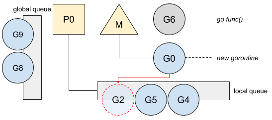

由 Renee French 创作的原始 Go Gopher 制作的“ Go 的旅程”插图。

[本文](https://medium.com/a-journey-with-go/go-g0-special-goroutine-8c778c6704d8)基于 Go 1.13。

Go 中创建的所有 goroutine 都在内部调度程序的管理下。Go 调度程序尝试为所有 goroutine 分配运行时间，并在当前 goroutine 被阻塞或终止时使所有 CPU 忙于运行 goroutine。实际上，Go 调度程序作为特殊的 goroutine 运行。

# 安排 goroutine

Go 通过`GOMAXPROCS`同时变量来限制运行的 OS 线程数。这意味着 Go 必须在每个正在运行的线程上调度和管理 goroutine。该角色委托给一个特殊的 goroutine，称为`g0`，这是为每个 OS 线程创建的第一个 goroutine：


然后，它将安排就绪的 goroutine 在线程上运行。

_有关更多信息_`*P*`_，_`*M*`_，_`*G*`\*模型，我建议你阅读[goroutine 跟 os thread 以及 cpu 管理之间的关系](./1.goroutine 跟 os thread 以及 cpu 管理之间的联系.md)

为了更好地了解调度的工作原理`g0`，让我们回顾一下通道的使用情况。这是当 goroutine 阻塞在通道发送时：

```go
ch := make(chan int)
[...]
ch <- v
```

在通道上阻塞时，当前 goroutine 将被停放(parking)，即处于等待模式，并且不会被推送到任何 goroutine 队列中：


然后，`g0`替换 goroutine 并进行第一轮调度：


在调度期间，本地队列具有优先级，并且 goroutine＃2 现在将运行：


\*有关调度优先级的更多信息，阅读[Go：在 Go Scheduler 中进行工作隐藏](./3.Work-Stealing-in-Go-Scheduler.md)

一旦接收者读取通道，则 goroutine＃7 将被解除阻塞：

```go
v := <-ch
```

接收到消息的 goroutine 将切换到`g0`并通过将其放置在本地队列中来解锁驻留的 goroutine：


尽管特殊的 goroutine 正在管理调度，但它不是唯一的工作，它的工作更多。

# 职责范围

与常规 goroutine 相反，`g0`它具有固定并且更大的堆栈。这样，Go 可以执行需要更大堆栈的操作，并且可以选择在堆栈不增长的情况下执行操作。g0 的职责有这些：

- Goroutine 创建。在调用`go func(){ ... }()`或时`go myFunction()`，Go 会将函数创建委托到`g0`然后再将其放置在本地队列中：



新创建的 goroutine 优先运行，并置于本地队列的顶部。

有关 goroutine 优先顺序的更多信息，阅读[并发和调度器优化](./4.Concurrency&Scheduler-Affinity.md)

- defer 函数的分配。
- 垃圾收集器操作，例如扫描 goroutine 的 stack 以及一些标记和清除操作。
- Stack 增长。在需要时，Go 会增加 goroutine 的大小。此操作通过`g0`的 prolog 函数完成。

这种特殊的 goroutine 涉及许多其他操作（大分配，cgo 等），`g0`使我们的程序可以更高效地管理操作，从而需要更大的 stack，以保持我们的程序在低内存打印下更加高效。
