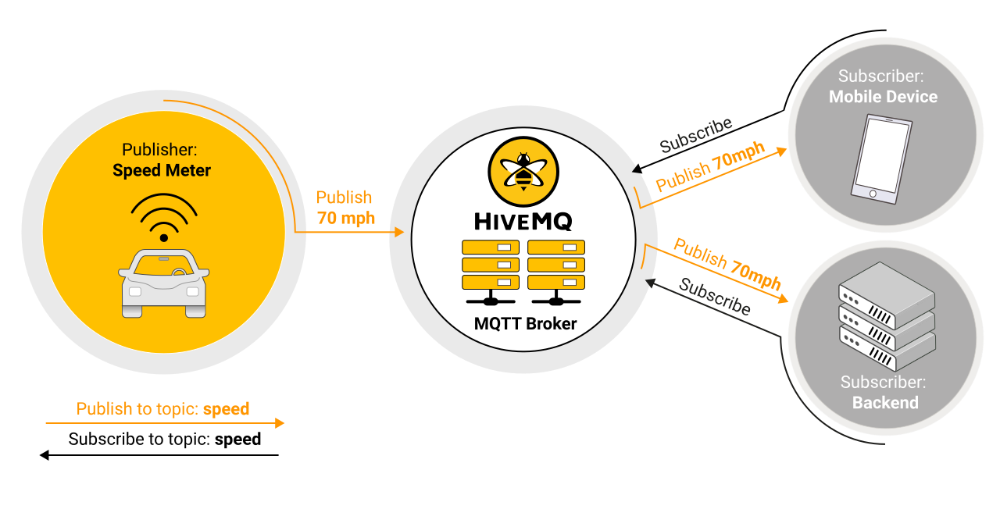

## 发布/订阅模式

发布/订阅模式（也称为 pub / sub）提供了传统客户端-服务器体系结构的替代方法。在客户端服务器模型中，客户端直接与端点进行通信。发布/**订阅**模型**将发送消息的客户端（发布者）与接收消息的客户端（订阅者）分离**。发布者和订阅者从不直接相互联系。实际上，他们甚至不知道对方的存在。**它们之间的连接由第三方组件（代理）处理**。代理的工作是过滤所有传入消息，并将其正确分发给订阅者。因此，让我们更深入地研究 pub / sub 的一些常规方面（我们将在稍后讨论 MQTT 的具体细节）。

_MQTT 发布/订阅架构_:

pub / sub 的最重要方面是消息的发布者与接收者（订阅者）的分离。这种解耦具有几个方面：

- **空间解耦**：发布者和订阅者不需要彼此了解（例如，无需交换 IP 地址和端口）。
- **时间解耦**：发布者和订阅者不需要同时运行。
- **同步解耦**：发布或接收期间，两个组件的操作都不需要中断。

总之，发布/订阅模型移除了消息发布者与接收者/订阅者之间的直接通信。代理的过滤活动控制哪个客户端/订户接收哪个消息。去耦具有三个维度：空间，时间和同步。

## 可扩展性

**Pub / Sub 的伸缩性优于传统的客户端-服务器方法**。这是因为代理上的操作可以高度并行化，并且可以以事件驱动的方式处理消息。消息缓存和消息的智能路由通常是提高可伸缩性的决定性因素。尽管如此，扩展到数百万个连接仍然是一个挑战。集群代理节点可以使用负载均衡器将负载分配到更多单独的服务器上，从而实现如此高的连接水平。（该主题超出了本文的讨论范围，我们将在另一篇文章中介绍）。

## 消息过滤

显然，代理在发布/订阅过程中扮演着举足轻重的角色。但是，代理如何管理所有消息，以便每个订户仅接收感兴趣的消息？正如您将看到的，代理具有几个过滤选项：

##### 选项 1：基于主题的过滤

此过滤基于每条消息的`subject`或[topic](https://www.hivemq.com/blog/mqtt-essentials-part-5-mqtt-topics-best-practices)。接收客户向代理订阅感兴趣的主题。从那时起，代理确保接收方的客户端获取发布到订阅主题的所有消息。通常，主题是具有层次结构的字符串，可以基于有限数量的表达式进行过滤。

##### 选项 2：基于内容的过滤

在基于内容的过滤中，代理根据特定的内容过滤语言过滤消息。接收客户端订阅他们感兴趣的过滤消息。该方法的一个重要缺点是必须预先知道消息的内容，并且不能对其进行加密或轻易更改。

##### 选项 3：基于类型的过滤

当使用面向对象的语言时，基于消息（事件）的类型/类的过滤是一种常见的做法。例如，订户可以收听所有消息，这些消息的类型为 Exception 或任何子类型。

**当然，发布/订阅并不是所有案例都适用的。使用此模型之前，需要考虑一些事项。**发布者和订阅者之间的脱钩是 pub / sub 中的关键，这本身就带来了一些挑战。例如，您需要事先了解发布数据的结构。对于基于主题的筛选，发布者和订阅者都需要知道要使用哪些主题。要记住的另一件事是消息传递。发布者不能假定有人正在听发送的消息。在某些情况下，可能没有订户阅读特定的消息。

## MQTT

现在，我们已经大致研究了发布/订阅模型，让我们专门关注[MQTT](https://www.hivemq.com/blog/how-to-get-started-with-mqtt/)。根据您要实现的目标，**MQTT 体现了我们提到的 pub / sub 的所有方面**：

- MQTT 在空间上解耦发布者和订阅者。要发布或接收消息，发布者和订阅者只需要知道代理的主机名/ IP 和端口即可。
- MQTT 按时间解耦。尽管大多数 MQTT 用例都几乎实时地传递消息，但是如果需要，代理可以为未在线的客户端存储消息。（必须满足两个条件来存储消息：客户端已与持久性会话建立连接，并订阅了[服务质量](https://www.hivemq.com/blog/mqtt-essentials-part-6-mqtt-quality-of-service-levels/)大于 0 的主题）。
- MQTT 异步工作。因为大多数客户端库都是异步工作的，并且基于回调或类似模型，所以在等待消息或发布消息时不会阻塞任务。在某些使用情况下，同步是理想的并且是可能的。为了等待特定消息，某些库具有同步 API。但是流程通常是异步的。

应该提到的另一件事是 MQTT 在客户端特别容易使用。大多数发布/订阅系统在代理方面具有逻辑，但是当使用客户端库时，MQTT 实际上是发布/订阅的本质，这使得它成为小型且受限制的设备的轻量协议。

**MQTT 使用基于主题的消息过滤。每个消息都包含一个主题（主题）**，代理可以使用**该主题**来确定预订客户端是否收到该消息。请参阅[MQTT Essentials 的第 5 部分，以了解有关主题概念的更多信息](https://www.hivemq.com/blog/mqtt-essentials-part-5-mqtt-topics-best-practices/)。如果需要，您还可以使用 HiveMQ [MQTT 代理](https://www.hivemq.com/hivemq/)和我们的[自定义扩展系统](https://www.hivemq.com/docs/plugins/latest/)来设置基于内容的过滤。

为了应对发布/**订阅**系统的挑战，**MQTT 具有三个服务质量（QoS）级别**。您可以轻松地指定一条消息已成功从客户端传递到代理，或从代理成功传递到客户端。但是，有可能没有人订阅该特定主题。如果这是一个问题，`broker`必须知道如何处理这种情况。例如，[HiveMQ MQTT 代理具有](https://www.hivemq.com/docs/plugins/latest/)可解决此类情况[的插件系统](https://www.hivemq.com/docs/plugins/latest/)。您可以让代理采取行动，也可以简单地将每条消息记录到数据库中以进行历史分析。为了保持分层主题树的灵活性，非常仔细地设计主题树并为将来的使用案例留出空间非常重要。**如果遵循这些策略，则 MQTT 非常适合生产设置。**

## 与消息队列的区别

关于 MQTT 名称以及该协议是否实现为消息队列，存在很多困惑。我们将尝试阐明该主题并解释差异。在[一篇文章中](https://www.hivemq.com/blog/mqtt-essentials-part-1-introducing-mqtt/)，我们提到了 MQTT 是指 IBM 的 MQseries 产品，与“消息队列”无关。无论名称来自何处，了解 MQTT 与传统消息队列之间的区别都是很有用的：

**消息队列存储消息，直到被消耗为止。** 使用消息队列时，每个传入消息都存储在队列中，直到客户端（通常称为使用者）将其接收到为止。如果没有客户端接收该消息，则该消息将停留在队列中并等待被使用。在消息队列中，任何客户机都不可能处理消息，就像在 MQTT 中没有人订阅主题一样。

**一条消息仅由一个客户端使用。** 另一个很大的区别是，在传统的消息队列中，一条消息只能由一个使用者处理。负载在队列的所有使用者之间分配。在 MQTT 中，行为恰好相反：订阅该主题的每个订户都会收到消息。

**队列是命名的，必须显式创建** 队列比主题严格得多。在使用队列之前，必须使用单独的命令显式创建队列。仅在命名和创建队列之后，才可以发布或使用消息。相反，MQTT 主题非常灵活，可以随时创建。
