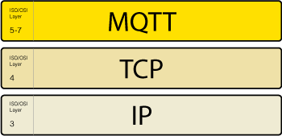

## 介绍

因为 MQTT 使发布者与订阅者脱钩，所以客户端连接始终由`broker`处理。在详细介绍这些连接之前，让我们先了解一下客户和经纪人的含义。

### 客户

当谈到客户时，我们几乎总是指[MQTT 客户](https://www.hivemq.com/blog/seven-best-mqtt-client-tools/)。发布者和订阅者都是 MQTT 客户端。发布者和订阅者标签指的是客户端当前正在发布消息还是已订阅接收消息（发布和订阅功能也可以在同一 MQTT 客户端中实现）。**MQTT 客户端是运行 MQTT 库并通过网络连接到MQTT 代理的任何设备（从微控制器到成熟的服务器）。**例如，MQTT 客户端可以是一个很小的，受资源限制的设备，它通过无线网络连接并具有最小库。MQTT 客户端也可以是运行图形 MQTT 客户端以进行测试的典型计算机。基本上，任何通过 TCP / IP 堆栈使用 MQTT 进行通信的设备都可以称为 MQTT 客户端。MQTT 协议的客户端实现非常简单明了。易于实现是 MQTT 非常适合小型设备的原因之一。**MQTT 客户端库可用于多种编程语言。例如，Android，Arduino，C，C ++，C＃，Go，iOS，Java，JavaScript 和.NET。**您可以在[MQTT Wiki](https://github.com/mqtt/mqtt.github.io/wiki/libraries)上看到完整列表。

### 经纪人(Broker)

MQTT 客户端的对接者是 MQTT 代理(Broker)。代理是任何发布/订阅协议的核心。根据实现的不同，代理可以处理多达数百万个并发连接的 MQTT 客户端。

**代理负责接收所有消息，过滤消息，确定谁订阅了每个消息，并将消息发送给这些订阅的客户端。**代理还保存具有持久会话的所有客户端的会话数据，包括订阅和丢失的消息（更多[详细信息](../7.持久性会话跟队列消息.md)）。经纪人的另一项责任是客户的认证和授权。通常，代理是可扩展的，这有助于自定义身份验证，授权以及与后端系统的集成。集成特别重要，因为代理通常是直接在 Internet 上公开，处理大量客户并需要将消息传递到下游分析和处理系统的组件。正如在订阅所有消息并不是[以前](https://www.hivemq.com/mqtt-sql-database/)的选择。简而言之，代理是每个消息必须通过的中心。因此，**重要的是，您的代理必须具有高度的可伸缩性，可集成到后端系统中，易于监视并且（当然）具有抗故障能力。**HiveMQ 通过使用最新的事件驱动的网络处理，开放式扩展系统和标准监视提供程序来满足这些要求。

## MQTT 连接

MQTT 协议基于 TCP / IP。客户端和代理都需要具有 TCP / IP 堆栈。

MQTT 连接始终在一个客户端和代理之间。客户端永远不会直接相互连接。要启动连接，**客户端将 CONNECT 消息发送给代理。代理以 CONNACK 消息**和状态码**响应**。建立连接后，代理将使其保持打开状态，直到客户端发送断开连接命令或连接中断为止。

#### 通过 NAT 的 MQTT 连接

在许多常见的用例中，MQTT 客户端位于使用网络地址转换（NAT）的路由器后面，该地址从私有网络地址（例如 192.168.xx，10.0.xx）转换为公开的地址。正如我们已经提到的，MQTT 客户端通过将 CONNECT 消息发送给代理来启动连接。因为代理具有公共地址，并且保持连接开放以允许双向发送和接收消息（在初始 CONNECT 之后），所以位于 NAT 后面的客户端完全没有问题。

### 客户端使用 CONNECT 消息启动连接

现在，让我们看一下[MQTT CONNECT](http://docs.oasis-open.org/mqtt/mqtt/v3.1.1/os/mqtt-v3.1.1-os.html#_Toc398718028)命令消息。要启动连接，客户端将命令消息发送到代理。如果此 CONNECT 消息格式不正确（根据 MQTT 规范），或者在打开网络套接字与发送连接消息之间经过了太多时间，则代理将关闭连接。这种行为阻止了可能使代理变慢的恶意客户端。 **良好的 MQTT 3 客户端发送带有以下内容的连接消息**（除其他外）：

CONNECT 消息中包含的某些信息可能对 MQTT 库的实现者而不是对该库的用户更有趣。有关所有详细信息，请查看[MQTT 3.1.1 规范](http://docs.oasis-open.org/mqtt/mqtt/v3.1.1/os/mqtt-v3.1.1-os.html)。

我们将重点关注以下选项：

#### ClientId

客户端标识符（ClientId）**标识**连接到 MQTT 代理的**每个 MQTT 客户端**。代理使用 ClientId 来标识客户端和客户端的当前状态，因此，此 ID 对于每个客户端和代理应该是唯一的。在 MQTT 3.1.1 中，如果不需要代理保留状态，则可以发送一个空的 ClientId。空的 ClientId 将导致连接没有任何状态。在这种情况下，必须将 clean session 标志设置为 true，否则代理将拒绝连接。

#### Clean Session

`clean session`标志告诉代理(broker)客户端是否要建立持久会话。在持久性会话中（CleanSession = false），代理将为客户端存储所有订阅，并为客户端存储所有[以服务质量（QoS）](../6.服务质量.md)级别 1 或 2 订阅的消息。如果会话不是持久性（CleanSession = true ），代理不会为客户端存储任何内容，并且会清除之前任何持久会话中的所有信息。

#### Username/Password

MQTT 可以发送**用户名和密码以进行客户端身份验证和授权**。但是，如果未对这些信息进行加密或散列（通过实现或 TLS），则密码将以纯文本格式发送。我们强烈建议使用用户名和密码以及安全的传输方式。(使用SSL证书)

#### WIll Message

遗嘱消息是 MQTT 的遗嘱（LWT）功能的一部分。**当客户端不正常地断开连接时，此消息会通知其他客户端。**当客户端连接时，它可以以 MQTT 消息和 CONNECT 消息内的主题的形式向代理提供最后的遗嘱。如果客户端不正常断开连接，则代理将代表客户端发送 LWT 消息。您可以在本系列的[第 9 部分中](https://www.hivemq.com/blog/mqtt-essentials-part-9-last-will-and-testament)了解有关 LWT 的更多信息。

#### KeepAlive

保持活动是建立连接后客户端指定并与代理进行通信**的时间间隔（以秒为单位）**。此时间间隔定义了代理和客户端可以在不发送消息的情况下忍受的最长时间。客户端承诺向代理发送常规的 PING 请求消息。代理以 PING 响应进行响应。此方法允许双方确定另一方是否仍然可用。有关 MQTT 保持活动功能的详细信息，请参阅本系列的[第 10 部分](https://www.hivemq.com/blog/mqtt-essentials-part-10-alive-client-take-over)。

基本上，这就是从 MQTT 3.1.1 客户端连接到 MQTT 代理所需的全部信息。单个库通常具有可以配置的其他选项。例如，在特定实现中存储排队消息的方式。

### 经纪人的回应与 CONNACK 消息

当代理接收到 CONNECT 消息时，它有义务以 CONNACK 消息进行响应。

CONNACK 消息包含两个数据条目：

- sessionPresent
- returnCode

#### 会话建立标志(Session Present Flag)

该**会议建立标志告诉客户端代理是否已经从与客户先前建立持续性会话**。当客户端在 Clean Session 设置为 true 的情况下进行连接时，session present 标志始终为 false，因为没有会话可用。如果客户端将 Clean Session 设置为 false 进行连接，则有两种可能性：如果 sessionId 可用于 clientId。并且代理已存储会话信息，会话建立标志为 true。否则，如果代理没有存储 clientId 的任何会话信息，则会话存在标志为 false。此标志是在 MQTT 3.1.1 中添加的，以帮助客户端确定他们是否需要订阅主题，或者主题是否仍存储在持久会话中。

#### 连接返回码

[CONNACK](http://docs.oasis-open.org/mqtt/mqtt/v3.1.1/os/mqtt-v3.1.1-os.html#_Toc398718033)消息中的第二个标志 是连接确认标志。该标志包含**一个返回代码，该代码告诉客户端连接尝试是否成功**。

以下是返回代码：

| 返回码 | 返回码响应                   |
| ------ | ---------------------------- |
| 0      | 接受连接                     |
| 1    | 连接被拒绝，协议版本不可接受 |
| 2      | 连接被拒绝，标识符被拒绝     |
| 3      | 连接被拒绝，服务器不可用     |
| 4      | 连接被拒绝，用户名或密码错误 |
| 5      | 连接被拒绝，未经授权         |

有关每个代码的更详细说明，请参见[MQTT 规范](http://docs.oasis-open.org/mqtt/mqtt/v3.1.1/os/mqtt-v3.1.1-os.html#_Toc398718035)。
