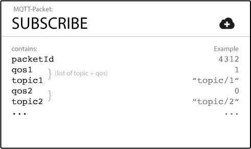
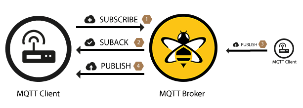
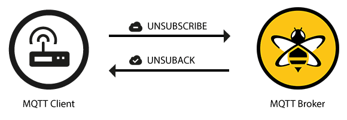

## 发布

MQTT 客户端一旦连接到代理，便可以发布消息。MQTT 利用基于主题的代理过滤消息（有关详细信息，请参见[第 2 部分](../2. publish 与 subscribe 模式.md)）。**每条消息必须包含一个主题，代理可以使用该主题将消息转发给感兴趣的客户端。通常，每个消息都有一个有效载荷，其中包含要以字节格式传输的数据。**MQTT 与数据无关。客户端的用例确定有效负载的结构。发送客户端（发布者）决定是否要发送二进制数据，文本数据，甚至是成熟的 XML 或 JSON。

MQTT 中的 PUBLISH 消息具有一些我们要详细讨论的属性：

\*\* 主题名称是一个简单的字符串，它以正斜杠作为定界符进行分层结构。例如，“myhome/livingroom/temperature” or “Germany/Munich/Octoberfest/people”.。有关主题的详细信息，请参见[MQTT Essentials 的第 5 部分](../5.topics主题.md)。

**QoS** 此数字表示消息的服务质量等级（QoS）。共有三个级别：0、1 和 2。服务级别确定消息对接收方（客户或代理）的保证类型。有关 QoS 的详细信息，请参见[MQTT Essentials 的第 6 部分](../6.服务质量.md)。

\*\*Retain Flag 此标志定义消息是否由代理保存为指定主题的最后一个已知值。当新客户订阅主题时，他们会收到该主题上保留的最后一条消息。有关保留消息的详细信息，请参见[MQTT Essentials 的第 8 部分](../8.保留的消息.md)。

\*\*Payload 这是消息的实际内容。MQTT 与数据无关。可以发送图像，任何编码的文本，加密数据以及几乎所有二进制数据。

Packet Identifier 数据包标识符在消息在客户端和代理之间流动时唯一地标识消息。数据包标识符仅与大于零的 QoS 级别相关。客户端库和/或代理负责设置此内部 MQTT 标识符。

\*\*DUP Flag 该标志指示消息是重复消息，并且已被重新发送，因为目标收件人（客户或代理）未确认原始消息。这仅与大于 0 的 QoS 相关。通常，重新发送/复制机制由 MQTT 客户端库或代理作为实现细节来处理。有关更多信息，请参阅[MQTT Essentials 的第 6 部分](../6.服务质量.md)。

当客户端将消息发送到 MQTT 代理以进行发布时，**代理读取该消息，确认该消息（根据 QoS 级别），然后处理该消息**。代理进行的处理包括确定哪些客户已订阅该主题并将消息发送给他们。

最初发布消息的客户端只关心将 PUBLISH 消息传递给代理。一旦代理接收到发布消息，则由代理负责将消息传递给所有订户。发布客户端没有收到有关任何人是否对发布的消息感兴趣或有多少客户端从代理接收到该消息的反馈。

## 订阅(Subscribe)

如果没有人收到消息，则发布消息毫无意义。换句话说，如果没有客户端订阅消息的主题。为了接收有关感兴趣主题的消息，客户端将[SUBSCRIBE](http://docs.oasis-open.org/mqtt/mqtt/v3.1.1/os/mqtt-v3.1.1-os.html#_Toc398718063)消息发送给 MQTT 代理。此订阅消息非常简单，它包含唯一的数据包标识符和订阅列表。

**Packet Identifier **数据包标识符在消息在客户端和代理之间流动时唯一地标识消息。客户端库和/或代理负责设置此内部 MQTT 标识符。

**订阅列表** SUBSCRIBE 消息可以包含一个客户端的多个订阅。每个订阅都由一个主题和一个 QoS 级别组成。订阅消息中的主题可以包含通配符，这些通配符使得可以订阅主题模式而不是特定主题。如果一个客户端的订阅重叠，则代理将传递该主题的 QoS 级别最高的消息。

## Suback

为了确认每个订阅，代理将[SUBACK](http://docs.oasis-open.org/mqtt/mqtt/v3.1.1/os/mqtt-v3.1.1-os.html#_Toc398718068)确认消息发送给客户端。该消息包含原始订阅消息的分组标识符（以清楚地标识消息）和返回码列表。

**Packet Identifier** 数据包标识符是用于标识消息的唯一标识符。它与 SUBSCRIBE 消息中的相同。

**返回码** 代理为它在 SUBSCRIBE 消息中接收的每个主题/ QoS 对发送一个返回码。例如，如果 SUBSCRIBE 消息具有五个订阅，则 SUBACK 消息包含五个返回码。返回代码确认每个主题，并显示代理授予的 QoS 级别。如果代理拒绝订阅，则 SUBACK 消息将针对该特定主题提示失败返回码。例如，如果客户端没有足够的权限订阅主题，或者主题格式错误。

| 返回码 | 返回码响应      |
| ------ | --------------- |
| 0      | 成功-最大 QoS 0 |
| 1      | 成功-最大 QoS 1 |
| 2      | 成功-最大 QoS 2 |
| 128    | 失败            |

客户端成功发送 SUBSCRIBE 消息并收到 SUBACK 消息后，它将获取与 SUBSCRIBE 消息包含的预订中的主题匹配的每个已发布消息。

## 退订(Unsubscribe)

SUBSCRIBE 消息的对方是[UNSUBSCRIBE](http://docs.oasis-open.org/mqtt/mqtt/v3.1.1/os/mqtt-v3.1.1-os.html#_Toc398718072)消息。此消息将删除代理上客户端的现有订阅。UNSUBSCRIBE 消息与 SUBSCRIBE 消息相似，并且具有数据包标识符和主题列表。

**Packet Identifier**数据包标识符在消息在客户端和代理之间流动时唯一地标识消息。客户端库和/或代理负责设置此内部 MQTT 标识符。

**List of Topic**主题列表可以包含客户要取消订阅的多个主题。仅需要发送主题（无 QoS）。代理取消订阅该主题，无论其最初订阅的 QoS 级别如何。

## UnSuback

为了确认退订，代理将[UNSUBACK](http://docs.oasis-open.org/mqtt/mqtt/v3.1.1/os/mqtt-v3.1.1-os.html#_Toc398718077)确认消息发送给客户端。该消息仅包含原始 UNSUBSCRIBE 消息的数据包标识符（以清楚地标识该消息）。

**数据包标识符** 数据包标识符唯一地标识消息。如前所述，这与 UNSUBSCRIBE 消息中的包标识符相同。

在从代理接收到 UNSUBACK 之后，客户端可以假定 UNSUBSCRIBE 消息中的订阅已删除。
