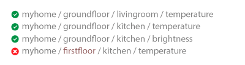

## 主题

在 MQTT 中，主题一词指的是 UTF-8 字符串，代理使用该字符串来过滤每个连接的客户端的消息。主题包含一个或多个主题级别。每个主题级别由一个正斜杠（主题级别分隔符）分隔。

与消息队列相比，MQTT 主题非常轻巧。客户端在发布或订阅之前无需创建所需的主题。代理接受每个有效主题，而无需任何事先初始化。

以下是一些主题示例：

> myhome/groundfloor/livingroom/temperature
>  USA/California/San Francisco/Silicon Valley
>  5ff4a2ce-e485-40f4-826c-b1a5d81be9b6/status
>  Germany/Bavaria/car/2382340923453/latitude

请注意，每个主题必须**至少**包含**1 个字符**，并且主题字符串允许使用空格。**主题区分大小写。**例如，*myhome / temperature*和*MyHome /* *Temperature*是两个不同的主题。此外，正斜杠本身就是一个有效的话题。

## 通配符

客户端订阅主题时，它可以订阅已发布邮件的确切主题，也可以使用通配符同时订阅多个主题。通配符只能用于订阅主题，不能用于发布消息。有两种不同的通配符：*单级*和*多级*。

### 单层：+

顾名思义，单级通配符替换一个主题级。加号表示主题中的单级通配符。

如果任何主题包含一个任意字符串而不是通配符，则该主题将与具有单级通配符的主题匹配。例如，订阅*myhome / groundfloor / + / temperature*可以产生以下结果：

### 多级：＃

多级通配符涵盖许多主题级别。哈希符号表示主题中的多级通配符。为了使代理确定匹配哪些主题，必须将多级通配符放置为主题中的最后一个字符，并在其前面加上正斜杠。

当客户端使用多级通配符订阅主题时，无论主题有多长或多深，客户端都会接收到以通配符前的模式开头的主题的所有消息。如果仅将多级通配符指定为主题（_＃_），那么您会收到发送到 MQTT 代理的所有消息。如果希望获得高吞吐量，则仅使用多级通配符进行订阅是一种反模式（请参见下面的最佳实践）。

## 以$开头的主题

通常，您可以根据需要命名 MQTT 主题。但是，有一个例外：**以$符号开头的主题具有不同的用途。**当您将多级通配符作为主题（＃）订阅时，这些主题不属于订阅。**$符号主题保留用于 MQTT 代理的内部统计。**客户不能将消息发布到这些主题。目前，此类主题尚无官方标准化。通常，**$ SYS /**用于以下所有信息，但是代理实现会有所不同。关于$ SYS-topics 的一项建议是在 [MQTT GitHub Wiki 中](https://github.com/mqtt/mqtt.github.io/wiki/SYS-Topics)。这里有些例子：

$ SYS / broker / clients / connected
$ SYS / broker / clients / disconnected
$ SYS / broker / clients / total
$ SYS / broker / messages / sented
$ SYS / broker / uptime

## 概要

这些是 MQTT 消息主题的基础。如您所见，MQTT 主题是动态的，并提供了极大的灵活性。在实际应用程序中使用通配符时，应注意一些挑战。我们已经收集了从与 MQTT 广泛合作的各种项目中学到的最佳实践，并且总是对这些实践提出建议或讨论。使用评论开始对话，让我们知道您的最佳做法，或者如果您不同意我们的其中一项！

### 最佳实践

#### 切勿使用正斜杠

MQTT 中允许使用正斜杠。例如， **/ myhome / groundfloor / livingroom**。但是，前导斜杠引入了不必要的主题级别，其前面的字符为零。零不会带来任何好处，并且经常导致混乱。

#### 切勿在主题中使用空格

空间是每个程序员的天敌。当事情进展不如预期时，空格会使阅读和调试主题变得更加困难。与前导斜线一样，仅因为允许使用某些内容，并不意味着应该使用它。[UTF-8 具有许多不同的空格类型](http://www.cs.tut.fi/~jkorpela/chars/spaces.html)，应避免使用这种不常见的字符。

#### 主题简短

每个主题都包含在使用该主题的每条消息中。使您的主题尽可能简短。对于小型设备，每个字节都很重要，主题长度也有很大影响。

#### 仅使用 ASCII 字符，避免使用不可打印的字符

由于非 ASCII UTF-8 字符通常显示不正确，因此很难找到与字符集有关的错字或问题。除非绝对必要，否则我们建议避免在主题中使用非 ASCII 字符。

#### 将唯一标识符或客户 ID 嵌入到主题中

在主题中包含发布客户端的唯一标识符可能非常有帮助。主题中的唯一标识符可帮助您确定谁发送了邮件。嵌入式 ID 可用于强制执行授权。只有具有与该主题中的 ID 相同的客户 ID 的客户才可以发布到该主题。例如，允许将具有*client1* ID 的客户端发布到*client1 / status*，但不允许发布到*client2 / status*。

#### 不要订阅＃

有时，必须订阅通过代理传输的所有消息。例如，将所有消息持久保存到数据库中。**不要通过使用 MQTT 客户端并订阅多级通配符来订阅代理上的所有消息。**通常，订阅客户端无法处理此方法导致的消息负载（特别是如果您的吞吐量很大）。我们的建议是在 MQTT 代理中实现扩展。例如，使用[HiveMQ 插件系统，](https://www.hivemq.com/extensions)您可以[了解 HiveMQ](https://www.hivemq.com/extensions)的行为，并添加异步例程来处理每个传入消息并将其持久化到数据库中。

#### 不要忘记可扩展性

主题是一个灵活的概念，不需要以任何方式对其进行预分配。但是，发布者和订阅者都需要了解该主题。考虑如何扩展主题以允许新功能或新产品很重要。例如，如果您的智能家居解决方案添加了新传感器，则应该可以将它们添加到主题树中，而无需更改整个主题层次结构。

#### 使用具体主题，而不是通用主题

在命名主题时，请勿以与队列中相同的方式使用它们。尽可能区分您的主题。例如，如果您的客厅中有三个传感器，请为*myhome/livingroom/temperature*, *myhome/livingroom/brightness* 创建主题 。不要通过*myhome / livingroom*发送所有值。对所有消息使用单个主题是一种反模式。特定的命名还使您可以使用其他 MQTT 功能，例如保留的消息。有关保留消息的更多信息，请参阅 Essentials 系列的[第 8 部分](https://www.hivemq.com/blog/mqtt-essentials-part-8-retained-messages)。
