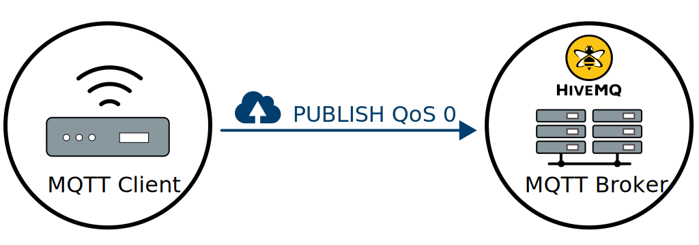
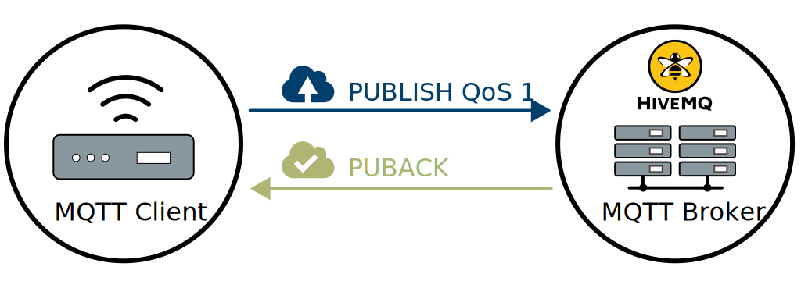
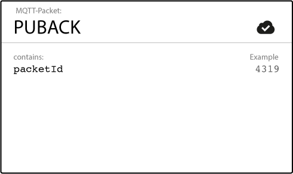
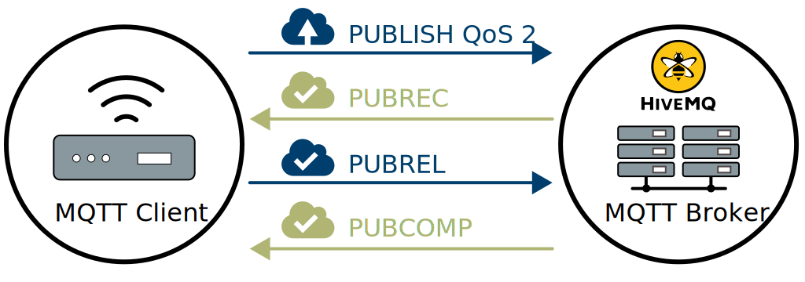

## 服务质量

### 什么是服务质量？

的**服务质量**（QoS）的电平是一个消息的发送者和限定递送保证用于特定消息的消息的接收器之间的协议。MQTT 中有 3 个 QoS 级别：

- _最多一次_（0）
- _至少一次_（1）
- _恰好一次_（2）

在谈论 MQTT 中的 QoS 时，您需要考虑消息传递的两个方面：

1. 消息从发布客户端传递到代理。
2. 消息从代理传递到订阅客户端。

我们将分别查看消息传递的两个方面，因为两者之间存在细微的差异。将消息发布到代理的客户端在将消息发送到代理时定义消息的 QoS 级别。代理使用每个订阅客户端在订阅过程中定义的 QoS 级别将此消息发送到订阅客户端。如果预订客户端定义的 QoS 比发布客户端定义的 QoS 低，则代理将以较低的服务质量发送消息。

### 服务质量为何如此重要？

QoS 是 MQTT 协议的关键功能。QoS 使客户端可以选择与其网络可靠性和应用程序逻辑相匹配的服务级别。因为 MQTT 管理消息的重新传输并保证传递（即使在基础传输不可靠的情况下），所以 QoS 使不可靠网络中的通信变得更加容易。

### 它是如何工作的？

让我们仔细研究一下 MQTT 协议中每个 QoS 级别的实现方式及其功能：

#### QoS 0-最多一次

最小 QoS 级别为零。此服务水平保证尽力而为。没有交货保证。收件人不确认已收到消息，并且发件人未存储并重新发送该消息。QoS 级别 0 通常被称为“即发即弃”，并提供与基础 TCP 协议相同的保证。

服务质量等级 0：最多一次交付

#### QoS 1-至少一次

QoS 级别 1 保证了消息至少一次发送到接收者。发送方存储消息，直到它从接收方获得确认消息已接收的[PUBACK](http://docs.oasis-open.org/mqtt/mqtt/v3.1.1/os/mqtt-v3.1.1-os.html#_Toc398718043)数据包为止 。一条消息有可能被多次发送或传递。

服务质量级别 1：至少交付一次

发送方使用每个数据包中的数据包标识符将 PUBLISH 数据包与相应的 PUBACK 数据包进行匹配。如果发送方在合理的时间内未收到 PUBACK 数据包，则发送方将重新发送 PUBLISH 数据包。当接收方获得具有 QoS 1 的消息时，它可以立即对其进行处理。例如，如果接收者是代理，则代理将消息发送给所有订阅客户端，然后使用 PUBACK 数据包进行回复。

如果发布客户端再次发送消息，它将设置重复（DUP）标志。在 QoS 1 中，此 DUP 标志仅用于内部目的，不会由代理或客户端处理。不管 DUP 标志如何，消息的接收方都会发送 PUBACK。

#### QoS 2-仅一次

QoS 2 是 MQTT 中的最高服务级别。此级别保证目标收件人仅接收一次每个消息。QoS 2 是最安全，最慢的服务质量。发送方和接收方之间至少有两个请求/响应流（四部分握手）来提供保证。发送者和接收者使用原始发布消息的数据包标识符来协调消息的传递。

服务质量级别 2：一次交付

当接收方从发送方获得 QoS 2 PUBLISH 数据包时，它会相应地处理发布消息，并使用确认 PUBLISH 数据包的[PUBREC](http://docs.oasis-open.org/mqtt/mqtt/v3.1.1/os/mqtt-v3.1.1-os.html#_Toc398718048)数据包答复发送方。如果发送方未从接收方收到 PUBREC 数据包，它将再次发送带有重复（DUP）标志的 PUBLISH 数据包，直到收到确认为止。

一旦发送方从接收方接收到 PUBREC 数据包，发送方就可以安全地丢弃初始的 PUBLISH 数据包。发送方存储来自接收方的 PUBREC 数据包，并以[PUBREL](http://docs.oasis-open.org/mqtt/mqtt/v3.1.1/os/mqtt-v3.1.1-os.html#_Toc398718053)数据包作为响应 。

接收者获得 PUBREL 数据包后，它可以丢弃所有存储的状态并用[PUBCOMP](http://docs.oasis-open.org/mqtt/mqtt/v3.1.1/os/mqtt-v3.1.1-os.html#_Toc398718058)数据包应答（发送者接收到 PUBCOMP 时也是如此）。在接收方完成处理并将 PUBCOMP 数据包发送回发送方之前，接收方将存储对原始 PUBLISH 数据包的数据包标识符的引用。此步骤很重要，可以避免再次处理该消息。发送方接收到 PUBCOMP 数据包后，已发布消息的数据包标识符将变为可重用。

当 QoS 2 流完成时，双方都可以确定邮件已传递，并且发送方已确认传递。

如果数据包在途中丢失，则发件人有责任在合理的时间内重新传输消息。如果发送者是 MQTT 客户端或[MQTT 代理，](https://www.hivemq.com/hivemq/)则同样如此。接收者有责任相应地响应每个命令消息。

### 很高兴知道

乍一看，QoS 的某些方面不是很明显。使用 QoS 时，请注意以下几点：

#### QoS 降级

正如我们已经提到的，发送（发布）消息的客户端和接收消息的客户端之间的 QoS 定义和级别是两件事。这两个交互的 QoS 级别也可以不同。将 PUBLISH 消息发送到代理的客户端定义消息的 QoS。但是，当代理将消息传递给收件人（订户）时，代理将使用接收者（订户）在订阅期间定义的 QoS。例如，客户端 A 是消息的发送者。客户端 B 是消息的接收者。如果客户端 B 以 QoS 1 订阅代理，并且客户端 A 将消息发送给 QoS 2 的代理，则代理将消息传递给具有 QoS 1 的客户端 B（接收者/订户）。消息可以多次传递给客户端 B，

#### 数据包标识符对于每个客户端都是唯一的

MQTT 用于 QoS 1 和 QoS 2 的数据包标识符在特定客户端和交互中的代理之间是唯一的。此标识符在所有客户端之间不是唯一的。一旦流程完成，数据包标识符即可重新使用。这种重用是数据包标识符不必超过 65535 的原因。客户端可以在不完成交互的情况下发送超过此数量的消息是不现实的。

### 最佳实践

我们经常被要求提供有关如何选择正确的 QoS 级别的建议。以下是一些可以帮助您进行决策的准则。适合您的 QoS 在很大程度上取决于您的用例。

#### 在以下情况下使用 QoS 0：

- 您在发送方和接收方之间具有完全或几乎稳定的连接。QoS 0 的经典用例是通过有线连接将测试客户端或前端应用程序连接到 MQTT 代理。
- 您不介意偶尔丢失几条消息。如果数据不那么重要或以短间隔发送数据，则丢失某些消息是可以接受的
- 您不需要消息排队。如果消息具有 QoS 1 或 2 和[持久会话，](https://www.hivemq.com/blog/mqtt-essentials-part-7-persistent-session-queuing-messages)则仅将消息排队给断开连接的客户端 。

#### 在以下情况下使用 QoS 1：

- 您需要获取每条消息，并且您的用例可以处理重复项。QoS 级别 1 是最常用的服务级别，因为它可以确保消息至少到达一次，但允许多次传递。当然，您的应用程序必须容忍重复项并能够相应地对其进行处理。
- 您无法承受 QoS 2 的开销。QoS1 传递消息的速度比 QoS 2 快得多。

#### 在以下情况下使用 QoS 2：

- 对您的应用程序来说，准确地接收所有消息是至关重要的。如果重复交付会损害应用程序用户或订阅客户，通常会出现这种情况。请注意开销，并且 QoS 2 交互需要更多时间才能完成。

### 排队 QoS 1 和 2 消息

所有以 QoS 1 和 2 发送的消息都将排队供脱机客户端使用，直到该客户端再次可用为止。但是，仅当客户端具有[持久会话时，](https://www.hivemq.com/blog/mqtt-essentials-part-7-persistent-session-queuing-messages/)才可以进行此排队 。
