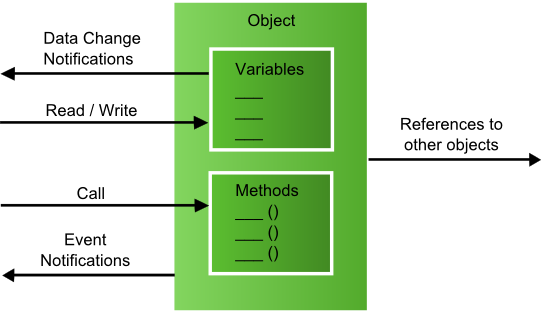
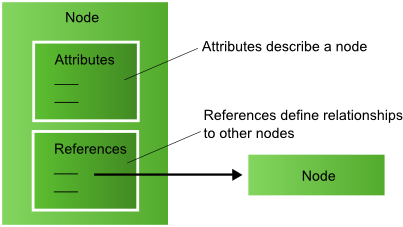
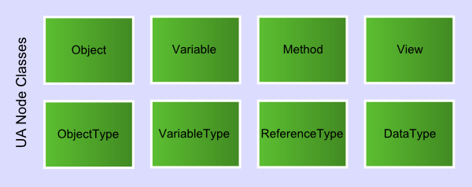

# 地址空间概念

## 对象模型

OPC UA 地址空间的主要目标是为服务器提供一种向客户端表示对象的标准方法。OPC UA 对象模型已被设计为满足此目标。它根据变量和方法定义对象。它还允许表达与其他对象的关系。

另外，对象具有类型，即 OPC UA 提供了一种定义和公开对象类型（具有成员变量和成员方法的类）和对象实例的方法。

不必使用这些面向对象的方法。可以使用文件夹对象和变量来构建简单的地址空间模型（如经典的 OPC Data Access 中一样）。但是，增强的面向对象功能的可用性使 OPC UA 可以更轻松地表示面向对象的系统。

OPC UA 对象模型:

UA 服务用于访问对象及其组件，例如读取或写入变量值，调用方法或从对象接收事件。浏览服务可用于探索对象及其组件之间的关系。

该模型的元素在地址空间中表示为节点。每个节点都分配给一个节点类:例如对象，变量和方法，并代表对象模型的不同元素。

## 节点模型

OPC UA 服务器提供给客户端的一组对象和相关信息是其地址空间。

对象及其组件在地址空间中表示为一组节点，这些节点由 attributes 描述并由引用互连。

节点和参考:

### 节点类

节点类正在定义不同节点的 attributes 和引用。OPC UA 定义了八个节点类。地址空间中的每个节点都是这些节点类之一的实例。不允许客户端和服务器定义其他节点类或扩展这些节点类的定义（例如，节点类的 attributes 列表）。[OPC UA 节点类](https://documentation.unified-automation.com/uasdkhp/1.0.0/html/_l2_ua_node_classes.html)提供有关不同节点类的更多详细信息。

OPC UA 节点类:

### Attributes

(下面的属性指 attributes)

属性是描述节点的数据元素。客户端可以使用读取，写入，查询和 Subscription / MonitoredItem 服务访问属性值。

属性是节点类的基本组成部分。属性定义是节点类定义的一部分，因此对于客户端是已知的，并且在地址空间中不直接可见。

每个属性定义都包含一个属性 ID，一个名称，一个描述，一个数据类型和一个强制/可选指示符。为每个节点类定义的属性集不能由客户端或服务器扩展。在地址空间中实例化节点时，必须提供强制节点类属性的值。

### 引用

引用用于将节点相互关联。可以使用浏览和查询服务来访问它们。

像属性(attributes)一样，它们被定义为节点的基本组件。与属性不同，引用被定义为 ReferenceType 节点的实例。ReferenceType 节点在地址空间中可见，并使用 ReferenceType 节点类定义。

包含引用的节点称为源节点，被引用的节点称为目标节点。OPC UA 服务中使用源节点，ReferenceType 和目标节点的组合来唯一标识引用。因此，每个节点只能引用具有相同 ReferenceType 的另一个节点一次。

引用的目标节点可以在同一地址空间中，也可以在另一个 OPC UA 服务器的地址空间中。使用远程服务器名称和由远程服务器分配给节点的标识符的组合，可以在 OPC UA 服务中标识位于其他服务器中的目标节点。

## Variables

变量用于表示值。定义了两种类型的变量：Properties 和 DataVariables。

它们在表示的数据类型以及是否可以包含其他变量方面有所不同。

### Properties

properties 包含对象，数据变量和其他类似于节点 attributes 的节点的服务器定义的元数据。properties 与 attributes 的不同之处在于，properties 可以由服务器定义和添加，并且可以表征节点表示的内容，例如设备或采购订单。

attributes 提供可用于所有节点的 OPC UA 元数据。attributes 是节点类的所有节点共有的属性，仅由 OPC UA 规范定义，而 properties 可以由服务器定义。

例如，一个 attribute 定义变量的数据类型，而 properties 可用于指定某些变量的工程单位。

为防止递归，不允许为 properties 定义 properties。为了轻松识别 properties，一个 property 的浏览名称在包含 properties 的节点的上下文中必须是唯一的。

节点及其 properties 必须始终位于同一服务器中。

### Data Variables

数据变量用于表示对象的内容。对象是变量和方法的容器。对象节点不提供值，而变量节点提供值。因此，数据变量节点用于表示对象的数据。

例如，文件对象使用数据变量将文件内容表示为字节数组。properties 可用于公开对象 Object 的创建时间和所有者。

作为另一个示例，控制系统中的功能块可以表示为对象。功能块的参数（例如其设定值）可以表示为数据变量。功能块对象还可能具有描述其执行时间和类型的 properties。

下一章介绍[OPC UA 节点类](https://documentation.unified-automation.com/uasdkhp/1.0.0/html/_l2_ua_node_classes.html)。
