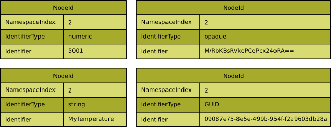
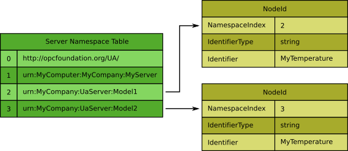
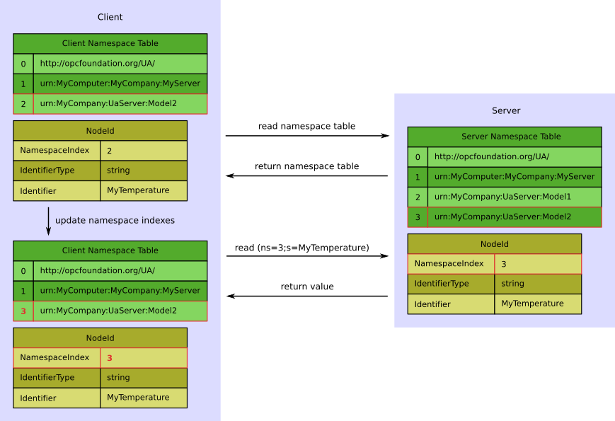

# OPC UA NodeId 概念

## 与“经典” OPC DA 的区别

在过去，经典的 DA Server 使用简单的“字符串”标识符。所谓的“ ItemID”是完全限定的名称，在整个服务器中都是唯一的（只有一个“命名空间”）。此外，经典的 DA 服务器仅具有简单层次结构的功能，即具有分支和叶子的树状结构。因此，许多供应商已经使用完整的文件夹层次结构来创建唯一的 ItemID（例如“ Folder1.Folder2.Folder3.MyTemperature”）。当查找或搜索单个项目时，这会导致大量的冗余字符串，浪费内存并降低性能。对于 OPC UA，此概念已被放弃。

## OPC UA 节点编号

在 OPC UA 中，地址空间中的每个实体都是一个节点。为了唯一地标识一个节点，每个节点都有一个 NodeId，该 ID 始终由三个元素组成：

- 命名空间索引

  OPC UA 服务器用于名称空间 URI 的索引。命名空间 URI 标识命名机构，该命名机构定义 NodeId 的标识符，例如 OPC Foundation，其他标准主体和联盟，底层系统，本地服务器。它们存储在所谓的名称空间数组（也称为名称空间表）中。命名空间索引是用于标识命名空间以优化传输和处理的数值。名称空间索引是名称空间数组中名称空间 URI 的索引。

- 标识符类型

  标识符的格式和数据类型。它可以是数字值，字符串，全局唯一标识符（GUID）或不透明值（ByteString 中特定于名称空间的格式）。首选哪种类型取决于用例。如果节省内存或带宽很重要，则可以使用较小且解析速度更快的数字 NodeId。OPC Foundation 定义的 OPC UA 命名空间使用数字 NodeId。系统范围的全局唯一标识符使客户端可以跟踪节点（例如工作订单）在 OPC UA 服务器通过系统运行时在它们之间切换。

- 识别码

  OPC UA 服务器的地址空间中节点的标识符。

下图显示了具有不同标识符类型的 NodeId 的示例。

不同类型的 NodeId 的示例:

## XML 表示法

OPC UA XML Schema 定义了一种 XML 表示法，它表示标准的 NodeId。字符串的格式为：

**ns = <名称空间索引>; <标识符类型> = <标识符>**

以及下面的字段:

- <namespace index>

  名称空间索引的格式设置为以 10 为基数的数字。如果索引为 0，则整个“ ns = 0;” 子句被省略。

- <identifier type>

  指定标识符类型的标志。该标志具有以下值：

  | Flag | Identifier Type     |
  | ---- | ------------------- |
  | i    | NUMERIC (UInteger)  |
  | s    | STRING (String)     |
  | g    | GUID (Guid)         |
  | b    | OPAQUE (ByteString) |

  <identifier>

  编码为字符串的标识符。使用针对标识符类型的 XML 数据类型映射来格式化标识符。注意，标识符可以包含任何非空的 UTF8 字符，包括空格。

### 例子：

- ns = 2; s = MyTemperature

  命名空间索引 2，字符串标识符

- i = 2045

  命名空间索引 0，数字标识符

- ns = 1; g = 09087e75-8e5e-499b-954f-f2a9603db28a

  名称空间索引 1，GUID 标识符

- ns = 1; b = M / RbKBsRVkePCePcx24oRA =='

  名称空间索引 1，Opaque / ByteString 标识符

NodeId 的标识符部分唯一地标识名称空间中的节点，但是同一标识符可能在不同名称空间中用于不同节点。因此，只有名称空间加上标识符才能形成完全限定的标识符（请参见下图）。这意味着，如果客户端请求一个节点（例如在读取服务中），则它不仅需要标识符，还需要该节点所属的名称空间。

不同名称空间中具有相同标识符的节点:

在 OPC UA 服务调用中，使用名称空间索引代替 NodeIds 中较长的名称空间 URI。

客户端需要正确映射名称空间 URI 到名称空间的索引。

只要存在活动会话，就不允许服务器更改特定名称空间 URI 的名称空间索引或从名称空间表中删除条目，以便客户端可以为特定会话缓存名称空间表。

但是，如果未连接任何客户端或重新启动服务器，则服务器可以更改名称空间索引并从名称空间表中删除条目。

因此，客户端不应该在不存储名称空间 URI 的情况下持久保留名称空间索引，因为在一个会话期间由索引“ 2”表示的名称空间 URI 可以在下一个会话期间由索引“ 5”表示。

因此，与服务器建立会话后，客户端应该始终读取服务器的命名空间表并且在调用涉及 NodeId 的服务前更新命名空间索引。

下图显示了客户端在读取节点的属性时遵循的典型过程。在此示例中，客户端要读取由标识符“ MyTemperature”表示的节点，该节点属于 URI“ urn：MyCompany：UaServer：Model2”标识的名称空间。

客户端存储自己的名称空间表，其中包含构建完整的 NodeId 所需的 URI，但尚不知道服务器名称空间表中的相应名称空间索引。为了能够访问正确的节点，客户端必须首先读取服务器名称空间表。名称空间 URI“ urn：MyCompany：UaServer：Model2”由服务器上的名称空间索引“ 3”表示。现在，客户端可以更新其自己的名称空间表中的名称空间索引以及要访问的 NodeId（在我们的示例中，这意味着将索引“ 2”替换为索引“ 3”），并具有访问正确的所有信息。节点，在我们的示例中为 XML 表示法“ ns = 3; s = MyTemperature”。由于允许 URI“ urn：MyCompany：UaServer：Model1”标识的名称空间还包含一个标识符为“ MyTemperature”的节点，因此客户端甚至在读取“ ns = 2”时可能不会注意到它访问了错误的节点； s = MyTemperature”。

读取和存储名称空间表

下一章介绍[OPC UA 订阅概念](./4.opcua订阅概念.md)。
