发现和安全配置

## 一般概念

要连接到服务器，客户端需要诸如网络地址，协议和安全设置之类的信息。为此，OPC UA 定义了一组发现功能。

在客户端和服务器之间建立连接所需的所有信息都存储在所谓的端点(Endpoint)中。服务器可以提供多个端点，每个端点包含

- 端点 URL（协议和网络地址）
- 安全策略（一组安全算法的名称和密钥长度）
- 消息安全模式（Message Security Mode,交换消息的安全级别）
- 用户令牌类型（服务器支持的用户身份验证类型）

如果存在多个 OPC UA 服务器，则可以使用发现服务器来提供可用服务器的信息。服务器可以在发现服务器上注册。然后，客户端可以从发现服务器请求所有可用服务器的列表，然后使用 GetEndpoints 服务从服务器获取连接信息。

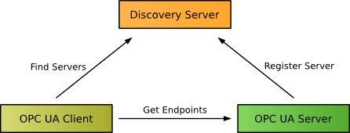

以下各节介绍了客户端和服务器端的初始配置，查找可用服务器的不同选项以及客户端和服务器之间的连接建立。

## 证书，证书存储和信任列表

为了向通信合作伙伴标识自己，每个已安装的 OPC UA 应用程序或设备都需要一个*应用程序实例证书*和一个关联的公用/专用密钥对。公钥与证书一起分发。私钥必须保持秘密，并用于签名和/或加密消息。通信伙伴可以使用公共密钥来验证信任关系，检查消息的签名并加密消息。包括公用密钥和专用密钥的应用程序实例证书可以由应用程序生成，也可以由管理员提供。

证书*存储*在*证书存储中*，其中包含受信任证书和自己的证书以及来自用于验证证书链的证书颁发机构的证书的单独位置。另一个拒绝的位置可能包含尝试连接但尚未受信任的应用程序的证书。

由应用程序颁发的证书称为自签名证书。它们通常在应用程序安装期间或首次启动时生成。为了在 OPC UA 客户端和服务器之间建立信任关系，将通信伙伴的自签名证书安装到信任列表中。客户端证书已安装到服务器的信任列表，服务器证书已安装到客户端的信任列表。如果从信任列表中删除了应用程序的证书，则无法建立通信。

由证书颁发机构（CA）签名的证书可以对一组 OPC UA 应用程序或设备进行集中信任管理。在这种情况下，仅 CA 证书必须安装到 OPC UA 应用程序的信任列表中。安装 CA 证书后，带有由 CA 签名的证书的所有其他应用程序都可以相互通信。为了能够从通信中排除以前受信任的应用程序，CA 维护了证书吊销列表（CRL）。每个已安装的 CA 证书都必须安装一个关联的最新 CRL。验证信任关系需要此 CRL。OPC UA[全局发现服务器](https://documentation.unified-automation.com/uasdkhp/1.0.0/html/_l2_ua_discovery_connect.html#DiscoveryConnect_Discovery_Global)定义提供了一种用于对 CA 签名证书进行集中管理和更新相应 CRL 的机制。CA 证书可以构建一条链，例如，公司的根 CA，由根 CA 签署站点 CA 的站点的 CA 和站点中生产线的 CA。生产线中的 OPC UA 应用程序仅信任生产线的 CA。其他 CA 证书仅用于验证链。

基于文件的证书存储区包含以下目录。应用程序的名称和结构可能有所不同。

- 拥有(Own)

  应用程序实例证书和应用程序的私钥

- 受信任(Trusted)

  受信任的 OPC UA 应用程序的自签名证书或受信任的 CA 的 CA 证书。每个 CA 证书都附带一个 CRL，该 CRL 需要频繁更新。

- 发行人(Issuers)

  不是直接信任的 CA 证书，但需要用来验证 CA 证书链的 CA 证书。每个 CA 证书都附带一个 CRL，该 CRL 需要频繁更新。

此外，通常存在一个拒绝目录，OPC UA 应用程序可以在该目录中存储来自其他尝试连接但不受信任的 OPC UA 应用程序的证书。如果允许应用程序连接，则管理员可以将证书从“拒绝”移动到“受信任”。

作为示例，让我们看一下 ServerX，ClientY 和 ClientZ 需要相互通信的生产线。在最简单的情况下，单个证书颁发机构（CaLine1R）管理生产线的中央证书管理（因此是根 CA）。ServerX，ClientY 和 ClientZ 都是由 CaLine1R 签署（见图[下文](https://documentation.unified-automation.com/uasdkhp/1.0.0/html/_l2_ua_discovery_connect.html#fig_certificate_authority)）。要彼此信任，只需安装证书和 CaLine1R 的关联证书吊销列表。

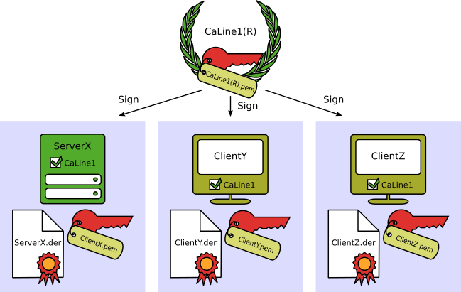

证书颁发机构

在更复杂的设置中，例如，如果生产线 1 是由多条生产线组成的大型工厂的一部分，而该生产线本身又是一家拥有多个生产地点的公司的一部分，则可能会有不止一个证书颁发机构，一并形成证书链（[见图](https://documentation.unified-automation.com/uasdkhp/1.0.0/html/_l2_ua_discovery_connect.html#fig_certificate_chain)）。CaLine1 由 CaPlantA（生产站点的证书颁发机构）签名，而 CaPlantA 又由 CaRoot（公司的根证书颁发机构）签名。这些 CA 均保留自己的证书吊销列表。

证书链:

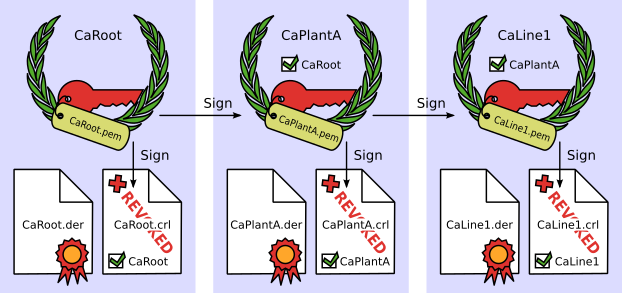

下[图](https://documentation.unified-automation.com/uasdkhp/1.0.0/html/_l2_ua_discovery_connect.html#fig_certificate_store_clientx)示例性地显示了上述方案中 ClientX 的基于文件的证书存储的内容。在这两种情况下，目录*本身*看起来都是相同的：子文件夹*certs*包含客户端自己的证书*ClientX.der，*而*private*包含私钥*ClientX.pem*。

该文件夹的内容*可信的*是在这两种情况下类似：*证书*包含可信证书颁发机构的证书（即 CA 签署应用到信任）：*CaLine1R.der*无证书链中的简单情况，并*CaLine1.der*在较复杂的情况。必须将关联的证书吊销列表*CaLine1R.crl*（简单情况）或*CaLine1.crl*（证书链示例）放入子文件夹*crl 中*。

如果没有证书链，该文件夹*的发行人*保留为空。如果有一个证书链，*发行人*必须包含验证子文件夹的完整链条所需的所有证书*的证书*，并且有且仅有一个证书吊销列表在文件夹中的每个证书颁发机构*的 CRL*。在上面的示例中，我们有两个上级证书颁发机构：CaPlantA 和 CaRoot。因此，文件夹*certs*包含证书*CaPlantA.der*和*CaRoot.der*，而文件夹*crl*包含证书吊销列表*CaPlantA.crl*和*CaRoot.crl*。

带证书链（顶部）和不带证书（底部）的 ClientX 的证书存储配置:

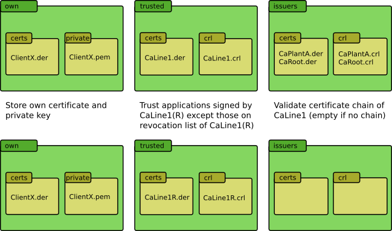

## 初始服务器配置

下图显示了安装后服务器的初始配置。

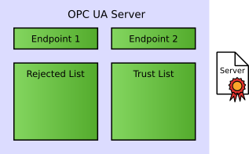

配置包括

- 标识服务器安装的应用程序实例证书
- 证书存储，包括受信任和拒绝的应用程序实例证书的列表
- 至少一个端点（[请参阅下文](https://documentation.unified-automation.com/uasdkhp/1.0.0/html/_l2_ua_discovery_connect.html#DiscoveryConnect_ServerInitialConfig_Endpoints)）

### Endpoints

服务器必须提供（至少一个）客户端可以连接到的端点。客户端使用发现 URL（通常与端点 URL 相同）从服务器请求端点列表，包括安全配置。通过 GetEndpoints 服务的此请求始终在没有安全性的情况下起作用。发现 URL 通常由发现服务器提供。

该*端点 URL*提供了客户端需要连接到服务器，包括协议，主机名或 IP 地址，端口号，例如 opc.tcp://localhost:48020。此外，客户端需要了解服务器上配置的以下安全选项。

OPC UA 定义*安全策略*以及每个策略的唯一 URI：

| 安全政策       | URI                                                                                                |
| -------------- | -------------------------------------------------------------------------------------------------- |
| Basic256Sha256 | http://opcfoundation.org/UA/SecurityPolicy#Basic256Sha256                                          |
| 256            | http://opcfoundation.org/UA/SecurityPolicy#Basic256                                                |
| Basic128Rsa15  | http://opcfoundation.org/UA/SecurityPolicy#Basic128Rsa15 （不再视为安全）                          |
| None           | [http://opcfoundation.org/UA/SecurityPolicy#None](http://opcfoundation.org/UA/SecurityPolicy#None) |

支持三种*消息安全模式*：

- None

  不应用安全性。

- Sign

  所有消息均已签名但未加密。

- Sign & Encrypt

  所有消息均已签名并加密。

- Note

  出于安全原因，默认情况下应禁用安全策略*Basic128Rsa15*和 None 以及 Message Security Mode None。

当前，OPC UA 支持以下*用户身份令牌类型*

- 匿名身份令牌

  没有可用的用户信息。

- 用户名身份令牌

  通过用户名和密码标识的用户。

- X.509 身份令牌

  由 X509v3 证书标识的用户。

- 发行的身份令牌

  由 WS-SecurityToken 标识的用户。

典型的端点集可能是：

| 属性                  | Endponit1                | Endpoint2                |
| --------------------- | ------------------------ | ------------------------ |
| Endpoint URL          | opc.tcp://MyServer:48001 | opc.tcp://MyServer:48001 |
| Security Policy       | Basic256                 | Basic256Sha256           |
| Message Security Mode | Sign, SignAndEncrypt     | Sign, SignAndEncrypt     |
| User Token Type       | Username, X.509          | Username                 |

### 发现服务器

服务器可以在称为发现服务器上注册，以便客户端可以发现它们。对于不同的发现选项，将进一步描述注册过程。

仅当有多个 OPC UA 服务器可用时，才需要网络节点上的本地发现服务器（LDS），例如，在装有多个 OPC UA 服务器的 Windows PC 上。在这种情况下，LDS 正在侦听端口 4840，该端口是 OPC UA 在 IANA 上注册的端口。OPC UA 客户端使用此端口通过 FindServers 启动服务发现过程。

设备或其他系统上只有一台 OPC UA 服务器直接使用端口 4840。在这种情况下，不需要 LDS。每个 OPC UA 服务器都实现了 FindServers 服务返回它自身。

## 初始客户端配置

下图显示了安装后客户端的初始配置：

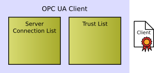

配置包括

- 应用程序实例证书以标识客户端应用程序
- 证书存储，包括受信任证书的列表
- 服务器端点列表（[请参见下文](https://documentation.unified-automation.com/uasdkhp/1.0.0/html/_l2_ua_discovery_connect.html#DiscoveryConnect_ClientInitialConfig_EndpointList)）

### 服务器端点列表

客户端可以使用不同的“[发现”](https://documentation.unified-automation.com/uasdkhp/1.0.0/html/_l2_ua_discovery_connect.html#DiscoveryConnect_Discovery)选项查找服务器，并检索通过 OPC UA 服务 GetEndpoints 连接到服务器所需的信息。为了避免在每次连接尝试之前都必须重复此发现过程，大多数客户端将存储已配置服务器的服务器端点信息。

## 连接配置

客户端找到要连接的服务器后，客户端便可以调用 GetEndpoints。服务器返回其提供的端点列表，包括安全配置（请参见[上文](https://documentation.unified-automation.com/uasdkhp/1.0.0/html/_l2_ua_discovery_connect.html#DiscoveryConnect_GeneralConcept)）以及其证书（包括服务器的公钥）。

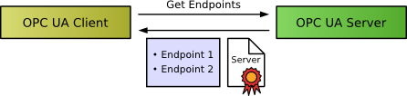

为了能够建立与服务器的安全连接，客户端必须信任服务器的证书，即必须将证书添加到信任列表中。通常，将打开一个对话框，提示用户检查证书并决定是否值得信任。

以下屏幕快照显示了首次尝试连接到服务器时 UaExpert 中相应的对话框窗口。它显示服务器证书的内容，并允许用户决定是否信任证书。如果用户选择“信任服务器证书”，它将存储在 UaExpert 的 PKI 证书存储区中的*trust / certs*文件夹中。

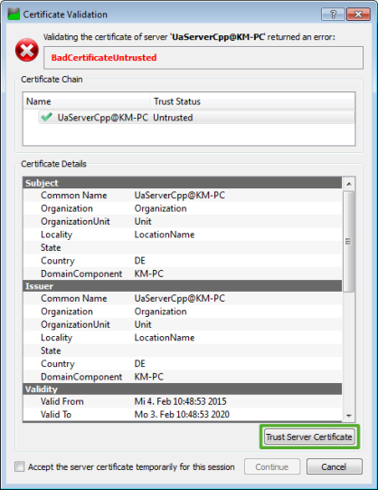

信任证书后，客户端可以检查来自服务器的消息的签名并加密要发送到服务器的消息。将端点保存到服务器连接列表后，客户端配置完成。

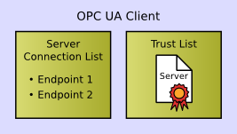

现在，客户端可以尝试与服务器创建安全通道，并发送其应用程序实例证书（包括客户端的公钥）。第一次连接尝试将被拒绝，因为服务器尚不信任客户端。

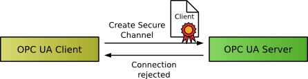

信任客户端的证书是服务器上的手动步骤。通常，服务器管理员必须将客户端证书从拒绝列表移动到受信任证书列表。

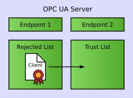

使用 C ++ SDK 演示服务器时，可以使用管理工具完成此操作，如以下屏幕快照所示。“证书”选项卡列出了服务器的证书库中的证书。来自*Trusted*目录的证书显示为受信任，来自*Rejected*目录的证书显示为不受信任。UaExpert 的证书显示为“不受信任”。右键单击证书，然后从上下文菜单中选择“信任”，将证书从*拒绝*的文件夹移动到服务器的证书存储中的*受信任/证书*。

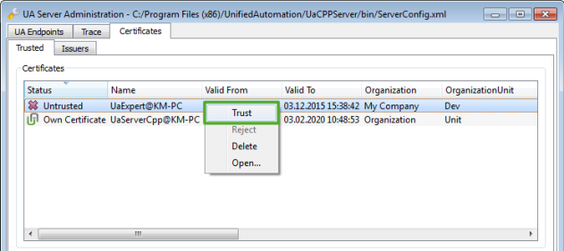

完成此步骤后，即配置了服务器。

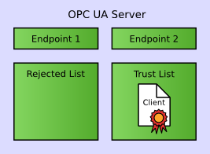

客户端下一次创建安全通道的尝试将成功，并且能够创建并激活与服务器的会话。

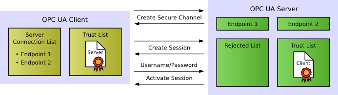

## 发现

在客户端可以连接到服务器之前，它需要收集信息。因此，OPC UA 定义了三种不同的发现选项：

- 本地发现 (Local Discovery)
- 组播子网发现(Multicast Subnet Discovery)
- 全球发现(Global Discovery)

### 本地发现

如果客户端确实知道某个主机上正在运行 OPC UA 服务器，但是没有详细的连接信息，则它可以根据主机名和标准的 OPC UA 端口 4840（例如 opc.tcp:/ / localhost:4840 或 opc.tcp:// targetHost:4840）。然后，使用该 URL 连接到发现服务器并调用 FindServers。

如果系统上安装了多个 OPC UA 服务器，则本地发现服务器（LDS）在端口 4840 上运行。LDS 维护一个可用服务器列表，服务器可以使用这些列表向客户端宣告它们的存在。

为了对本地发现可见，服务器必须使用 RegisterServer2 或 RegisterServer 服务在 LDS 上注册。向 LDS 进行注册需要安全配置。因此，服务器证书必须安装在 LDS 的信任列表中。

如果仅安装一台服务器，则不需要单独的 LDS，并且服务器本身将使用端口 4840，并将响应 FindServers 返回自身。

### 组播子网发现

对于客户端不知道网络上可用服务器的情况，OPC UA 定义了 mDNS 的使用，mDNS 是 DNS 的标准多播扩展，也称为 zeroconf。mDNS 定义了无需中央 DNS 服务器的名称解析机制以及服务发现功能。这种临时发现通常仅在子网内有效。

对于常规的 OPC UA 应用程序，该功能由具有多播扩展（LDS-ME）的本地发现服务器提供。在 LDS 中注册的服务器会通过 LDS-ME 自动宣布。在 RegisterServer2 中注册的服务器还可以提供服务器功能列表，可用于过滤可用服务器列表。

LDS-ME 的另一个功能是通过 mDNS 宣布的 OPC UA 服务器创建本地缓存。

客户端可以通过调用本地 LDS-ME 上的 FindServersOnNetwork 服务来检索此列表。

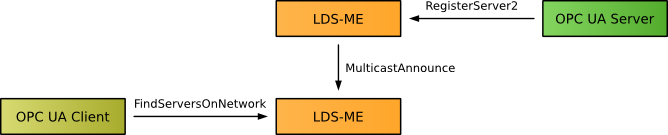

### 全球发现服务器

OPC UA 全局发现服务器（GDS）概念允许配置 OPC UA 服务器的网络范围发现，该发现不限于 mDNS 这样的子网。此外，它还提供了用于中央证书管理的功能，包括分发 CA 签名证书和相关的证书吊销列表（CRL）。GDS 是完整的 OPC UA 服务器，因此提供了唯一的安全发现选项。

对于发现功能，将 OPC UA 服务器安装在网络中时必须将其注册为 GDS 应用程序。注册需要对 GDS 的安全和管理权限。

OPC UA 客户端可以使用不同的过滤器选项（例如，在产品或应用程序 URI 上匹配字符串模式的功能过滤器）在 GDS 中查询可用的服务器。

如果 GDS 在不同子网中的不同 LDS-ME 上注册，则客户端可以使用本地 LDS-ME 上的 FindServersOnNetwork 查找 GDS。

## 使用 GDS 进行证书管理

向 GDS 注册的 OPC UA 应用程序也可以将 GDS 用于中央证书管理。

GDS 可以管理自签名证书，但主要用例是证书颁发机构（CA）的管理，CA 签名的应用程序实例证书的生成以及与 CA 相关的证书吊销列表（CRL）的分发。有关证书的更多详细信息，请参见[证书，证书存储和信任列表](https://documentation.unified-automation.com/uasdkhp/1.0.0/html/_l2_ua_discovery_connect.html#DiscoveryConnect_Certificates)。

OPC UA 接口 DirectoryType 提供应用程序注册和发现功能。GDS 的 OPC UA 接口 CertificateDirectoryType 封装了 CA 或与 CA 的通信以及相关的证书管理功能。

证书管理包括

- 应用程序实例证书的初始设置
- 定期更新信任列表和与 CA 相关的证书吊销列表
- 续订应用程序实例证书

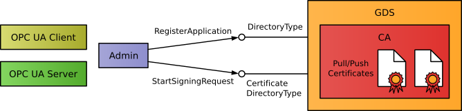

初始应用程序设置需要管理权限。第一步是使用 DirectoryType :: RegisterApplication 注册客户端或服务器应用程序。注册的服务器在对 DirectoryType :: QueryServers 的调用中返回。

第二步是创建 CA 签名证书。对 CertificateDirectoryType :: StartSigningRequest 的调用用于将证书签名请求发送到 CA。使用此方法，私钥将保留在客户端和服务器应用程序中，并且仅用于签署请求。CA 使用该请求来创建和签名公共密钥。另一种选择是使用方法 CertificateDirectoryType :: StartNewKeyPairRequest 创建私钥和公钥。GDS 处理请求后，OPC UA 应用程序可以使用新证书。初始设置还包括应用程序的信任列表从 GDS 到应用程序的初始传输。

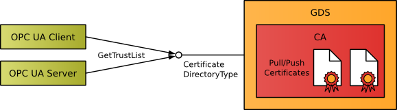

由于 CA 可以吊销证书，因此必须经常更新应用程序信任列表和与 CA 相关的证书吊销列表（CRL）。如果 OPC UA 应用程序是客户端或具有客户端功能的服务器，则 OPC UA 应用程序可以使用 CertificateDirectoryType :: GetTrustList 从 GDS OPC UA 服务器请求最新的信任列表和 CRL。

此更新模型称为“拉证书管理”。

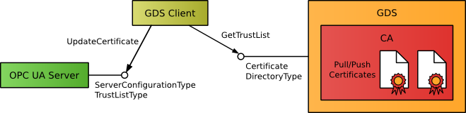

对于没有客户端功能的 OPC UA 服务器，GDS 概念还定义了一个称为 ServerConfigurationType 的服务器端接口。它允许通过标准接口管理服务器证书和信任列表。管理是通过 GDS 客户端完成的，该客户端代表服务器连接到 GDS，以通过 ServerConfiguration 对象管理和更新服务器。

此更新模型称为“推送证书管理”。

通过使用 UaExpert 之类的工具，ServerConfiguration 对象还可以在没有 GDS 的情况下实现远程证书管理。

所有与证书管理相关的功能都需要管理权限和加密的通信通道。
