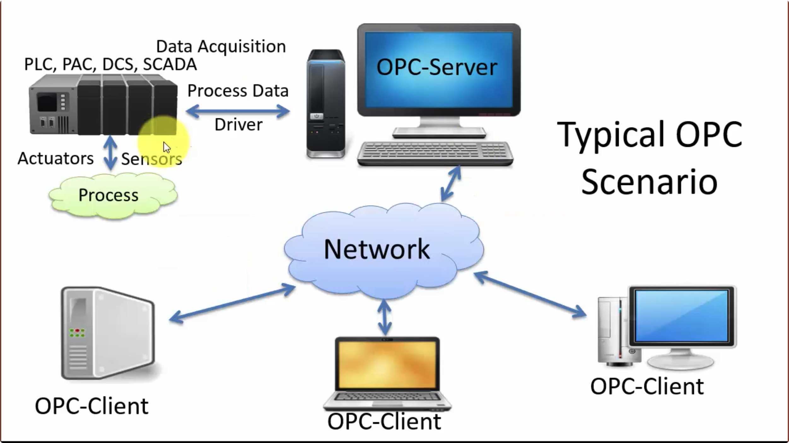
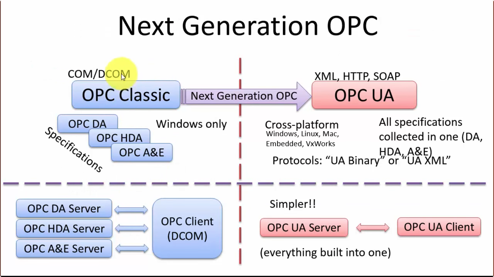
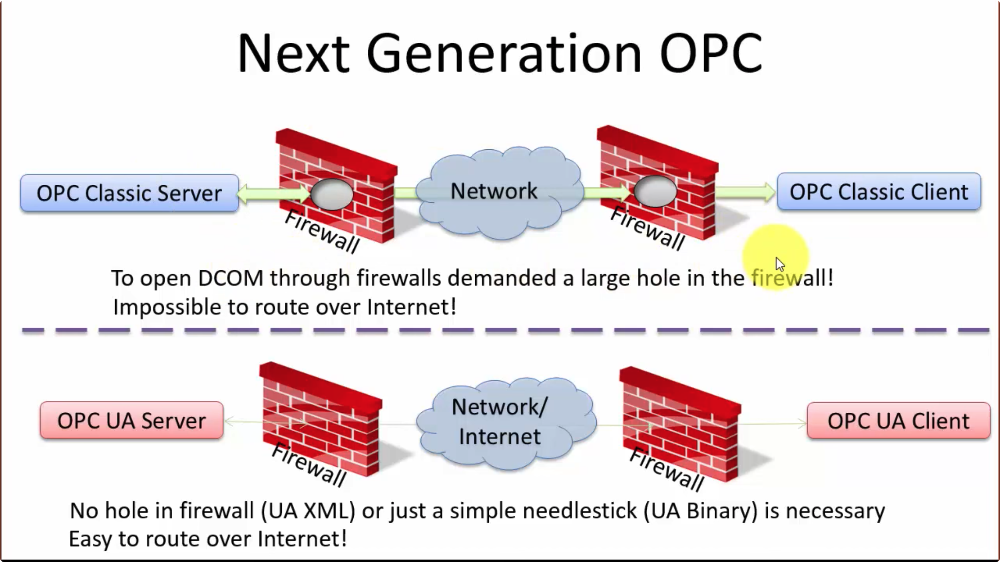
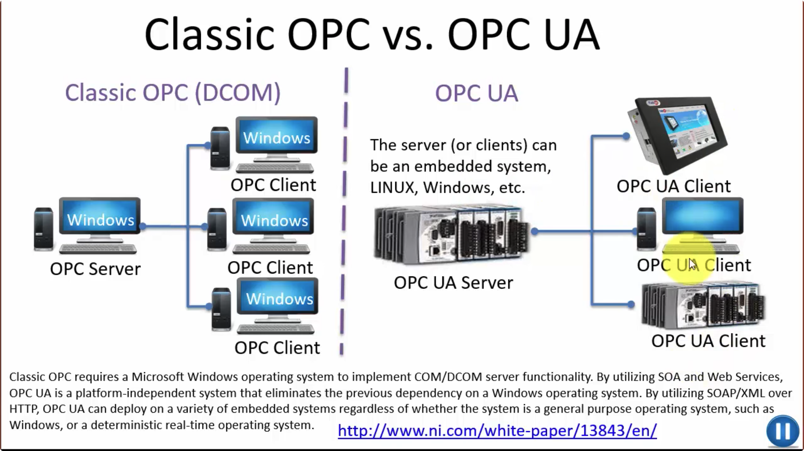

## OPC

OPC 是定义了不同厂商生产的设备进行数据交换的标准。

OPC 需要`OPC server`跟`OPC clients`进行通信

OPC 支持"即插即用"，不需要安装或者选择不同厂商的产品。

OPC 有不同的标准，比如 "Real-time" data(`OPC DA`) ,Historical data(`OPC HDA`),Alarm & Event data(`OPC AE`)等等。

上面提到的 OPC 规范都是`古典`的 OPC 规范，下一代 OPC 规范则是`OPC UA`

### OPC UA(Unified Architecture 统一架构)

OPC UA 打破了传统的 OPC 只基于 Windows 操作系统的局面。OPC UA 将现存的 OPC 接口用新的技术，比如 XML 跟 WEB 服务(HTTP,SOAP)结合起来。

OPC UA 是下一代的 OPC 标准

