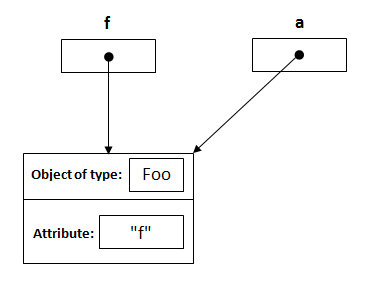

```java
public class Main
{
     public static void main(String[] args)
     {
          Foo f = new Foo("f");
          changeReference(f); // It won't change the reference!
          modifyReference(f); // It will modify the object that the reference variable "f" refers to!
     }
     public static void changeReference(Foo a)
     {
          Foo b = new Foo("b");
          a = b;
     }
     public static void modifyReference(Foo c)
     {
          c.setAttribute("c");
     }
}
```

I will explain this in steps:

1. Declaring a reference named `f` of type `Foo` and assign it to a new object of type `Foo` with an attribute `"f"`.

   ```java
   Foo f = new Foo("f");
   ```

   

2. From the method side, a reference of type `Foo` with a name `a` is declared and it's initially assigned to `null`.

   ```java
   public static void changeReference(Foo a)
   ```

   

3. As you call the method `changeReference`, the reference `a` will be assigned to the object which is passed as an argument.

   ```java
   changeReference(f);
   ```

   

4. Declaring a reference named `b` of type `Foo` and assign it to a new object of type `Foo` with an attribute `"b"`.

   ```java
   Foo b = new Foo("b");
   ```

   

5. `a = b` is re-assigning the reference `a` NOT `f` to the object whose its attribute is `"b"`.

   

   ------

6. As you call `modifyReference(Foo c)` method, a reference `c` is created and assigned to the object with attribute `"f"`.

   

7. `c.setAttribute("c");` will change the attribute of the object that reference `c` points to it, and it's same object that reference `f` points to it.

   

上面的例子在GOLANG中也是一样的,如果在golang中执行:

```go
type Person struct {
	name string
	age  int
}

func main() {
	steve := Person{
		"wujiabang", 24,
	}
	fmt.Printf("内存地址是:%p\n", &steve)
	changeoBJ(&steve)
	fmt.Println(steve)
}

func changeoBJ(person *Person) {
	fmt.Printf("传入steve的内存地址是:%p", person)
	newPerson := Person{"zhaoshouyang", 27}
	person = &newPerson
	fmt.Println(person)
	fmt.Printf("新的person的内存地址是:%p", person)
}
```

打印结果:

```
传入前内存地址是:0xc00000c060
传入steve的内存地址是:0xc00000c060
&{zhaoshouyang 27}
新的person的内存地址是:0xc00000c080
传入后内存地址是:0xc00000c060
{wujiabang 24}
```

实际上golang的fag有这么一段话:

As in all languages in the C family, everything in Go is passed by value. That is, a function always gets a copy of the thing being passed, as if there were an assignment statement assigning the value to the parameter.