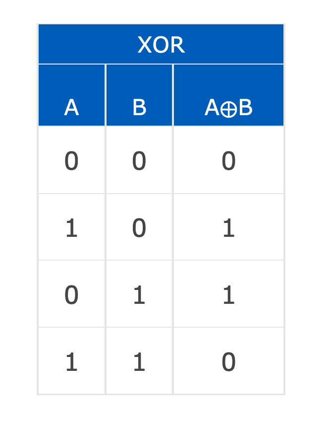

1. AND GATE

   

2. NOT GATE

   

3. NAND GATE 

   NAND GATE如同字面意思是AND GATE的补集

   NAND GATE可以使用 AND跟NOT两个门组合的方式得到

   

   想一想如果a b连着c, c作为输入给a,b 那么只要c有电压a,b就都有电压，输出为0.只要c没有电压，a,b就都没有电压，输出就是1. 因此NAND GATE可以用来作为NOT GATE

   

   

4. NOR GATE 

   跟NAND GATE一样，NOR GATE是OR GATE的补集

   

5. XOR GATE

   Exclusive disjunction essentially means 'either one, but not both nor none'

   翻译成华文就是： 只要一个，不要全上也不要全不上。

   It's Venn Diagram looks like this:

   

6. XNOR GATE

   一样则true,不一样为false

   It gives true if both have the same logical value, gives false otherwise.

   

