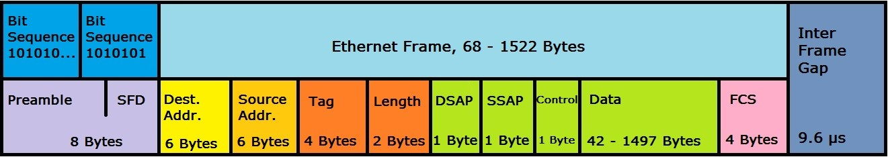

| 序号 | 网络名称    | 协议              | 协议数据单位 | 定位        |
| ---- | ----------- | ----------------- | ------------ | ----------- |
| 5    | Application | HTTP,SMTP,etc...  | Messages     | n/a         |
| 4    | Transport   | TCP/UDP           | Segment      | Port #'s    |
| 3    | Network     | IP                | Datagram     | IP address  |
| 2    | Data Link   | Ethernet, Wi-Fi   | Frames       | MAC address |
| 1    | Physical    | 10 Base T, 802.11 | Bits         | n/a         |

1. Physical layer

   用来表示物理连接着的计算机

2. Data Link

   负责定义一种通用的方式来解析物理层的信号，这样网络设备之间才能交流。数据链路层使用 Ethernet 协议。这个协议的作用是通过网络或者链路给某一个结点 node 发送数据

3. Network Layer

   允许不同的网络间进行交流，需要通过一种叫做路由器的设备。Internetwork 就是连接在一起的网络的集合，最著名的是 Internet。网络层所使用的最多的协议是 IP 协议。(Internet Protocol) ,它是互联网以及小型网络的基础。基于网络的程序一般分类为服务端跟客户端，一台电脑上可能会有多个应用，多个应用间的数据传输不会相互干扰，这归功于 Transport Layer。

4. Transport Layer

   传输层需要找到接收数据的程序。每当提到 TCP（Transmition Control Protocol),你可能会想到 TCP/IP.之所以它们被放到一起是因为 TCP 主要使用了 IP 协议。另外一种常用的协议也是基于 IP 协议，称为 UDP(User Data Protocol)

   TCP 跟 UDP 的区别是 TCP 有确保数据可靠的传输的机制而 UDP 没有。

5. Application

   应用层

小结：

5 层协议可以这样理解：

网络层类似送快递的货车，数据链路层相当于道路，网络层相当于高德导航，传输层相当于快递员把货物搬上楼，应用层就是货物本身。

---

**Cabels**

就是网线，有 copper 铜线跟 fiber 光纤两种

**Crosstalk**

当一根线的电流脉冲被另外一个线检测到，高层的协议可以识别到数据的异常并且要求重新传输。

光纤的每根管子大概跟人的头发丝一样细。

---

**Hub**

它是一个物理层的设备，允许同时连接多台计算机，连接到一台 HUB 的计算机，发送的数据会传播给连接到 HUB 的全部计算机。

**Collision domain**

它是一个网络时间片段，在这个片段内只有一台设备可以获取数据。如果多个设备同时发送数据，通过网线发送的电流脉冲将彼此干扰。这也是为什么现在 HUB 都不用了。

---

Switch

跟 Hub 类似，区别在于 HUB 是一个物理层的设备，而 Switch 是数据链路层的设备。

也就是说 Switch 知道不同的数据应该被送往哪个系统。

Hubs 跟 Switches 主要用于单个网络的连接，这种网络一般称为 LAN(Local Area Netwrok)

---

Router

A device that knows how to forward data between independent networks

既然路由器可以在不同的网络间转发数据，那么说明它是网络层的设备。

Border Gateway Protocal (BGP)

路由器们通过 BGP 协议来彼此交流，BGP 使得路由器可以从最优的路线传输数据

---

Twisted pair cable (双绞线)

双绞线（twisted pair，TP）是一种[综合布线](https://baike.baidu.com/item/综合布线/4282)工程中最常用的传输介质，是由两根具有绝缘保护层的铜[导线](https://baike.baidu.com/item/导线/1413914)组成的。把两根绝缘的铜导线按一定密度互相绞在一起，每一根导线在传输中[辐射](https://baike.baidu.com/item/辐射/5676)出来的电波会被另一根线上发出的电波抵消，有效降低信号干扰的程度。

双绞线一般由两根 22 ～ 26 号绝缘铜导线相互缠绕而成，“双绞线”的名字也是由此而来。实际使用时，双绞线是由多对双绞线一起包在一个绝缘电缆套管里的。如果把一对或多对双绞线放在一个绝缘套管中便成了[双绞线电缆](https://baike.baidu.com/item/双绞线电缆/3393109) [1] ，但**日常生活中一般把“双绞线电缆”直接称为“双绞线”**。

与其他传输介质相比，双绞线在传输距离，[信道宽度](https://baike.baidu.com/item/信道宽度/1208670)和数据传输速度等方面均受到一定限制，但价格较为低廉。

普通的网线就是双绞线。通常的网线有两个灯，黄色的是 Link LED,绿色的是 Activity LED

---

MAC address

是一个全局唯一的标识符依附在一个独立的网络接口上，它由 6 组（一组两个）16 进制数表示，因此是 48（6X2X4)位

Ethernet 使用 Mac 地址来明确发送数据的设备跟接收数据的设备的地址。

---

Unicast(单播)

In computer networking, **unicast** is a one-to-one transmission from one point in the network to another point; that is, one sender and one receiver, each identified by a network address. **Unicast** is in contrast to multicast and broadcast which are one-to-many transmissions.

Mac 地址的第一个 16 进制数的最后一位如果是 0 则表示 ethernet frame 只针对目标地址即单播，也就是说数据会被发送到冲突域中的全部机器，但是只有 mac 地址是目标地址的设备可以接收到这些数据。

Mac 地址的第一个 16 进制数的最后一位如果是 1 则表示 ethernet 处于**multicast** 多播模式

ethernet 的最后一种模式是广播模式，广播模式通过一种特殊的地址实现： FF:FF:FF:FF:FF:FF

---

Data Package

数据包是一个概括的(all-encompassing)名词用来表示任何单一的通过网络链路传输的二进制数据

Ethernet Frame

- Preamble

  长度为 8 bytes(或者 64bits)，然后它可以分成两个部分。前 7 个 bytes，它充当了帧之间的缓冲器作用，也可以被网络接口用来同步内部时钟来控制发送数据的速度。

  - Start frame delimiter(SFD)

    向接收的设备发送信号表示 Preamble 结束了然后接下来会发送实际的帧内容。

- Destination (Mac) Address

- Source (Mac) Address

- VLAN Tag(VLAN header)

  暗示帧自身是一个被称为`VLAN frame`的帧，只要有 VLAN tag 那么后面就有 Ether-Type

  - VLAN(Virtual LAN)

    一种技术允许你在同一个网络设备上有多个逻辑 LANs。VLAN 用于分隔不同种类的网络流量。比如电话线既可以上网又可以打电话。

- Ether-Type

  长度为 16bits，用来描述`帧内容`(`contents of the frame`)所使用的协议。

- Payload

  是网络中真实传输的数据，包括所有不是请求头的内容。

- FCS(Frame Check Sequence)

  一个 4 字节(32 位)的数，用来表示整个帧的校验和(`checksum value`)。校验和通过对帧进行循环冗余校验(`Cyclical Redundancy Check` AKA `CRC`)得到。

## The Network Layer

在局域网中节点可以通过Mac地址来通信。