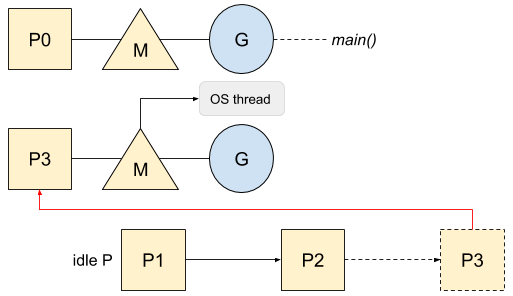
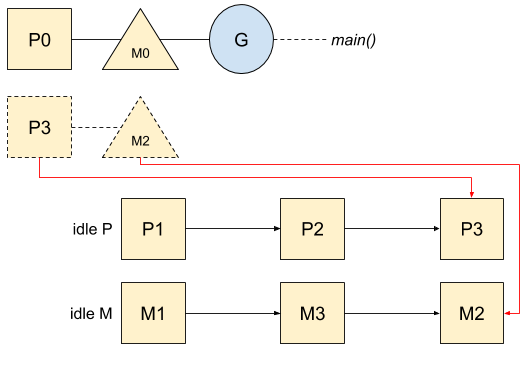
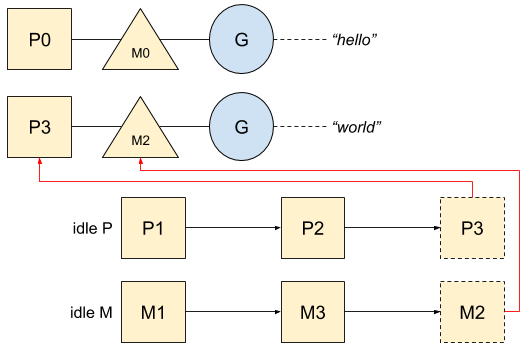
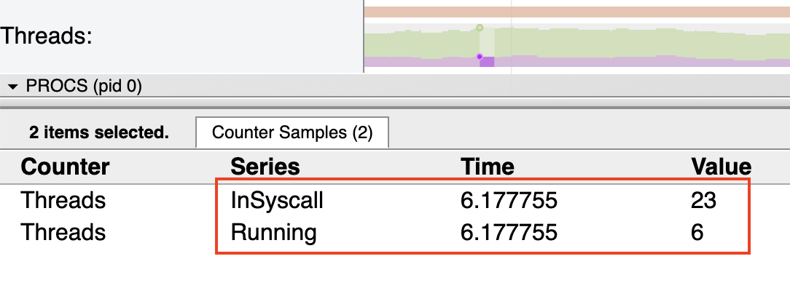

就内存和性能而言，创建操作系统线程或从一个线程切换到另一个线程可能会使您的程序付出高昂的代价。Go 旨在从核心中获得尽可能多的优势。从一开始就考虑到并发性。

# M，P，G 编排

为了解决这个问题，Go 有自己的调度程序，可以在线程上分配 goroutine。该调度程序定义了三个主要概念，如[代码本身所述](https://golang.org/src/runtime/proc.go)：

```
The main concepts are:
G - goroutine.
M - worker thread, or machine.
P - processor, a resource that is required to execute Go code.
    M must have an associated P to execute Go code[...].
```

这里就是一个图`P`，`M`，`G`型号：


P，M，G 图

每个 goroutine（`G`）在 OS 线程（`M`）上运行，而线程又被分配给逻辑 CPU（`P`）。 让我们举一个简单的例子，看看 Go 如何管理它们：

```go
func main() {
   var wg sync.WaitGroup
   wg.Add(2)

   go func() {
      println(`hello`)
      wg.Done()
   }()

   go func() {
      println(`world`)
      wg.Done()
   }()

   wg.Wait()
}
```

Go 首先会`P`根据计算机的逻辑 CPU 数量创建不同的对象，并将它们存储在空闲列表中`P`：


P 初始化

然后，准备运行的新 goroutine 或 goroutine 将唤醒以`P`更好地分配工作。这`P`将创建一个`M`具有关联的 OS 线程的：



操作系统线程创建

但是，就像一个`P`一样，一个没有任何工作的`M`（即没有等待运行的 goroutine）从 syscall 返回，或者甚至被垃圾收集器强制停止，它进入一个空闲列表：



M 和 P 空闲列表

在程序引导期间，Go 已经创建了一些 OS 线程以及与之关联的`M`。对于我们的示例，打印`hello`的第一个 goroutine 将使用 main goroutine，而第二个 goroutine 将从此空闲列表中获取 M`和`P`：



M 和 P 从空闲列表中获取

现在，我们对 goroutine 和线程管理有了一个全面了解，让我们看看在哪种情况下，比起`P`Go 将使用更多的`M`,以及在系统调用的情况下如何管理 goroutine。

# 系统调用

Go 会优化系统调用-Go 通过将系统调用包装在运行时中来优化它们（无论是否阻塞）。该包装器将自动`P`从线程`M`分离，并允许另一个线程在其上运行。让我们以读取文件为例：

```go
func main() {
   buf := make([]byte, 0, 2)

   fd, _ := os.Open("number.txt")
   fd.Read(buf)
   fd.Close()

   println(string(buf)) // 42
}
```

这是打开文件时的工作流程：


Syscall 切换 P

`P0`现在处于空闲列表中并且可能可用。然后，一旦系统调用退出，Go 就会应用以下规则，直到可以满足一个规则为止：

- 试图获得例子中完全一样的`P`，`P0`，并继续执行
- 尝试在空闲列表中获取`P`并恢复执行
- 将 goroutine 放到全局队列中，并将关联的`M`放回空闲列表

但是，在非阻塞 I / O（例如 http 调用）的情况下，Go 还可以处理资源尚未准备就绪的情况。在这种情况下，由于资源尚未准备就绪，遵循先前工作流程的第一个系统调用将不会成功，从而迫使 Go 使用网络轮询器并将 goroutine 暂停(parking)。这是一个例子：

```go
func main() {
   http.Get(`https://httpstat.us/200`)
}
```

一旦完成第一次系统调用并明确指出资源尚未准备好，goroutine 将暂停，直到网络轮询器通知它资源已准备好为止。在这种情况下，该线程`M`将不会被阻塞：


网络轮询器正在等待资源

Go 调度程序查找工作后，goroutine 将再次运行。然后，调度程序将在成功获取其正在等待的信息之后，询问网络轮询器是否正在等待运行 goroutine：


如果准备了多个 goroutine，则多余的 goroutine 将进入全局可运行队列，并在以后进行调度。

# 操作系统线程方面的限制

使用系统调用时，Go 不会限制可以阻止的 OS 线程数，如代码中所述：

> GOMAXPROCS 变量限制了可以同时执行用户级 Go 代码的操作系统线程的数量。对于代表 Go 代码的系统调用中可以阻止的线程数量没有限制,那些不计入 GOMAXPROCS 限制,该程序包的 GOMAXPROCS 函数查询并更改限制。

这是这种情况的示例：

```go
func main() {
   var wg sync.WaitGroup

   for i := 0;i < 100 ;i++  {
      wg.Add(1)

      go func() {
         http.Get(`https://httpstat.us/200?sleep=10000`)

         wg.Done()
      }()
   }

   wg.Wait()
}
```

这是从跟踪工具创建的线程数：



由于 Go 优化了线程的使用，因此可以在其 goroutine 阻塞时重新使用它，这说明了为什么该数字与循环数不匹配。
