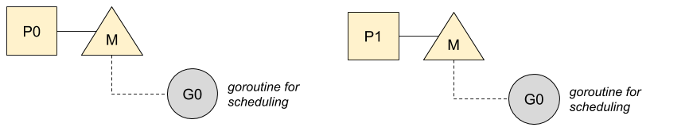
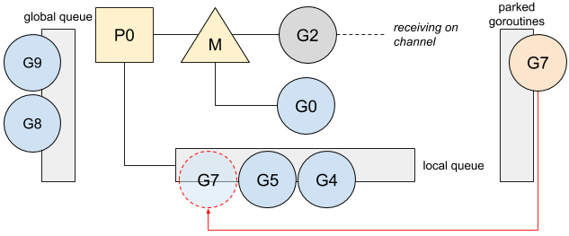

由Renee French创作的原始Go Gopher制作的“ Go的旅程”插图。

[本文](https://medium.com/a-journey-with-go/go-g0-special-goroutine-8c778c6704d8)基于Go 1.13。

Go中创建的所有goroutine都在内部调度程序的管理下。Go调度程序尝试为所有goroutine分配运行时间，并在当前goroutine被阻塞或终止时使所有CPU忙于运行goroutine。实际上，Go调度程序作为特殊的goroutine运行。

# 安排goroutine

Go通过`GOMAXPROCS`同时变量来限制运行的OS线程数。这意味着Go必须在每个正在运行的线程上调度和管理goroutine。该角色委托给一个特殊的goroutine，称为`g0`，这是为每个OS线程创建的第一个goroutine：




然后，它将安排就绪的goroutine在线程上运行。

*有关更多信息*`*P*`*，*`*M*`*，*`*G*`*模型，我建议你阅读[goroutine跟os thread以及cpu管理之间的关系](./1.goroutine跟os thread以及cpu管理之间的联系.md)

为了更好地了解调度的工作原理`g0`，让我们回顾一下通道的使用情况。这是当goroutine阻塞在通道发送时：

```go
ch := make(chan int)
[...]
ch <- v
```

在通道上阻塞时，当前goroutine将被停放(parking)，即处于等待模式，并且不会被推送到任何goroutine队列中：


然后，`g0`替换goroutine并进行第一轮调度：


在调度期间，本地队列具有优先级，并且goroutine＃2现在将运行：


*有关调度优先级的更多信息，建议您阅读我的文章 [Go：在Go Scheduler中进行工作隐藏](./3.Work-Stealing+in+Go+Scheduler.md)

一旦接收者读取通道，则goroutine＃7将被解除阻塞：

```go
v := <-ch
```

接收到消息的goroutine将切换到`g0`并通过将其放置在本地队列中来解锁驻留的goroutine：




尽管特殊的goroutine正在管理调度，但它不是唯一的工作，它的工作更多。

# 职责范围

与常规goroutine相反，`g0`它具有固定并且更大的堆栈。这样，Go可以执行需要更大堆栈的操作，并且可以选择在堆栈不增长的情况下执行操作。g0的职责有这些：

- Goroutine创建。在调用`go func(){ ... }()`或时`go myFunction()`，Go会将函数创建委托到`g0`然后再将其放置在本地队列中：


新创建的goroutine优先运行，并置于本地队列的顶部。

*有关goroutine优先顺序的更多信息，建议您阅读我的文章 [并发和调度器优化](./4.Concurrency&Scheduler+Affinity.md)

- defer函数的分配。
- 垃圾收集器操作，例如扫描goroutine的stack以及一些标记和清除操作。
- Stack增长。在需要时，Go会增加goroutine的大小。此操作通过`g0`的prolog函数完成。

这种特殊的goroutine涉及许多其他操作（大分配，cgo等），`g0`使我们的程序可以更高效地管理操作，从而需要更大的stack，以保持我们的程序在低内存打印下更加高效。