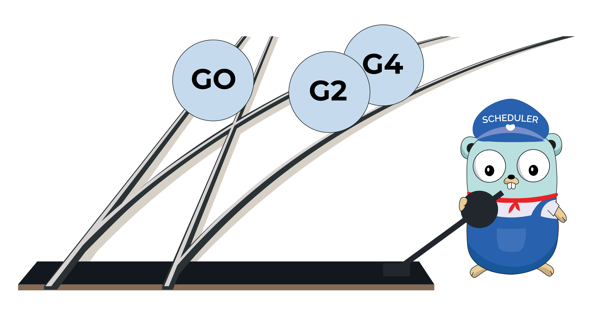
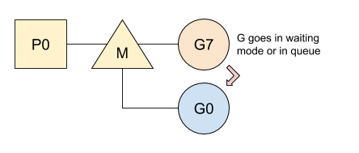
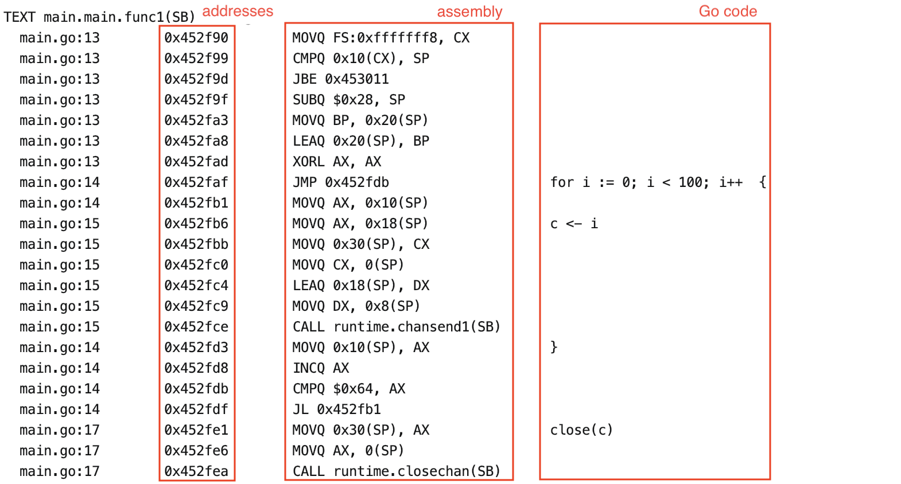
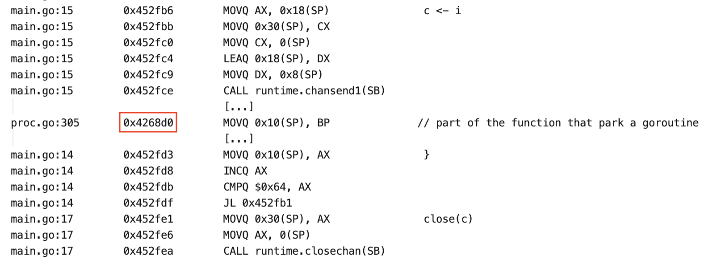
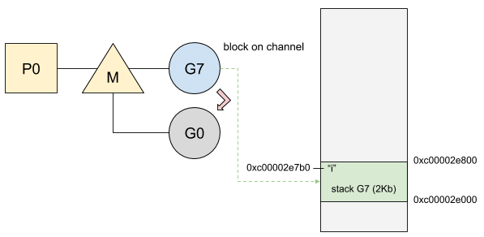
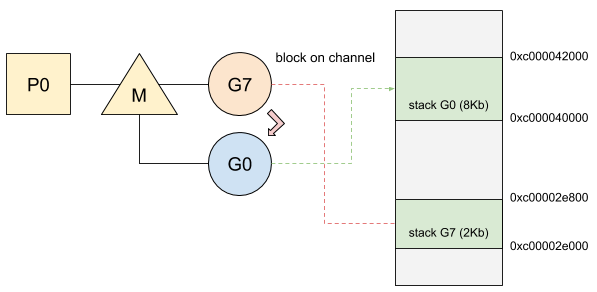
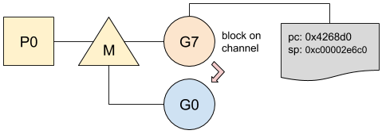
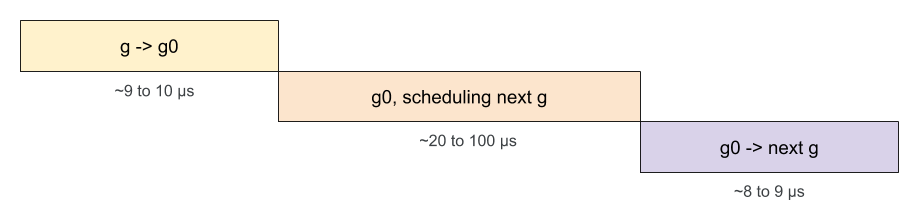

[Medium 原文地址](https://medium.com/a-journey-with-go/go-what-does-a-goroutine-switch-actually-involve-394c202dddb7)

This️*本文基于 Go 1.13。*

goroutine 很轻；他们只需要 2Kb 的内存栈即可运行。它们运行起来也很便宜；将一个 goroutine 切换到另一个不需要很多操作。在跳到 switch 之前，让我们回顾一下 switch 在更高级别上的工作方式。

_在继续本文之前，强烈建议阅读_ [goroutine 跟 os thread 以及 cpu 管理之间的联系](./1.goroutine跟os+thread以及cpu管理之间的联系.md)

# 案例

Go 根据两种断点将 goroutine 调度到线程上：

- 当 goroutine 阻塞时：比如 system call，mutex 或通道。被阻止的 goroutine 进入睡眠模式/进入队列，并允许 Go 计划并运行一个等待的 goroutine。
- 在函数调用过程中，在序言中，如果 goroutine 必须增加其栈。这个断点允许 Go 安排另一个 goroutine 并避免正在运行的 goroutine 占用 CPU。

在这两种情况下，`g0`运行调度程序的都会用另一个可以运行的 goroutine 替换当前的 goroutine。然后，所选的 goroutine 替换`g0`并在线程上运行。

_有关更多信息_`*g0*`_，建议您阅读[g0-特殊的 goroutine](./2.+g0-特殊的goroutine.md)_

通过另一个切换正在运行的 goroutine 涉及两个开关：

- 运行`g`到`g0`：

- `g0`到下一个`g`运行：

在 Go 中，goroutine 切换很轻量。只需要保存两件事：

- 在未调度之前 goroutine 停止的行。当前要运行的指令记录在程序计数器（`PC`）中。goroutine 稍后将在同一位置恢复。
- goroutine 的栈，以便在再次运行时还原局部变量。

让我们看看它在实践中如何工作。

# 程序计数器

在本例中，我将使用通过通道进行通信的 goroutine，一个用于生成数据，而另一个用于使用它们。这是代码：

使用者基本上会打印从 0 到 99 的偶数。我们将关注第一个 goroutine-生产者，它将数字加到缓冲区中。当缓冲区已满时，它将在发送消息时阻塞。此时，Go 必须切换到`g0`并计划另一个 goroutine。

如前所述，Go 首先需要保存当前指令，以便在同一条指令中还原 goroutine。程序计数器（`PC`）保存在 goroutine 的内部结构中。这是先前代码的示例：

指令及其地址可以在命令中找到`go tool objdump`。这是生产者的说明：

程序逐个指令执行，然后在函数`runtime.chansend1`的通道上阻塞。Go 将当前程序计数器保存到当前 goroutine 的内部属性中。在我们的示例中，Go 将程序计数器保存到地址`0x4268d0`，这个地址在运行时(runtime)以及方法`runtime.chansend1`内部：

然后，当`g0`唤醒 goroutine 时，它将以相同的指令继续执行，循环执行值并推入通道。现在让我们在 goroutine 切换期间移至栈管理。

# 栈

在被阻塞之前，正在运行的 goroutine 具有其原始栈。该栈包含临时存储器，例如变量`i`：

然后，当它在通道上阻塞时，goroutine 将`g0`跟它的栈一起（更大的栈）切换到：

在切换之前，将保存栈，以便在 goroutine 再次运行时进行恢复：

现在，我们对 goroutine 切换中涉及的不同操作有了完整的了解。现在让我们看看它如何影响性能。

_我们应该注意，某些体系结构（例如_`*arm*`_）需要再保存一个寄存器，_`*LR*`_即链接寄存器。_

# 运作方式

为了衡量切换可能花费的时间，我们将使用之前看到的程序。但是，由于它可能取决于找到要安排的下一个 goroutine 所花费的时间，因此无法提供完美的性能视图。这样，goroutine 切换也会影响性能。从函数序言(function prologue)进行的切换要比在通道上阻塞 goroutine 的切换进行更多的操作。

> In assembly language programming, the function prologue is a few lines of code at the beginning of a function, which prepare the stack and registers for use within the function.

让我们总结一下我们要测量的操作：

- 当前`g`在通道阻塞并切换到`g0`：
  - `PC`与在内部结构中的堆栈指针一起保存
  - `g0`被设置为运行 goroutine
  - `g0`的栈替换当前栈
- `g0` 正在寻找新的 goroutine 运行。
- `g0`必须使用选定的 goroutine 进行切换：
  - `PC`并从其内部结构中提取堆栈指针
  - 程序跳至`PC`提取的的地址

结果如下：

来自开关`g`到`g0`或`g0`到`g`是最快的阶段。它们包含少量固定的指令，与调度程序相反，调度程序检查许多源以查找要运行的下一个 goroutine。根据正在运行的程序的情况，此阶段甚至可能花费更多时间。
