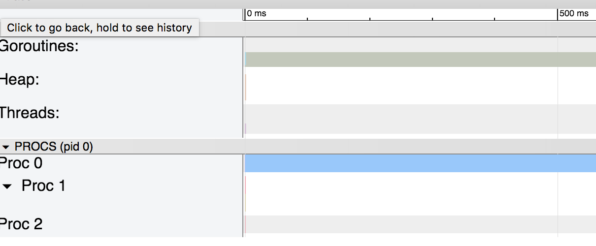
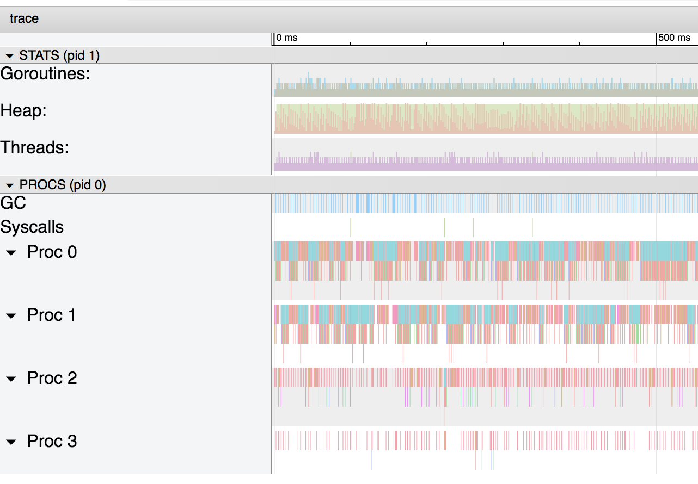
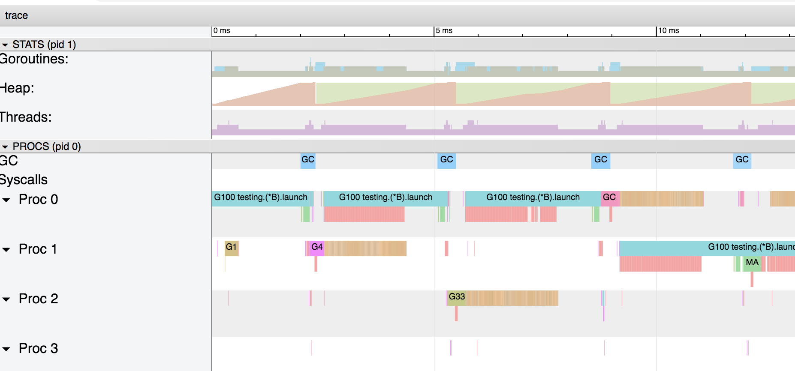
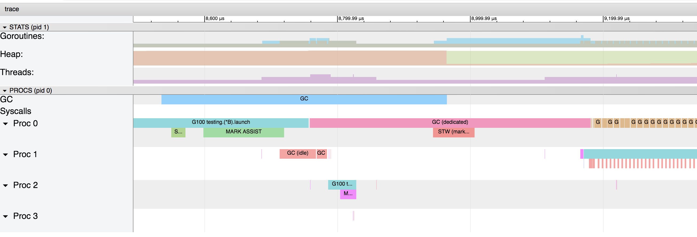

由 Renee French 创作的原始 Go Gopher 制作的“ Go 的旅程”插图。
[Medium原文地址](https://medium.com/a-journey-with-go/go-should-i-use-a-pointer-instead-of-a-copy-of-my-struct-44b43b104963)

对于许多 Go 开发人员而言，就性能而言，系统地使用指针共享结构而不是副本本身似乎是最佳选择。

为了了解使用指针而不是结构副本的影响，我们将回顾两个用例。

# 密集分配数据

让我们举一个简单的示例，说明何时要共享其值的结构：

```go
type S struct {
   a, b, c int64
   d, e, f string
   g, h, i float64
}
```

这是可以通过复制或指针共享的基本结构：

```go
func byCopy() S {
   return S{
      a: 1, b: 1, c: 1,
      e: "foo", f: "foo",
      g: 1.0, h: 1.0, i: 1.0,
   }
}

func byPointer() *S {
   return &S{
      a: 1, b: 1, c: 1,
      e: "foo", f: "foo",
      g: 1.0, h: 1.0, i: 1.0,
   }
}
```

基于这两种方法，我们现在可以编写两个基准测试，其中一个基准通过复制传递：

```go
func BenchmarkMemoryStack(b *testing.B) {
   var s S

   f, err := os.Create("stack.out")
   if err != nil {
      panic(err)
   }
   defer f.Close()

   err = trace.Start(f)
   if err != nil {
      panic(err)
   }

   for i := 0; i < b.N; i++ {
      s = byCopy()
   }

   trace.Stop()

   b.StopTimer()

   _ = fmt.Sprintf("%v", s.a)
}
```

还有一个非常相似，当它通过指针传递时：

```go
func BenchmarkMemoryHeap(b *testing.B) {
   var s *S

   f, err := os.Create("heap.out")
   if err != nil {
      panic(err)
   }
   defer f.Close()

   err = trace.Start(f)
   if err != nil {
      panic(err)
   }

   for i := 0; i < b.N; i++ {
      s = byPointer()
   }

   trace.Stop()

   b.StopTimer()

   _ = fmt.Sprintf("%v", s.a)
}
```

让我们运行基准测试：

```go
go test ./... -bench=BenchmarkMemoryHeap -benchmem -run=^$ -count=10 > head.txt && benchstat head.txt
go test ./... -bench=BenchmarkMemoryStack -benchmem -run=^$ -count=10 > stack.txt && benchstat stack.txt
```

以下是统计信息：

```
name          time/op
MemoryHeap-4  75.0ns ± 5%
name          alloc/op
MemoryHeap-4   96.0B ± 0%
name          allocs/op
MemoryHeap-4    1.00 ± 0%
------------------
name           time/op
MemoryStack-4  8.93ns ± 4%
name           alloc/op
MemoryStack-4   0.00B
name           allocs/op
MemoryStack-4    0.00
```

在这里使用结构体的副本比使用结构体指针要快 8 倍。

为了理解原因，让我们看一下跟踪生成的图形：



通过复制传递的结构图



指针传递的结构的图形

第一张图很简单。由于没有使用堆，因此没有垃圾收集器，也没有多余的 goroutine。
对于第二张图，指针的使用迫使 go 编译器[将变量转义到堆](https://golang.org/doc/faq#stack_or_heap)，并对垃圾收集器施加压力。如果放大图，可以看到垃圾收集器占据了进程的重要部分：



我们可以在该图上看到垃圾收集器必须每 4 毫秒工作一次。

如果再次缩放，我们可以确切了解正在发生的事情：



蓝色，粉红色和红色是垃圾收集器的阶段，而棕色的与堆上的分配有关（在图中用“ runtime.bgsweep”标记）：

> 清除是指回收与堆内存中未标记为使用中的值相关联的内存。当应用程序 Goroutines 尝试在堆内存中分配新值时，将发生此活动。清除的延迟增加了在堆内存中执行分配的成本，并且与与垃圾回收相关的任何延迟无关。
>
> https://www.ardanlabs.com/blog/2018/12/garbage-collection-in-go-part1-semantics.html

即使这个例子有点极端，我们也可以看到在堆而不是栈上分配变量的代价是多么昂贵。在我们的示例中，与在堆上分配并共享其地址相比，在栈上分配并复制结构的代码要快得多。

_如果您不熟悉堆栈/堆，并且想进一步了解它们的内部细节，那么可以在线上找到许多资源，例如**Paul Gribble 的**这篇_[_文章_](https://www.gribblelab.org/CBootCamp/7_Memory_Stack_vs_Heap.html)

如果我们在 GOMAXPROCS = 1 的情况下将处理器限制为 1，则可能会更糟：

```
name        time/op
MemoryHeap  114ns ± 4%
name        alloc/op
MemoryHeap  96.0B ± 0%
name        allocs/op
MemoryHeap   1.00 ± 0%
------------------
name         time/op
MemoryStack  8.77ns ± 5%
name         alloc/op
MemoryStack   0.00B
name         allocs/op
MemoryStack    0.00
```

如果在堆栈上分配的基准不变，则堆上的基准已从 75ns / op 降低到 114ns / op。

# 密集函数调用

对于第二个用例，我们将向结构中添加两个空方法，并稍稍调整一下基准：

```go
func (s S) stack(s1 S) {}

func (s *S) heap(s1 *S) {}
```

在栈上分配内存的基准将创建一个结构体并通过副本传递它：

```go
func BenchmarkMemoryStack(b *testing.B) {
   var s S
   var s1 S

   s = byCopy()
   s1 = byCopy()
   for i := 0; i < b.N; i++ {
      for i := 0; i < 1000000; i++  {
         s.stack(s1)
      }
   }
}
```

堆的基准将通过指针传递结构体：

```go
func BenchmarkMemoryHeap(b *testing.B) {
   var s *S
   var s1 *S

   s = byPointer()
   s1 = byPointer()
   for i := 0; i < b.N; i++ {
      for i := 0; i < 1000000; i++ {
         s.heap(s1)
      }
   }
}
```

不出所料，现在的结果是完全不同的：

```
名称时间/操作
name          time/op
MemoryHeap-4  301µs ± 4%
name          alloc/op
MemoryHeap-4  0.00B
name          allocs/op
MemoryHeap-4   0.00
------------------
name           time/op
MemoryStack-4  595µs ± 2%
name           alloc/op
MemoryStack-4  0.00B
name           allocs/op
MemoryStack-4   0.00
```

# 结论

在 go 中使用指针而不是复制结构并不总是一件好事。
为了选择适合您数据的语义，我强烈建议阅读[Bill Kennedy](https://twitter.com/goinggodotnet)撰写的[有关值/指针语义的](https://www.ardanlabs.com/blog/2017/06/design-philosophy-on-data-and-semantics.html)文章。它将使您更好地了解可用于结构和内置类型的策略。此外，对内存使用情况进行性能分析绝对可以帮助您弄清分配和堆中正在发生的情况。
