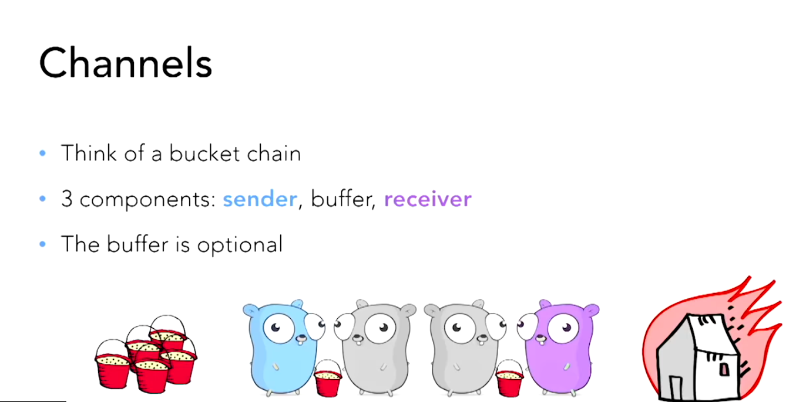
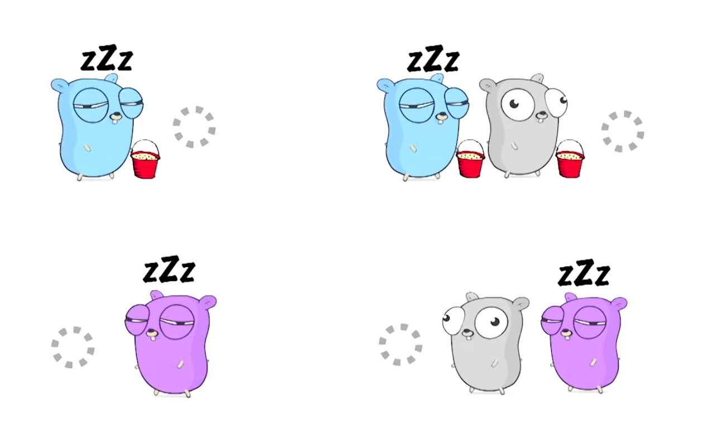
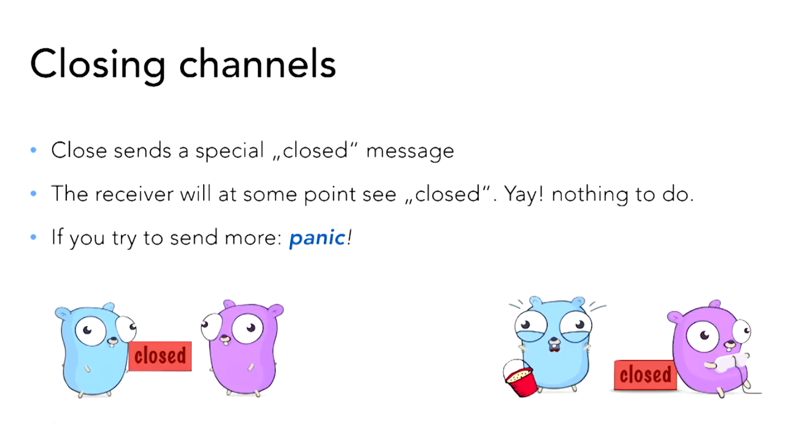
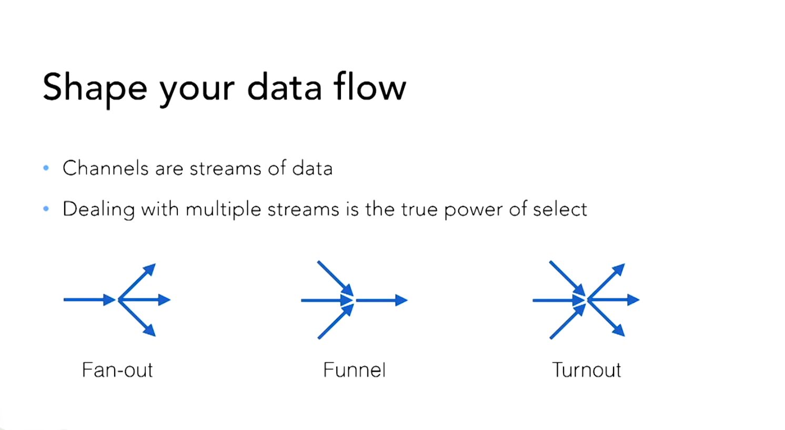

GO语言是如何实现并发的？

答案是： Communicating Sequential Processes (CSP)

who brought it up？ Tony Hoare in 1978

### CSP的三个特点：

1. Each process is built for sequentail execution 

2. Data is communicated between processes via channels. No shared state!

3. Scaled by adding more of the same

   

CSP只需要你写顺序执行的代码，然后也没有共享的状态，这样死锁也就不存在了。线程间的数据通过通道来传递。

### Go实现并发的几个工具：

1. go routines
2. channels
3. select
4. sync package

### Channels

通道看起来就像是这样的:



通道什么时候被阻塞了？ 水桶没有人拿了。



第三张图说明了一个道理: 没有水桶（数据) 就意味着阻塞

```go
func main(){
	unbuffered := make(chan int)
	//阻塞，因为通道中没有数据
	//a := <- unbuffered
	//被阻塞因为没有gopher从unbuffered中获取数据
	//unbuffered <- 1
	go func(){
		fmt.Println("我可以了")
		<- unbuffered

	}()
	//无缓冲通道如果数据没有传递走那么就会阻塞
	unbuffered <- 1
}
```

```go
func main(){
	buffered := make(chan int,1)
	//下面的仍然阻塞
	//a := <- buffered

	//不会阻塞
	buffered <- 1

	//再次阻塞,上图中的所有gopher都拿着水桶没有地方传递的情况
	buffered <- 2
}
```

为什么要如此在乎blocking？ 因为阻塞会破坏并发。阻塞是可以用来建造死锁的。阻塞会阻止缩放。

### 关闭通道

​	

```go
func main(){
	c := make(chan int)
	close(c)
	//打印0
	fmt.Println(<- c)
}
```

### Select

- 它是通道中的switch语句
- cases的顺序一点都不重要
- 当然也有一个默认case
- 第一个非阻塞的case会被选择(send and/or receive)

让通道非阻塞



如何实现Fan-out?

```go
func Fanout(In <- chan int, OutA,OutB chan int) {
	for data := range In{ //In接收数据直到通道关闭
		select {		  // 发送给第一个非阻塞的通道
			case OutA <- data:
			case OutB <- data:
		}
	}
}
```

如何实现TurnOut?

```go
func TurnOut(Quit <- chan int,InA,InB,OutA,OutB chan int) {
	for {
		 select {
			case data = <- InA:
			case data = <- InB:

			case <- Quit: 			//记住：close会产生一个message
				close(InA)			//实际上这是反模式的
				close(InB)			//quit表现得像是在赋值

				Fanout(InA,OutA,OutB)  //Flush剩余的数据
				Fanout(InB,OutA,OutB)
				return
		}
	}
}
```

对于百分之90的问题都可以通过select 跟channel的配合来解决

什么时候通道会出现问题？

1. 使用通道有可能出现死锁
2. 通道传递的是copies,这会影响性能
3. 如果往通道传递指针会导致race condition
4. 如果是天然的共享数据，类似缓存caches跟寄存器registries呢？

通道会出现问题，但是不能用Mutexes来解决

- mutexes跟马桶一样，你使用的时间越长，队列也会更长
- 读写mutexes只能减轻问题不能解决问题
- 只要使用了mutexes你就有可能使用多个mutexes，然后会导致迟早出现死锁
- 反正不是我们想要的解决办法

### Three shades of code (关于代码需要记住的三点)

- Blocking = 你的程序有被锁住（一段无法确定的时间）的可能
- Lock Free = 你的程序中至少有一部分一直在取得进步
- Wait Free = 你的程序全部在运行

### Atomic Operations

- sync.atomic package
- Store, Load, Add, Swap and CompareAndSwap
- Mapped to thread-safe CPU instructions
- These instructions only work on integer types
- Only about 10 - 60x slower than their non-atomic counterparts

Spining CAS (CAS Algorithem)

- You need a state variable and a "free" constant
- Use CAS(CompareAndSwap) in a loop
  - If state is not free: try again until it is
  - If state is free: set it to something else

- If you managed to change the state, you "own" it

```go
type Spinlock struct{
	state *int32
}

const free = int32(0)

func (l *Spinlock) Lock() {
	// 检查l.state的值是否跟free相等，如果是的那么交换并且返回true
	for !atomic.CompareAndSwapInt32(l.state,free,42) {
		// Gosched yields the processor, allowing other goroutines to run. It does not
		// suspend the current goroutine, so execution resumes automatically.
		runtime.Gosched();
	}
}

func (l *Spinlock) Unlock() {
	atomic.StoreInt32(l.state,free)
}
```

runtime.Gosched()的作用是让当前goroutine让出处理器以允许其他goroutine运行，但是只是暂停，可以自动恢复。

### Ticket Storage

- We need an **indexed data structure**, a **ticket** and a **done** variable 
- A function draws a new ticket by adding 1 to the ticket
- Every ticket number is **unique** as we never decrement
- Treat the **ticket as an index** to store your data
- Increase done to extend the "ready to read" range

```go
type TicketStore struct{
	ticket *uint64
	done *uint64
	slots []string

}

func(ts *TicketStore) Put(s string) {
	t := atomic.AddUint64(ts.ticket,1) -1
	ts.slots[t] = s
	for !atomic.CompareAndSwapUint64(ts.done,t,t+1) {
		runtime.Gosched()
	}
}

func (ts *TicketStore) GetDone() []string{
	return ts.slots[:atomic.LoadUint64(ts.done)+1]
}
```

### Guidlines for non-blocking code

- Don't switch between atomic and non-atomic functions
- Target and exploit situations which enforce uniqueness
- Avoid changing two things at a time
  - Sometimes you can exploit bit operations
  - Sometimes intelligent ordering can do the trick
  - Sometimes it's just not possible at all

### Concurrency in practice

- Avoid blocking, avoid race condition
- Use channels to avoid shared state. Use select to manage channels
- Where channels don't work：
  - Try to use tools from the sync package first
  - In simple cases or when really needed: try lockless code