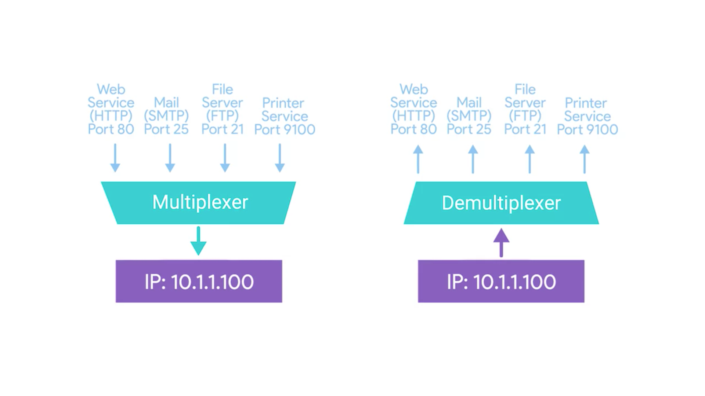
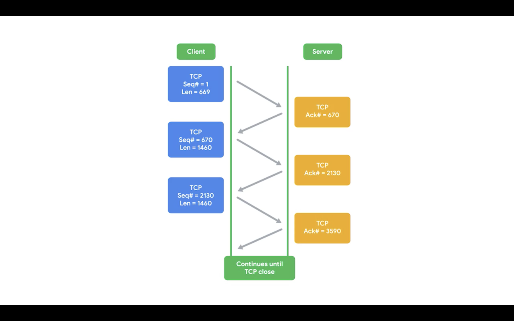
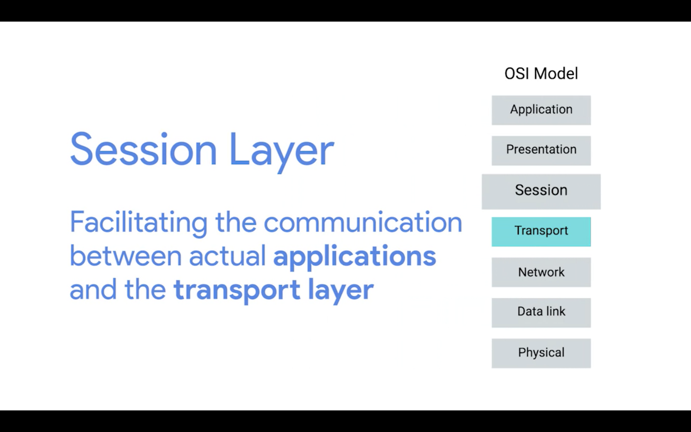
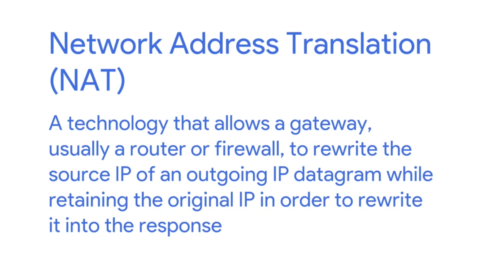

| 序号 | 网络名称    | 协议              | 协议数据单位 | 定位        |
| ---- | ----------- | ----------------- | ------------ | ----------- |
| 5    | Application | HTTP,SMTP,etc...  | Messages     | n/a         |
| 4    | Transport   | TCP/UDP           | Segment      | Port #'s    |
| 3    | Network     | IP                | Datagram     | IP address  |
| 2    | Data Link   | Ethernet, Wi-Fi   | Frames       | MAC address |
| 1    | Physical    | 10 Base T, 802.11 | Bits         | n/a         |

1. Physical layer

   用来表示物理连接着的计算机

2. Data Link

   负责定义一种通用的方式来解析物理层的信号，这样网络设备之间才能交流。数据链路层使用 Ethernet 协议。这个协议的作用是通过网络或者链路给某一个结点 node 发送数据

3. Network Layer

   允许不同的网络间进行交流，需要通过一种叫做路由器的设备。Internetwork 就是连接在一起的网络的集合，最著名的是 Internet。网络层所使用的最多的协议是 IP 协议。(Internet Protocol) ,它是互联网以及小型网络的基础。基于网络的程序一般分类为服务端跟客户端，一台电脑上可能会有多个应用，多个应用间的数据传输不会相互干扰，这归功于 Transport Layer。

4. Transport Layer

   传输层需要找到接收数据的程序。每当提到 TCP（Transmition Control Protocol),你可能会想到 TCP/IP.之所以它们被放到一起是因为 TCP 主要使用了 IP 协议。另外一种常用的协议也是基于 IP 协议，称为 UDP(User Data Protocol)

   TCP 跟 UDP 的区别是 TCP 有确保数据可靠的传输的机制而 UDP 没有。

5. Application

   应用层

小结：

5 层协议可以这样理解：

网络层类似送快递的货车，数据链路层相当于道路，网络层相当于高德导航，传输层相当于快递员把货物搬上楼，应用层就是货物本身。

---

**Cabels**

就是网线，有 copper 铜线跟 fiber 光纤两种

**Crosstalk**

当一根线的电流脉冲被另外一个线检测到，高层的协议可以识别到数据的异常并且要求重新传输。

光纤的每根管子大概跟人的头发丝一样细。

---

**Hub**

它是一个物理层的设备，允许同时连接多台计算机，连接到一台 HUB 的计算机，发送的数据会传播给连接到 HUB 的全部计算机。

**Collision domain**

它是一个网络时间片段，在这个片段内只有一台设备可以获取数据。如果多个设备同时发送数据，通过网线发送的电流脉冲将彼此干扰。这也是为什么现在 HUB 都不用了。

---

Switch

跟 Hub 类似，区别在于 HUB 是一个物理层的设备，而 Switch 是数据链路层的设备。

也就是说 Switch 知道不同的数据应该被送往哪个系统。

Hubs 跟 Switches 主要用于单个网络的连接，这种网络一般称为 LAN(Local Area Netwrok)

---

Router

A device that knows how to forward data between independent networks

既然路由器可以在不同的网络间转发数据，那么说明它是网络层的设备。

Border Gateway Protocal (BGP)

路由器们通过 BGP 协议来彼此交流，BGP 使得路由器可以从最优的路线传输数据

---

Twisted pair cable (双绞线)

双绞线（twisted pair，TP）是一种[综合布线](https://baike.baidu.com/item/综合布线/4282)工程中最常用的传输介质，是由两根具有绝缘保护层的铜[导线](https://baike.baidu.com/item/导线/1413914)组成的。把两根绝缘的铜导线按一定密度互相绞在一起，每一根导线在传输中[辐射](https://baike.baidu.com/item/辐射/5676)出来的电波会被另一根线上发出的电波抵消，有效降低信号干扰的程度。

双绞线一般由两根 22 ～ 26 号绝缘铜导线相互缠绕而成，“双绞线”的名字也是由此而来。实际使用时，双绞线是由多对双绞线一起包在一个绝缘电缆套管里的。如果把一对或多对双绞线放在一个绝缘套管中便成了[双绞线电缆](https://baike.baidu.com/item/双绞线电缆/3393109) [1] ，但**日常生活中一般把“双绞线电缆”直接称为“双绞线”**。

与其他传输介质相比，双绞线在传输距离，[信道宽度](https://baike.baidu.com/item/信道宽度/1208670)和数据传输速度等方面均受到一定限制，但价格较为低廉。

普通的网线就是双绞线。通常的网线有两个灯，黄色的是 Link LED,绿色的是 Activity LED

---

MAC address

是一个全局唯一的标识符依附在一个独立的网络接口上，它由 6 组（一组两个）16 进制数表示，因此是 48（6X2X4)位

Ethernet 使用 Mac 地址来明确发送数据的设备跟接收数据的设备的地址。

---

Unicast(单播)

In computer networking, **unicast** is a one-to-one transmission from one point in the network to another point; that is, one sender and one receiver, each identified by a network address. **Unicast** is in contrast to multicast and broadcast which are one-to-many transmissions.

Mac 地址的第一个 16 进制数的最后一位如果是 0 则表示 ethernet frame 只针对目标地址即单播，也就是说数据会被发送到冲突域中的全部机器，但是只有 mac 地址是目标地址的设备可以接收到这些数据。

Mac 地址的第一个 16 进制数的最后一位如果是 1 则表示 ethernet 处于**multicast** 多播模式

ethernet 的最后一种模式是广播模式，广播模式通过一种特殊的地址实现： FF:FF:FF:FF:FF:FF

---

Data Package

数据包是一个概括的(all-encompassing)名词用来表示任何单一的通过网络链路传输的二进制数据

Ethernet Frame

- Preamble

  长度为 8 bytes(或者 64bits)，然后它可以分成两个部分。前 7 个 bytes，它充当了帧之间的缓冲器作用，也可以被网络接口用来同步内部时钟来控制发送数据的速度。

  - Start frame delimiter(SFD)

    向接收的设备发送信号表示 Preamble 结束了然后接下来会发送实际的帧内容。

- Destination (Mac) Address

- Source (Mac) Address

- VLAN Tag(VLAN header)

  暗示帧自身是一个被称为`VLAN frame`的帧，只要有 VLAN tag 那么后面就有 Ether-Type

  - VLAN(Virtual LAN)

    一种技术允许你在同一个网络设备上有多个逻辑 LANs。VLAN 用于分隔不同种类的网络流量。比如电话线既可以上网又可以打电话。

- Ether-Type

  长度为 16bits，用来描述`帧内容`(`contents of the frame`)所使用的协议。

- Payload

  是网络中真实传输的数据，包括所有不是请求头的内容。

- FCS(Frame Check Sequence)

  一个 4 字节(32 位)的数，用来表示整个帧的校验和(`checksum value`)。校验和通过对帧进行循环冗余校验(`Cyclical Redundancy Check` AKA `CRC`)得到。

## The Network Layer

在局域网中节点可以通过物理 Mac 地址来通信。因为 switch 可以快速获取其连接设备的 Mac 地址。由于 Mac 地址并不是系统性排列好的，它并不适合远距离通信。

`dotted decimal notation`指使用四个以逗号分隔的数表示 IP 地址的方法，IP 地址属于网络，而不是连接到网络的设备。

- Dynamic IP address

  - Dynamic Host Configuration Protocol
    该协议用于动态设置 IP 地址，通过该协议设置的 IP 地址称为 Dynamic IP Address

- Static IP address

  多数情况下，static ip address 分配给服务器以及网络设备，而动态 ip 地址分配给客户端。

### IP datagram

- A highly structured series of fields that are strictly defined.

  - Header Length Field
    在 IPV4 协议中几乎都是长度为 20 个字节
  - Total Length Field
    表示了 IP datagram 的总长度
  - Identification field
    A 16-bit number that's used to group messages together
    也就是说 Ip datagram 的总长度是**2^16=65535**

    如果数据的总长度超过了单个 datagram 的最大长度，那么 IP 层需要将数据分割成多个独立的 packets。

  - Flags
  - Fragment Offset

    `Fragmentation` 是接收一个 ip 数据包，然后将其分割成多个小数据包的过程。

  - TTL(Time to Live)

    一个 8 比特的字段，表示了一个数据包在被丢弃前最多可以经过多少个 router hops(Hops are the number of devices or routers or computers in between the source and destination.),数据包每经过一个网络节点，TTL 就被减一。这个字段的作用避免了由于网络配置错误导致数据包被无限循环传输。

  - Protocol field

    一个 8 比特的字段，包含了正在使用的传输层协议的数据，比如 TCP、UDP

  - Header Checksum

    是整个数据包 header 的内容的校验和

  - Source IP Address
  - Destination IP Address
  - Options

    一个可选的字段，用于设置 datagram 的特殊值，主要用于测试目的。

  - Padding

    A series of zeros used to ensure the header is the correct total size

### ARP

`ARP`是一个协议用于发现有特定 IP 地址的节点的硬件地址,也就是将 mac 地址映射到 ip 地址。
物理连接在一起的设备，其中一台发送 ARP 请求到网络中，所有的设备都能收到请求，如果请求体里的 mac 地址是收到请求的设备 mac 地址那么该设备就将返回自己的 IP 地址。

- ARP table
  是 IP 地址以及相关的 MAC 地址的一组列表，ARP 表格记录通常在一个很短的时间后会失效来确保网络中的改变生效。

### Subnet mask

子网掩码是给计算机用于计算一个 IP 地址是否在其网络中存在。

subnet mask 表明了在计算 host id 的时候什么部分可以忽略，全部是`111 111`的就是需要忽略的部分。全部是`000 000`的部分就是需要保留的部分。

子网掩码中全部是 1 部分是子网掩码 ID，全部是 0 的部分是 Host ID.

!
对于 255.255.255.224 这个子网掩码，可以看到还有 32 个地址

由于包含了 27 个 1 以及 5 个 0，因此也经常把子网掩码中的 IP:9.100.100.100 写成: `9.100.100.100/27`

### Routing

- Routing Table

  - Destination network
    
  - Next hop
  - Total hops
    router 会在 A->B 的过程中选择一个最短的节点。
  - Interface

- Interior Gateway Protocols

  routing table 在获取前往某一节点的过程中始终会被更新。

  - Routing Protocol
    分为两类:

    - interior gateway protocols

      routers 使用该协议在单个自治系统(Autonomous System)中共享信息。自治系统是由一个网络运行商控制的网络集合。

      - Link state routing protocols
        
      - distance-vector protocols

        在计算机中，一个列表就是一个 vector,一个距离列表被称为 distance-vector
        
        在 B 通过 distance routing protocol 给 A 发送它的 routing table 之前，A 到 X 需要经过 4 个 hops,接收到 B 的数据后发现 B 只需要 2 个 hops 就能到 X,于是 A 就会更新它的 routing table

    - exterior gateway protocols

- Exterior Gateway Protocol

- Non-Routable Address Space

## Transport Layer

允许网络流量被导向特定的网络应用。
这一节需要讨论的话题包括

1. `multiplexing`以及`demultiplexing`
   
2. 建立长连接，通过错误检查以及数据校验确保数据准确性。

- port
  是一个 16 位的数字，用于将流量导向使用网络的目标网络服务。流量将被默认导向 80 端口。
  
- TCP segment
  由 tcp header 以及 data section 组成

  - tcp header
    

    - destination port
    - source port
    - sequence number

      记录当前数据处于一系列 TCP 片段中的顺序

    - acknowledgment number

      是数据发送者所期待的下一个片段的序号，sequence number 1 跟 acknowledgment number 2 表示这是序号 1 的数据，期待序号 2 的数据。

    - data offset field

      一个长度 4 位，用于表示当前 segment 片段的 TCP header 有多长。

    - tcp window

      定义了可能会发送的序列号范围

    - checksum
    - urgent pointer field

      跟`TCP control flag`一起使用，用于指出特定的比其他更重要的片段。

    - Options field
    - Padding field

  - TCP control flags(有 6 个)

        - URG(urgent)

          如果值是 1 表示该数据片段是紧急的，并且`urgent pointer field`会包含更多相关信息。

        - ACK(ac)

          如果值是 1 表示`acknowledgement number field`应该被检查

        - PSH(push)

          发送数据的设备希望接收数据的设备尽可能快的把`currently-buffered data`推送给接收端的应用。(buffer 就是一种在数据发送前存放在某个地方的技术)

        - RST(reset)

          TCP 连接的一方无法正确的从一系列 segment 丢失或者错误中恢复

        - SYN(synchronize)

          在初次建立 TCP 连接时使用，确保接收端知道要检查`sequnce number field`

        - FIN(finish)

          当这个值设置为 1，表示发送数据的计算机没有更多数据需要发送，连接可以关闭。

- 三次握手建立连接:
  
  **Handshake**的作用是确保两个设备使用相同的协议并且他们能够互相理解。
  

- 四次握手关闭连接:
  计算机使用`FIN`来表示自己可以关闭连接了，收到`FIN`请求的接收者返回一个`ACK`信息。
  

### TCP Socket States

- Socket

  The instantiation of an end-point in a potential TCP conenction
  在可能建立的 TCP 连接上的端点。

- Instantiation

  在其他地方定义的某个东西的具体实现,TCP Socket 需要其他程序去实现它。
  我们可以往任何一个`port`发送数据，但是只有程序在该`port`上打开了一个`socket` 你才能收到响应。

- Listen(服务端)

  一个 TCP socket 已经准备好了，开始监听进来的连接。

- SYN_SENT(客户端)

  一个同步请求已经发送，但是连接还没有建立。

- SYN-RECEIVED

  之前处于`LISTEN`状态的 socket 已经接收到了一个同步请求，并且发送了一个 `SYN/ACK` 回应

- ESTABLISHED

  TCP 连接处于工作的顺序，双方都可以给对方发送数据。

- FIN_WAIT

  一个`FIN`请求已经发送，但是对方还没有发送`ACK`响应。

- CLOSE_WAIT

  TCP 层的连接已经关闭，但是打开 socket 的应用还没有释放对`socket`的占有。

- CLOSED

  TCP 连接彻底关闭，不再会有通信发生

### Connection Oriented and Connectionless Protocols

- TCP 是面向连接的协议
  到目前为止我们学习了 TCP,它是面向连接的协议。任何一个数据包的发送都需要被 acknowledged,因此只要没有收到`ack`发送数据的一方就能够重新发送数据包。

  
  由于`segment`是有序列号的，因此即使发生丢包也不会有问题。
  

- UDP 是面向无连接的协议
  UDP 只需要 ip 跟端口号然后直接发送数据。

### firewall

防火墙是阻止特定流量的设备。防火墙在网络的各层都能部署，但是最常被部署到传输层。

## Application Layer

当我们打开浏览器输入一个地址，计算机所在的网络 A 查看其子网掩码发现该地址不属于网络 A，于是计算机 1 知道需要将数据发送给网关，然后计算机 1 查看`ARP`表查找 10.1.1.1 的 mac 地址，但是它可能找不到地址，于是计算机 A 发送一个`ARP Request`,这个请求的目标地址是`FF:FF:FF:FF:FF:FF`，然后网关(Router A)将发送一个包含自己 mac 地址的响应，于是计算机 1 就能更新自己的`ARP`表格。

接着就构建一个 `TCP segment`

接着构建 `IP datagram`

接着构建 `ethernet frame`

路由 A 发现数据是传给自己的就会对其计算`checksum`,如果 checksum 跟 ethernet 头部信息中的 checksum 一致那么路由 A 就知道数据是完整的。

接着将 ip datagram 取出继续计算 checksum,然后路由 A 检查 ip datagram 的目标地址，在自己的 ARP 表中查找，发现为了抵达 172.16.1.100 最近只有 1 个 hop 的距离，于是 A 知道要把数据发送给 B。

接着 A 再构建 ethernet frame,发送给 B

由于 B 取出 ip datagram 后发现目标 IP 地址在本地连接网络，因此将 TTL 减一，再封装为 ethernet frame 发送给网络 c 的 switch.

## Network Services

### Standard Modern Network Configuration

- IP address
- Subnet mask
- Gateway for a host
- DNS server

  - Caching name servers
  - Recursive name servers

    上面两种 DNS server 的作用是存储已知的域名并且在一定的时间内查询域名。Recursive name servers perform full DNS resolution requests.请求结束会将 ip 地址缓存起来，下一次其他人访问同样的域名就能直接返回 ip 地址。
    
    下面是`DNS resolution requests`的示意图:
    
    www.google.com中`.com`就是`TLD`(Top Level domain)
    
    
    实际上电子设备也会缓存域名对应的 IP 地址。

  - Root name servers
  - TLD name servers
  - Authoritative name servers

### DNS and UDP

如果 DNS Resolution Request 使用`TCP`解析域名信息，那么总共将发送 44 个 packets.如果使用 UDP 解析域名总共将发送 8 个 packets

计算方式:
首先三次握手 3 次数据包，然后发送 DNS Resolution Request 到 Caching/Recursive Name Server,server 会返回一个 ACK 表示自己收到了请求，加起来是 5 次。同理，Caching/Recursive Name Server 三次握手，关闭时再四次握手，发送数据以及受到数据各两个数据包，加起来就是 11 个数据包。

- TCP
  
- UDP
  

实际上 DNS Resolution Request 有的时候也会使用 TCP 连接。

如果域名十分复杂，那么一个 UDP datagram 无法容纳全部的域名，这种情况下 DNS Server 会响应一个`pakcet too large`的错误，只能建立 TCP 连接。

### Resource Record Types

- `A record`

  is used to point to a certain domain name at a certain IPv4 IP address
  a single A record is configured for a single domain name

  - DNS ROUND ROBIN (DNS 负载均衡)

- `AAAA-QuadA` record

just like A record but it returns a IPv6 address

- A `CNAME` record

  is used to redirect traffic from one domain name to another,比如访问 google.com
  的时候指向www.google.com

- MX record - mail exchange

- SRV record - service record

- TXT record

### Anatomy of a Domain Name

- Top level domain (TLD)

  www.google.com 中 `.com`就是顶级域名

- Sub domain

  `www`就是子域名

- Fully qualified domain name (FQDN)

DNS 理论上最高支持 127 级的 FQDN 域名

- DNS zones

allow for easier control over multiple levels of a domain.

如果一家名为 largecompany 的公司在三个地方设立办公室，每间办公室有 200 员工并且他们的计算机名都是唯一的，那么如果只有一个 `ZONE`就得维护 600 条`A记录`。这家公司可以让三个办公室每个都有自己的`ZONE`

比如 la.largecompany.com,这样总共只需要 4 个 authorizied name server

- Zone files

  Simple configuration files that declare all resources records for particular zone.

- State of authority(SOA)

Declares the zone and the name of the name server that is authoritative for it.

- NS records

Indicate other name servers that might also be responsible for this zone.

- Pointer resources record (PTR)

Resolves an IP to a name.

### Dynamic Host Configuration Protocol (DHCP)

任何基于 TCP/IP 网络的计算机都需要配置 4 项内容:

- IP Address
- Subnet mask for local network
- Gateway
- Name Server

子网掩码、网关、域名服务器对于一个网络内的计算机来说都是一样的。但是网络内的每一个节点的 IP 地址
需要是不同的。这个时候`DHCP`就能派上用场了。

DHCP 是应用层的协议。由服务器控制一段 IP 地址范围，客户机登录服务器时就可以自动获得服务器分配的 IP 地址和子网掩码。
有了 DHCP 只需要一个请求计算机就能获取到它的网络配置。

- Dynamic allocation

  A range of IP addresses is set aside for client devices and one of these Ips is issued to these devices when they reuqest one.(相当于每次请求 IP 都会变化)

- Automatic Allocation

  A range of IP addresses is set aside for assignment purposes.

- Fixed allocation

  Requires a manually specified list of MAC address and their corresponding IPs.
  如果静态查找没有找到 IP 那么就会使用动态分配或者自动分配的方式，或者拒绝分配 IP。

  

- Network time protocol (NTP)

被用于让一个网络内的计算机保持时间同步。

DHCP 不仅可以用于分配 IP、子网掩码、网关以及域名服务器。

### DHCP in Action

- DHCP discovery

The process by which a client configured to use DHCP attempts to get network configuration information.

- DHCP REQUEST

request 是一个广播请求

- DHCP ACK
  ack 也使用广播，但是数据包里包含了目标地址的 mac 地址,因此只有 client 会接收这个 DHCP ACK
  

### NAT (Net Address Translation)

也就是将一个 IP 翻译为另外一个 IP
这项技术允许一个网关(通常是路由器或者防火墙)重写向外发送的 IP daatagram 的源 IP 地址并且

通常来说路由器会检查 IP datagram 的内容，将 TTL 减少 1，重新计算 checksum,然后在不改变数据包其他内容的情况下将数据发送出去。

但是使用了`NAT`后路由还会修改 source ip 地址，这样一来数据接收方会以为数据来自路由器，而不是真正发送数据的一方。

- IP masquerading

  NAT 将隐藏数据包的真实 IP 地址。有了 NAT 网络 A 的 IP 可以有无数个，因为他们发送的数据包到了路由器都会被修改，发送给外界的时候源 IP 将是路由器的 IP。
  

- Port preservation

  A technique where the source port chosen by a client is the same port used by the router.

- Port Forwarding

- NAT, Non-Routable Address Space, the Limits of IPv4

Non-Routable Address Space 在`RFC1918`中定义。有了 NAT 技术你可以让几千台计算机使用 Non-Routable Address Space ，他们共享一个公共 IP。

### Virtual Private Networks(VPNS and Proxies)

VPNs are a technology that use encrypted tunnels to allow for a remote computer to act as if it's connected to a network that it's not actually physically connected to.

vpns provision something not locally avaliable,最早出现是为了解决远程办公无法访问内部网络的问题。

vpn 率先使用了双因子认证

VPN 跟 NAT 一样，是概念而不是协议。

- Proxy Service

  A server that acts on behalf of a client in order to access another service.

  Proxy只是概念并不是具体的实现，实际上网络模型每一层都存在Proxy.

  - Web Proxy

    比如窄带时期通过使用Web Proxy,缓存远端服务器的网页，来提高网页的浏览速度。起到这种作用的计算机就是一种Proxy。

  - Reverse Proxy

      
      反向代理将incoming requests分配给无数的物理服务器。跟DNS ROUND ROBING的概念类似，一种负载均衡。

      反向代理被很多大网站使用的另外一个原因是 `DECRYPTION`
      反向代理可以将加密的数据解密。
      

## Connecting To The Internet

### POTS and Dial-up

### Broadband Connections

  - T-Carrier technologies

  - DSL
  - Cable broadband
  - Fiber connections

## Wireless Networking

