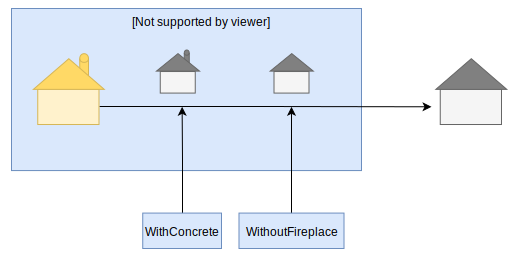

Functional options take the form of extra arguments to a function, that extend or modify its behavior. Here’s an example which uses functional options to create a new `House` struct:

```go
h := NewHouse(
  WithConcrete(),
  WithoutFireplace(),
)
```

Here, `NewHouse` is a constructor function. `WithConcrete` and `WithFireplace` are options passed to the constructor to modify it’s return value.



We will soon see why `WithConcrete` and `WithFireplace` are called _“functional”_ options and how they are useful over regular function arguments.

##

## Defining the Constructor

First, let’s define the struct that we will make options for:

```go
type House struct {
	Material     string
	HasFireplace bool
	Floors       int
}

// `NewHouse` is a constructor function for `*House`
func NewHouse() *House {
	const (
		defaultFloors       = 2
		defaultHasFireplace = true
		defaultMaterial     = "wood"
	)

	h := &House{
		Material:     defaultMaterial,
		HasFireplace: defaultHasFireplace,
		Floors:       defaultFloors,
	}

	return h
}
```

A `House` can be made with a particular material, can have a certain number of floors, and can optionally contain a fireplace.

The `NewHouse` constructor gives us a default `House` pointer, with some default values for all of it’s attributes.

Normally, we would need to construct the house first, and then modify it’s values if we wanted a different variant. With functional options, we can give a list of modifications to the constructor itself.

##

## Defining the Functional Options

Let’s define a function type that accepts a pointer to a `House`:

```go
type HouseOption func(*House)
```

This is the signature of our option functions.

Let’s define some functional options that modify the `*House` instance:

```go
func WithConcrete() HouseOption {
	return func(h *House) {
		h.Material = "concrete"
	}
}

func WithoutFireplace() HouseOption {
	return func(h *House) {
		h.HasFireplace = false
	}
}
```

Each of the above functions are “option constructors” and return another function, that takes a `*House` as an argument, and returns nothing.

We can see that the returned functions modify the provided `*House` instance.

We can even add arguments to the option constructors to modify the returned options:

```go
func WithFloors(floors int) HouseOption {
	return func(h *House) {
		h.Floors = floors
	}
}
```

This will return an options that modifies the number of floors in a house according to the argument given to the `WithFloors` option constructor.

##

## Adding Functional Options to our Constructor

We can now incorporate functional options into our constructor:

```go
// NewHouse now takes a slice of option as the rest arguments
func NewHouse(opts ...HouseOption) *House {
	const (
		defaultFloors       = 2
		defaultHasFireplace = true
		defaultMaterial     = "wood"
	)

	h := &House{
		Material:     defaultMaterial,
		HasFireplace: defaultHasFireplace,
		Floors:       defaultFloors,
	}

	// Loop through each option
	for _, opt := range opts {
		// Call the option giving the instantiated
		// *House as the argument
		opt(h)
	}

	// return the modified house instance
	return h
}
```

The constructor now accepts a list of any number of function option arguments, which it then applies to the `*House` instance before returning it. Coming back to the first example, we can now make sense of what these options do:

```go
h := NewHouse(
  WithConcrete(),
  WithoutFireplace(),
  WithFloors(3),
)
```

##

## Advantages of Using the Option Pattern

Now that we have seen how to implement the option pattern, let’s see why we would want to use functional options.

###

### Explicit

Rather than modifying the `*House` like so:

```go
h := NewHouse()
h.Material = "concrete"
```

we can be explicit about the building material in the constructor itself:

```go
h := NewHouse(WithConcrete())
```

This helps us in being explicit about the string value of the material. The previous example allows the user to make typos and exposes the internal of the `*House` instance.

###

### Extensible

In case we do want to give the user extensibility, we can always provide arguments to our option constructor.

For example, since we can have any number of floors in our house, the option to add floors to the house can be created by providing an argument for the number of floors:

```go
h := NewHouse(WithFloors(4))
```

###

### Order of Arguments

When using functional options, the order of the options doesn’t matter. This gives us a lot of flexibility when compared to regular function arguments (which have to be in the correct order).

Furthermore, we can give any number of options. When using functions with regular arguments, we have to provide _all_ the arguments:

```go
// What `NewHouse` would look like if we used
// regular function arguments
// We would always need to provide all three
// arguments no matter what
h := NewHouse("concrete", 5, true)
```
