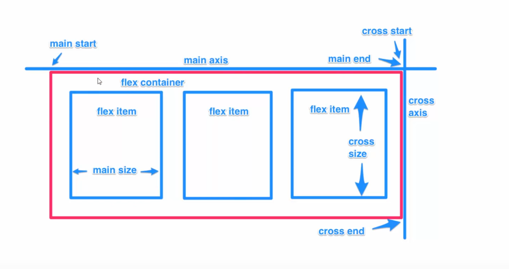
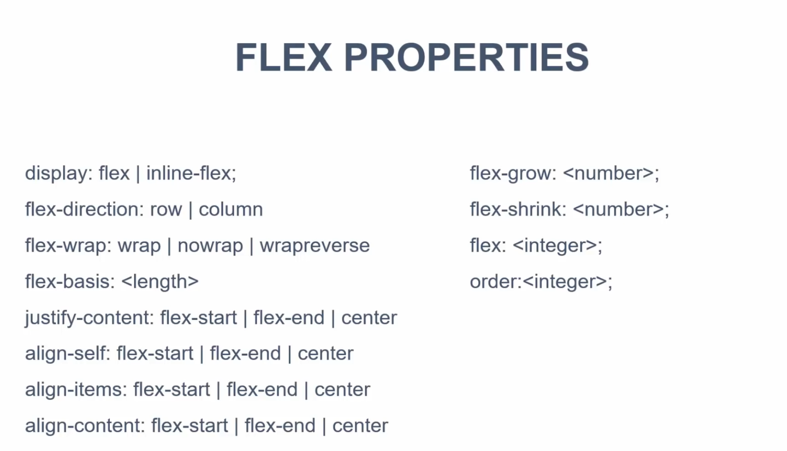
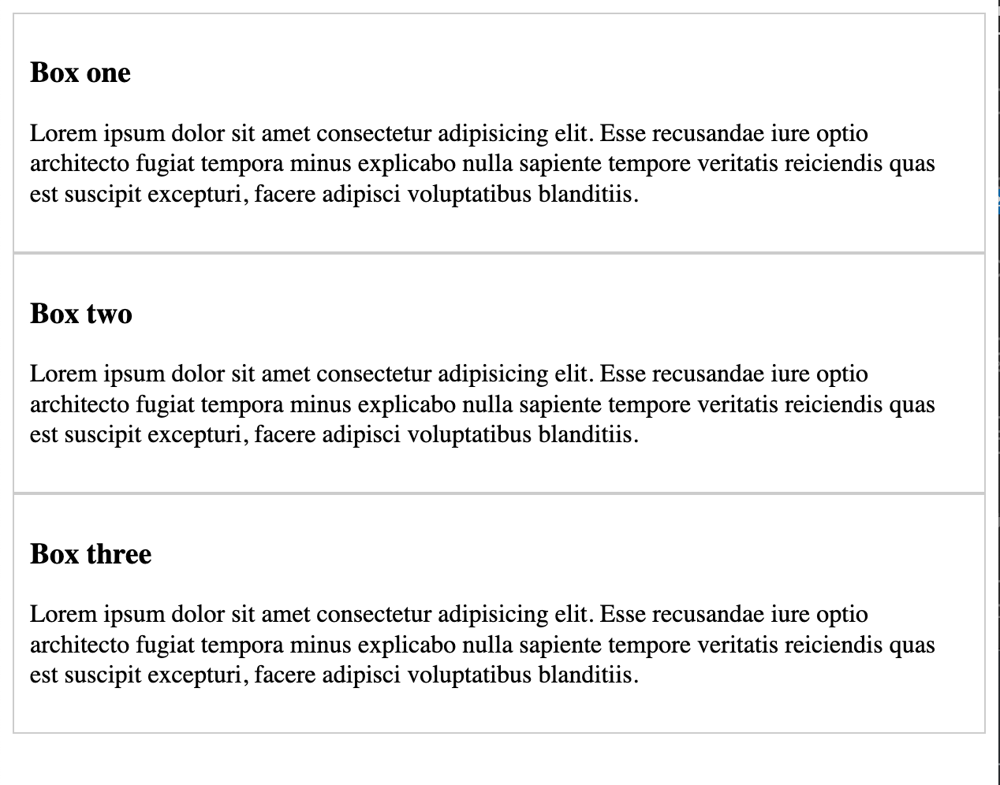
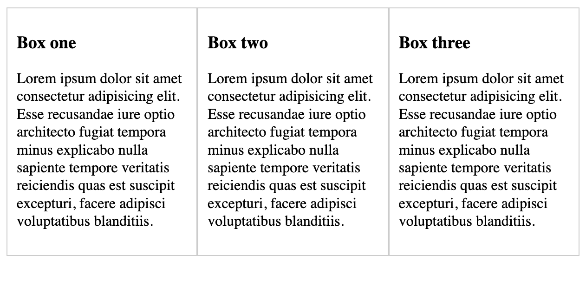
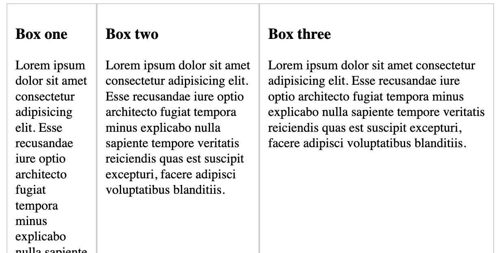

在flexbox布局中y轴被称为cross axis，x轴被称为main axis



flexbox的属性:



普通的三个div:

```html
<!DOCTYPE html>
<html lang="en">
<head>
    <meta charset="UTF-8">
    <meta name="viewport" content="width=device-width, initial-scale=1.0">
    <title>Document</title>
</head>
<body>
    <div class="container-1">
        <div class="box-1">
            <h3>Box one</h3>
            <p>Lorem ipsum dolor sit amet consectetur adipisicing elit. Esse recusandae iure optio architecto fugiat tempora minus explicabo nulla sapiente tempore veritatis reiciendis quas est suscipit excepturi, facere adipisci voluptatibus blanditiis.</p>
        </div>
        <div class="box-2">
            <h3>Box two</h3>
            <p>Lorem ipsum dolor sit amet consectetur adipisicing elit. Esse recusandae iure optio architecto fugiat tempora minus explicabo nulla sapiente tempore veritatis reiciendis quas est suscipit excepturi, facere adipisci voluptatibus blanditiis.</p>
        </div>
        <div class="box-3">
            <h3>Box three</h3>
            <p>Lorem ipsum dolor sit amet consectetur adipisicing elit. Esse recusandae iure optio architecto fugiat tempora minus explicabo nulla sapiente tempore veritatis reiciendis quas est suscipit excepturi, facere adipisci voluptatibus blanditiis.</p>
        </div>
    </div>
</body>
</html>

<style>
    .container-1 div{
        border: 1px #ccc solid;
        padding: 10px;
    }
</style>
```

显示效果:



加上 display: flex



如果需要调整三个盒子所占空间的比例为1:2:3

```css
.box-1{
	flex:1;
}
.box-2{
	flex:2;
}
.box-3{
	flex:3;
}
```



甚至还可以改变盒子的排列顺序:

然后盒子就会按照Order排列

```css
.box-1{
	flex:1;
	order:2;
}
.box-2{
	flex:2;
	order:3;
}
.box-3{
	flex:3;
	order:1;
}
```

容器container可以设置:

align-items: flex-start

align-items；flex-end

align-items:center

设置align-items:center后的效果:


还有一个justify-content属性，这个属性是用来设置x轴方向的属性的，比如justify-content:space-around会让一行的卡片以同样的间隔排列。justify-content:between会让卡片之间以同样的间隔排列（不包括两侧）

**最好看这个:  https://www.freecodecamp.org/news/flexbox-the-ultimate-css-flex-cheatsheet/**


### **CSS that can be applied to the container**

```css
display: flexbox | inline-flex;
flex-direction: row | row-reverse | column | column-reverse;
flex-wrap: nowrap | wrap | wrap-reverse;
flex-flow: <‘flex-direction’> || <‘flex-wrap’>
justify-content: flex-start | flex-end | center | space-between | space-around;
align-items: flex-start | flex-end | center | baseline | stretch;
align-content: flex-start | flex-end | center | space-between | space-around | stretch;
```

### **CSS that can be applied to items/elements in the container**

```css
order: <integer>;
flex-grow: <number>; /* default 0 */
flex-shrink: <number>; /* default 1 */
flex-basis: <length> | auto; /* default auto */
flex: none | [ <'flex-grow'> <'flex-shrink'>? || <'flex-basis'> ]
align-self: auto | flex-start | flex-end | center | baseline | stretch;
```

可以看到上面的三个Box占满了屏幕，使用flex-basis可以调整Box的宽度，然后配置justify-content可以调整box在main-cross上的分布。

