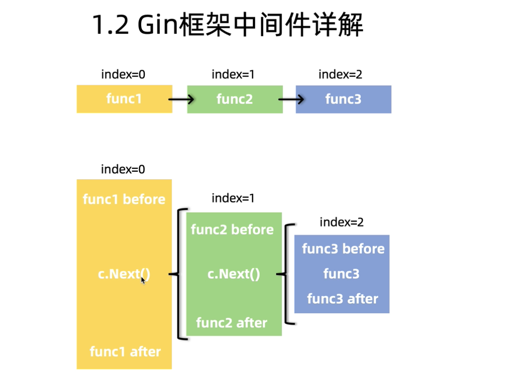
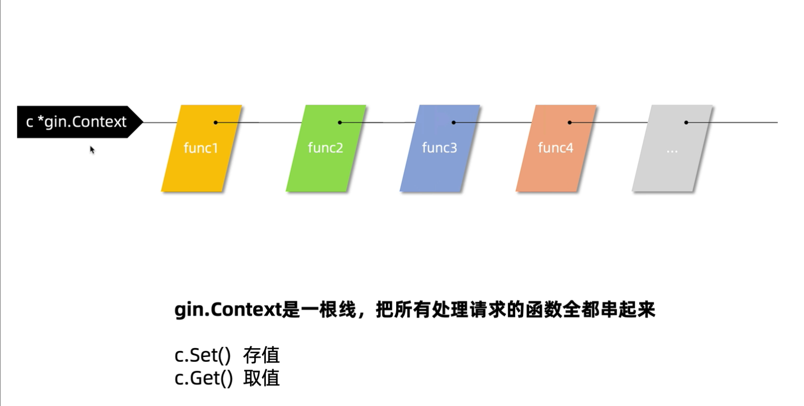

## 中间件

### 中间件的注册

`gin.Default()`函数:

```go

// Default returns an Engine instance with the Logger and Recovery middleware already attached.
func Default() *Engine {
	debugPrintWARNINGDefault()
	engine := New()
	engine.Use(Logger(), Recovery())
	return engine
}
```

`engine.Use()`方法将中间件注册到引擎

engine.RouterGroup 是 engine 中的一个结构体

```go
// Use attaches a global middleware to the router. ie. the middleware attached though Use() will be
// included in the handlers chain for every single request. Even 404, 405, static files...
// For example, this is the right place for a logger or error management middleware.
func (engine *Engine) Use(middleware ...HandlerFunc) IRoutes {
	engine.RouterGroup.Use(middleware...)
	engine.rebuild404Handlers()
	engine.rebuild405Handlers()
	return engine
}
```

RouterGroup 中的`Use`方法:

```go
// Use adds middleware to the group, see example code in GitHub.
func (group *RouterGroup) Use(middleware ...HandlerFunc) IRoutes {
	group.Handlers = append(group.Handlers, middleware...)
	return group.returnObj()
}
```

也就是说只要传入`HandlerFunc`就可以了:
下面两种使用中间件的方式都可以

```go
func main() {
	r := gin.Default()

	testGroup := r.Group("/test", func(c *gin.Context) {
		fmt.Println("你太美")
	})
	testGroup.Use(func(c *gin.Context) {
		fmt.Println("我知道")
	})
	testGroup.GET("/", func(c *gin.Context) {
		c.String(http.StatusOK, "请求成功")
	})
	r.Run(":8088")
}
```

打印结果:

```go
[GIN-debug] Listening and serving HTTP on :8088
[GIN-debug] redirecting request 301: /test/ --> /test/
你太美
我知道
[GIN] 2021/01/17 - 11:32:28 | 200 |      25.194µs |             ::1 | GET      "/test/"
```

### Next 实现嵌套调用



gin context 的 Next()函数:

```go
// Next should be used only inside middleware.
// It executes the pending handlers in the chain inside the calling handler.
// See example in GitHub.
func (c *Context) Next() {
	c.index++
	for c.index < int8(len(c.handlers)) {
		c.handlers[c.index](c)
		c.index++
	}
}
```

例子:

```go
func main() {
	r := gin.Default()

	testGroup := r.Group("/test", func(c *gin.Context) {
		fmt.Println("你太美")
		c.Next()
		fmt.Println("不，你不知道")
	}, func(c *gin.Context) {
		fmt.Println("我知道")
	})
	testGroup.GET("/", func(c *gin.Context) {
		c.String(http.StatusOK, "请求成功")
	})
	r.Run(":8088")
}
```

打印结果则是:

```go
[GIN-debug] GET    /test/                    --> main.main.func3 (5 handlers)
[GIN-debug] Listening and serving HTTP on :8088
[GIN-debug] redirecting request 301: /test/ --> /test/
你太美
我知道
不，你不知道
[GIN] 2021/01/17 - 11:49:11 | 200 |      42.399µs |             ::1 | GET      "/test/"
```

### Abort

Abort 的作用是退出 Next 调用

```go
func main() {
	r := gin.Default()

	testGroup := r.Group("/test", f1, f2, f3, f4, f5)
	testGroup.GET("/", func(c *gin.Context) {
		c.String(http.StatusOK, "请求成功")
	})
	r.Run(":8088")
}

func f1(c *gin.Context) {
	fmt.Println("f1")

}
func f2(c *gin.Context) {
	fmt.Println("准备要跳过f2了")
	c.Next()
	fmt.Println("f2")
}
func f3(c *gin.Context) {
	fmt.Println("f3")
}

func f4(c *gin.Context) {
	fmt.Println("f4")
	fmt.Println("再继续执行f2")
	c.Abort()
}
func f5(c *gin.Context) {
	fmt.Println("f5")
}
```

打印结果为:

```go
[GIN-debug] GET    /test/                    --> main.main.func1 (8 handlers)
[GIN-debug] Listening and serving HTTP on :8088
[GIN-debug] redirecting request 301: /test/ --> /test/
f1
准备要跳过f2了
f3
f4
再继续执行f2
f2
[GIN] 2021/01/17 - 11:55:50 | 200 |      21.138µs |             ::1 | GET      "/test/"

```

可以看到 f4 中执行了`c.Abort()`之后 f5 就不会再执行了。如果没有`Next`跟`Abort`函数会从 f1 到 f5 依次执行

Next

Abort 方法:

```go
func (c *Context) Abort() {
	c.index = abortIndex
}
```

可以看到 Abort 实际上是将 context 的 index 直接变成退出的 index,因此后面的函数都不会执行了。

### context



gin.Context 是一根线，把所有的处理请求的函数全部串起来。

`c.Set()` 存值

`c.Get()` 取值
