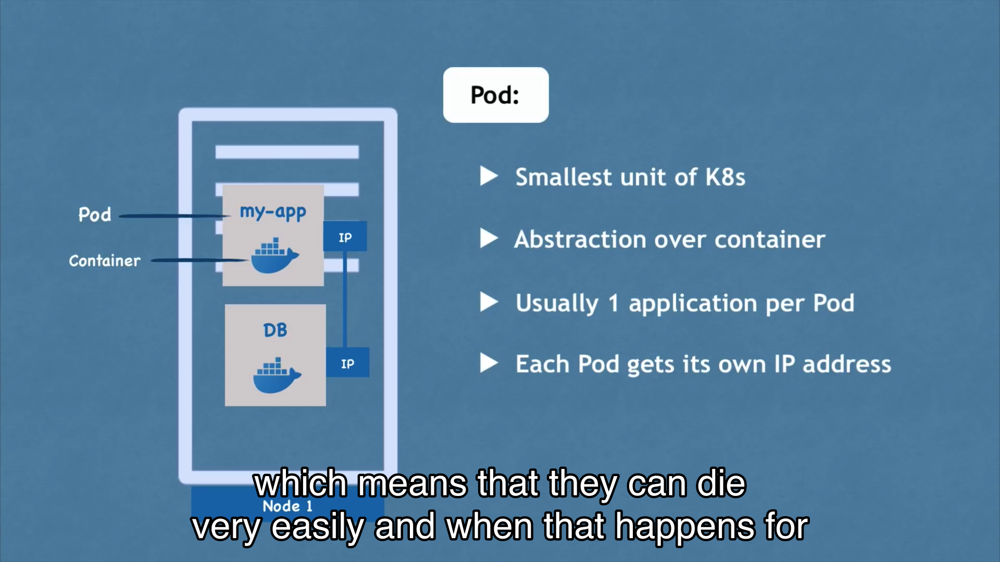

比如运行:

```
kubectl create deployment swsiot --image
```


使用下面的命令来修改部署:
```
kubectl edit deployment
```


同样可以进入pod来进行debug:

```
kubectl exec -it mongo- --bin/bash
```


使用下面的命令删除，podname不支持开头简写
```
kubectl delete deployment [podnam]
```


通常在创建deployement的时候需要用到configuration文件

```
kubectl apply -f config.yaml

```


比如执行
```

touch nginx-deployment.yaml
vim nginx-deployment.yaml
```

然后粘贴下面的文件:
```
apiVersion: apps/v1
kind:Deployment
metadata:
  name: nginx-deployment
  labels:
    app: nginx
spec:
  replicas: 1
  selector:
    matchLabels:
      app: nginx
  template:
    metadata:
      labels:
        app: nginx
    spec:
      containers:
      - name: nginx
        image: nginx:1.16
        ports:
          - containerPort: 80
                    
```
接着执行:

```
kubectl apply -f nginx-deployment.yaml
```
如果发现deployment.yaml文件需要修改，比如需要修改replica的数量，直接修改然后执行
```
kubectl apply -f nginx-deployment.yaml
```
即可


