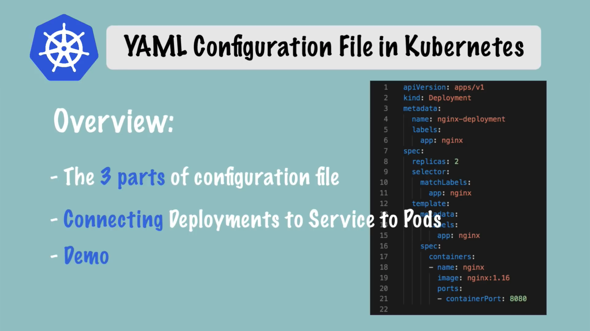

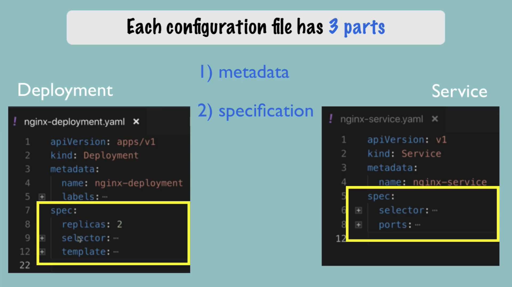

Deployment跟Service的Specification不一样
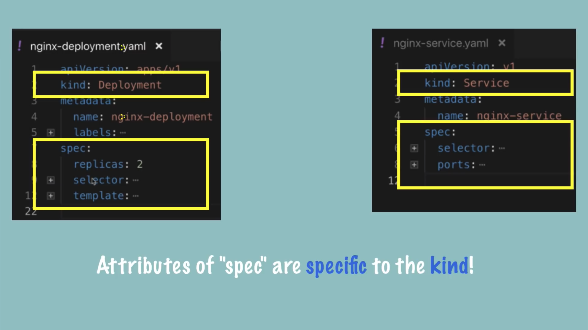

配置文件的第三部分是Status,kubernetes会检查什么是desired的配置,什么是实际的配置，然后试着fix实际的配置。
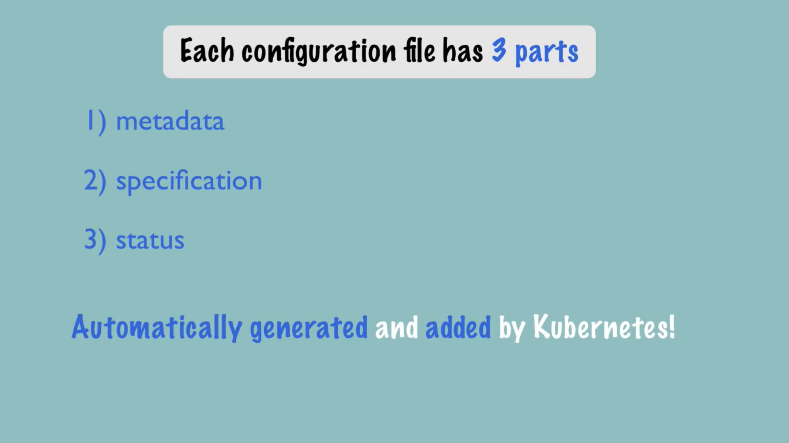

status数据从etcd中获得
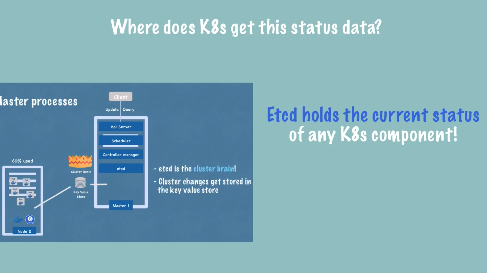
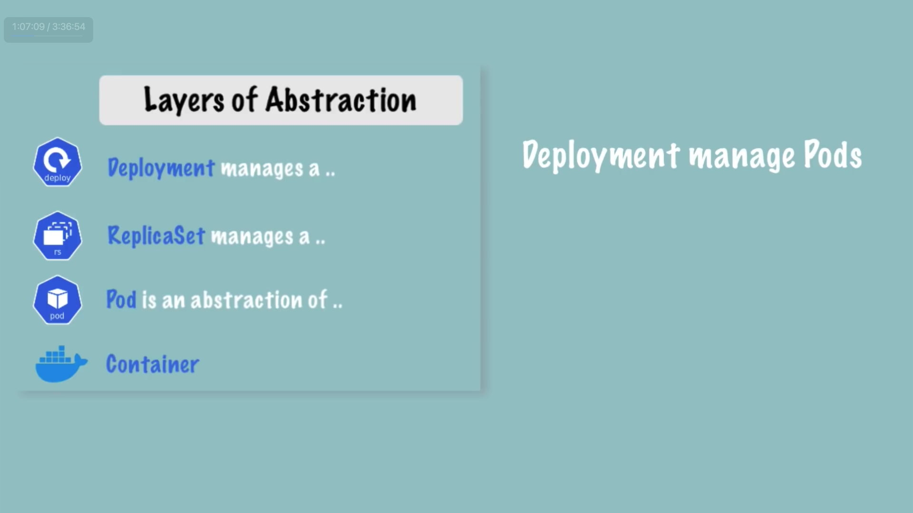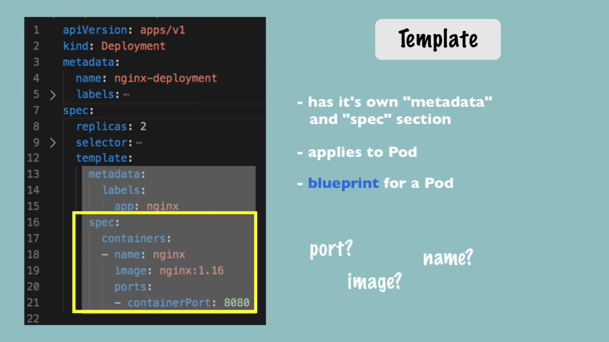
配置之间通过`label`以及`selector`建立关系
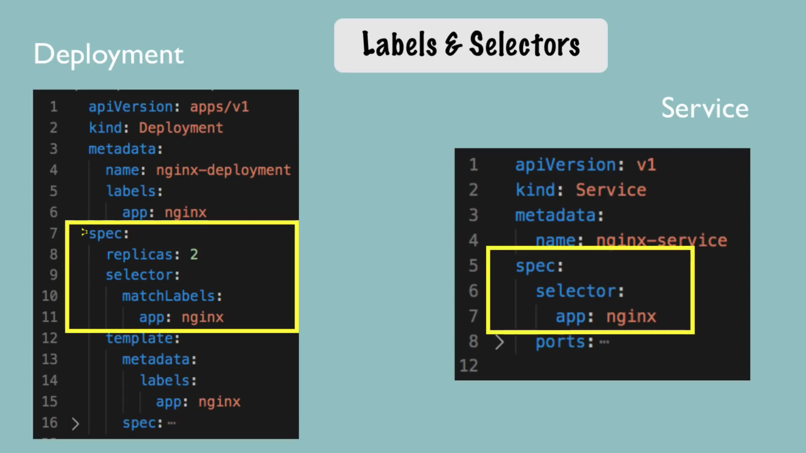

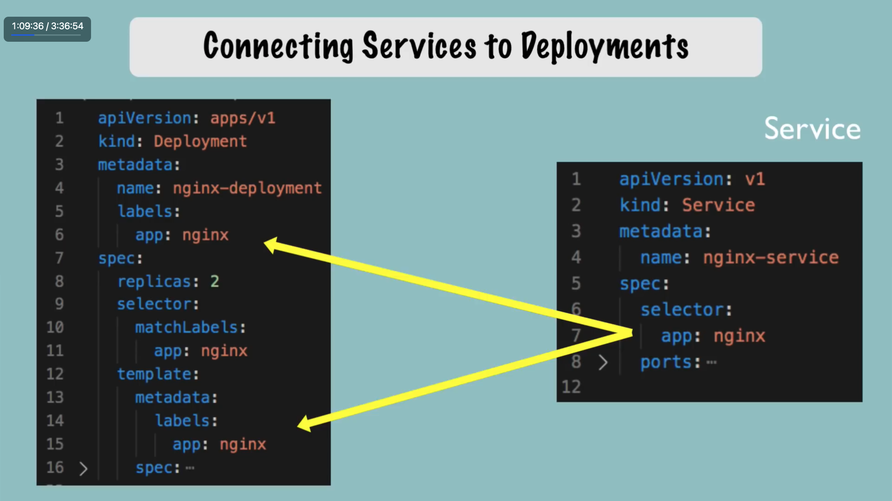
template存放的是pod的蓝图

service中的80端口给外部系统访问，pod内部则是8080端口，因此service的port应该跟containerPort匹配。
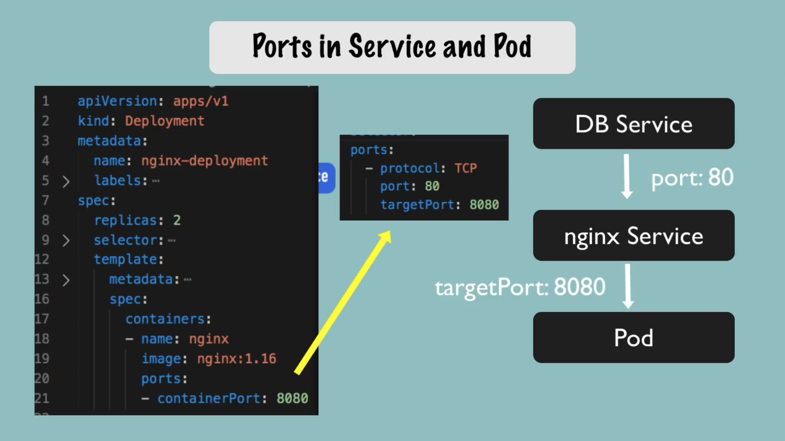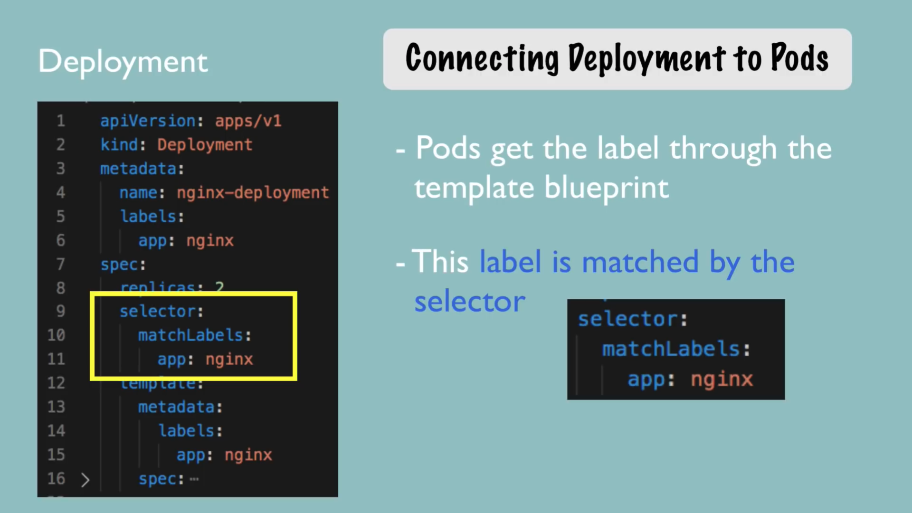


写好nginx-deployment.yaml跟nginx-service.yaml后使用下面的命令部署:
```
kubectl apply -f nginx-deployment.yaml
kubectl apply -f nginx-service.yaml
```
然后还可以执行
```
kubectl get deployment nginx-deployment -o yaml
```

来打印部署信息，加上 `>` 来将打印结果保存到文件中，通过这份文件可以用于debug kubernetes

```
kubectl get deployment nginx-deployment -o yaml > nginx-deployment-result.yaml
```

使用下面的命令可以删除kubernetes部署:

```
kubectl delete -f nginx-deployment.yaml
kubectl delete -f nginx-service.yaml
```

