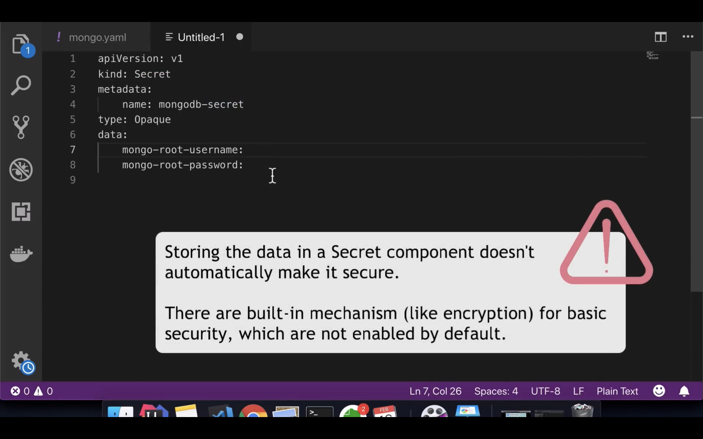
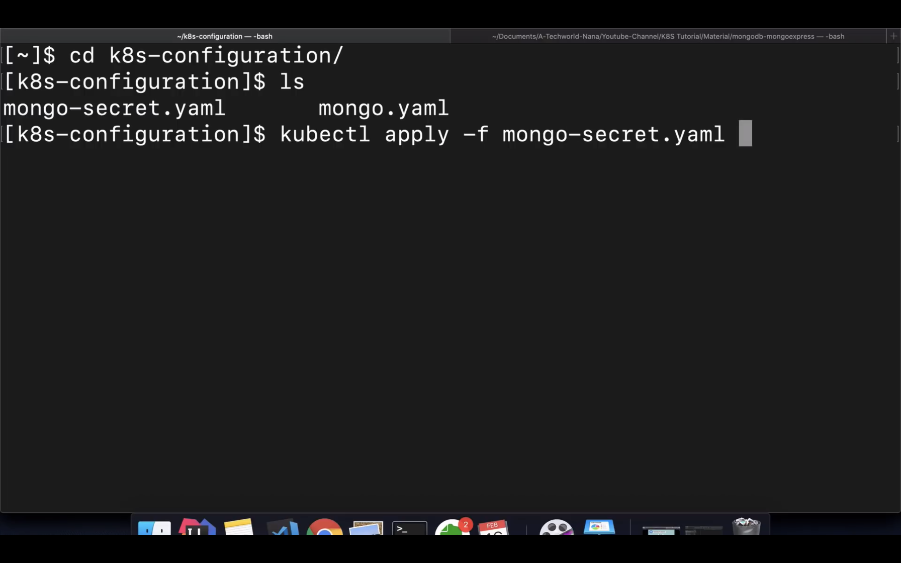
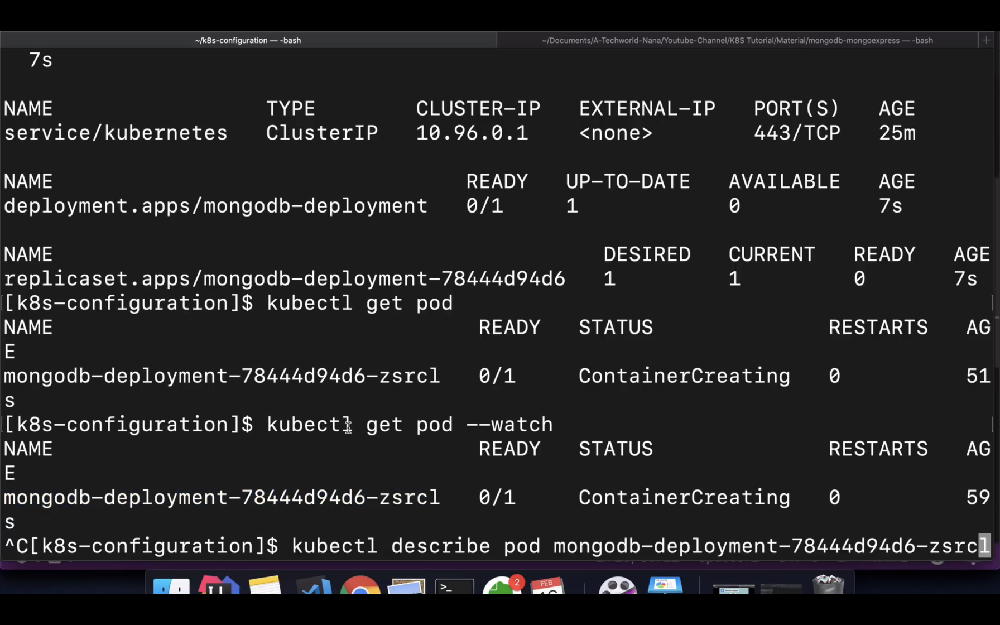
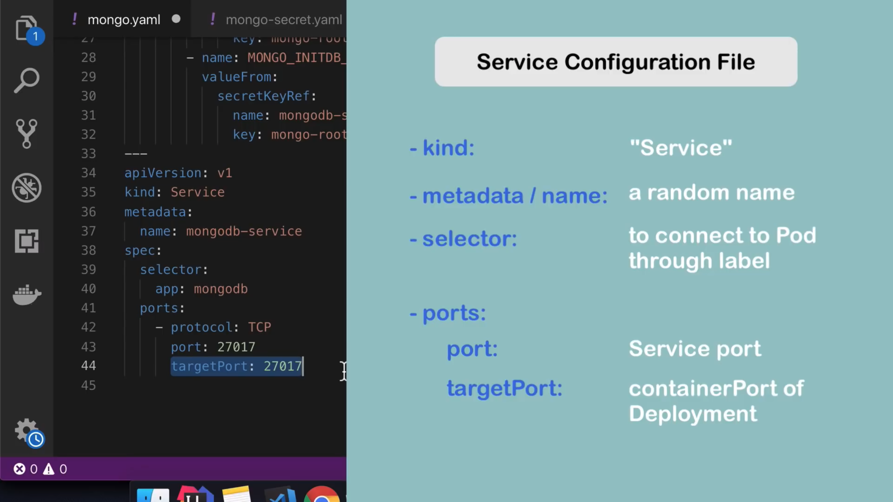
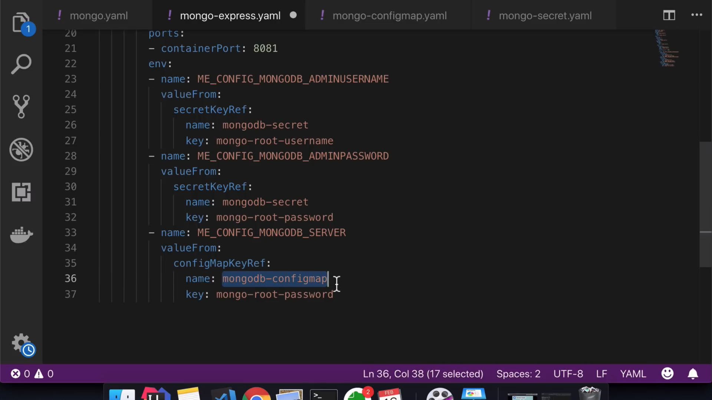
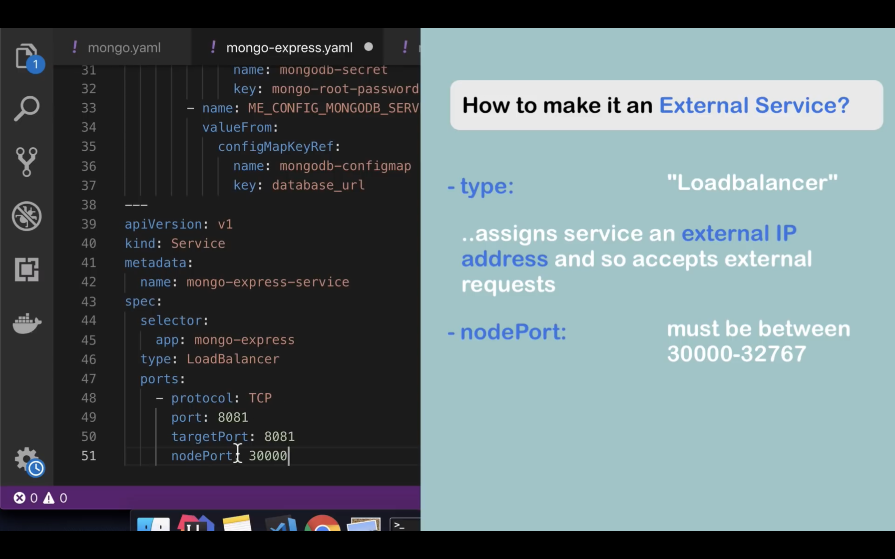
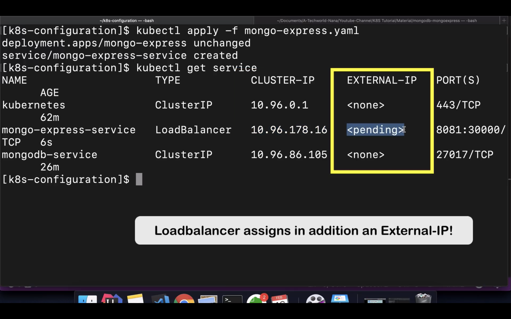

创建两个文件:

`mongo-deployment.yaml`

```
apiVersion: apps/v1
kind: Deployment
metadata:
  name: mongodb-deployment
  labels:
    app: mongodb
spec:
  replicas: 1
  selector:
    matchLabels:
      app: mongodb
  template:
    metadata:
      labels:
        app: mongodb
    spec:
      containers:
      - name: mongodb
        image: mongo
        ports:
        - containerPort: 27017
        env:
        - name: MONGO_INITDB_ROOT_USERNAME
          valueFrom:
            secretKeyRef:
              name: mongodb-secret
              key: mongo-root-username
        - name: MONGO_INITDB_ROOT_PASSWORD
          valueFrom:
            secretKeyRef:
              name:  mongodb-secret
              key: mongo-root-password
```

`mongo-secret`
使用下面的命令将会创建`KubernetesRocks!`的base64加密后的密码。
```
echo -n 'KubernetesRocks!' | base64
```
下面的用户名跟密码是Base64加密后的`username`以及`password`字段

```
apiVersion: v1
kind: Secret
metadata:
  name: mongodb-secret
type: Opaque
data:
  mongo-root-username: dXNlcm5hbWU=
  mongo-root-password: cGFzc3dvcmQ=

```

使用下面的命令来确认 secret:

```
kubectl apply -f mongo-secret.yaml
```



创建过程中可以使用下面的命令来 debug:

首先查看现在的`pod`:

```
kubectl get pod
```

将会看到 pod 的`NAME`属性


值得注意的是后面的部分可以省略 👇🏻

```
kubectl describe pod mongodb-deployment-*****
```

然后将 service 的定义写在 mongo-deployment.yml 里



然后重新加载 `mongo-deployment.yaml`文件，这个时候会出现这样的提示:

```
deployment.apps/mongodb-deployment unchanged
service/mongodb-service created
```


通过定义一个 configMap 文件我们可以存放一些环境变量:

```
apiVersion: v1
kind: ConfigMap
metadata:
  name: mongodb-configmap
data:
  database_url: mongodb-service
```

data 里面的`database_url`就是 configMap 的一个键。
然后在定义`mongo-express.yaml`的时候，可以使用`valueFrom`的方式导入`configMap`的配置了


然后使用命令`kubectl load - f`将 yaml 配置文件加载到系统中。

查看某一个 pod 的运行情况使用命令:

```
kubectl logs [pod的NAME]
```


启动mongo-express之后，由于需要提供给前端访问的接口，因此还需要启动一个服务,而且是给外部访问的服务。同样是在`mongo-express.yaml`文件下添加service的定义。

nodePort就是开放给外部浏览器访问的端口，这里端口号为`30000`





服务缺少外部IP,minikube的办法是:

```
minikube service mongo-express-service
```
