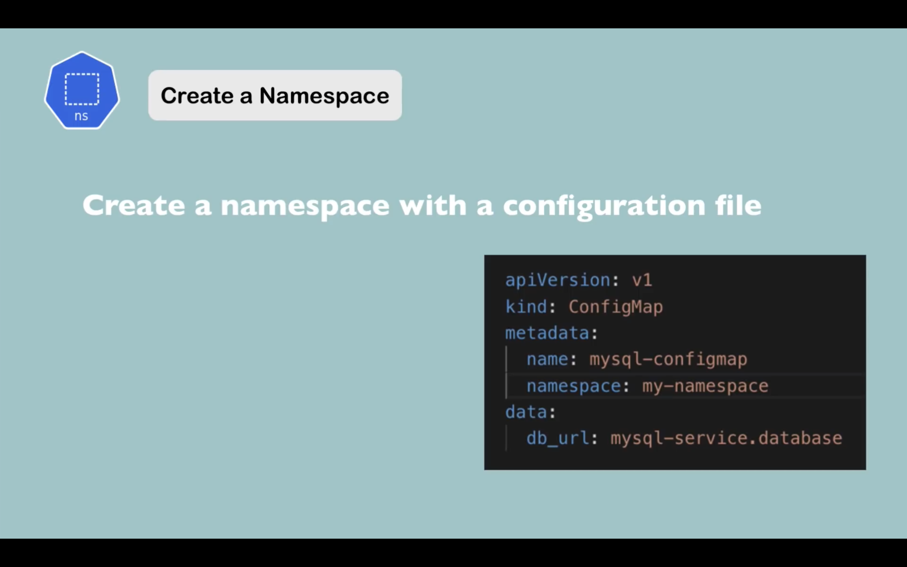
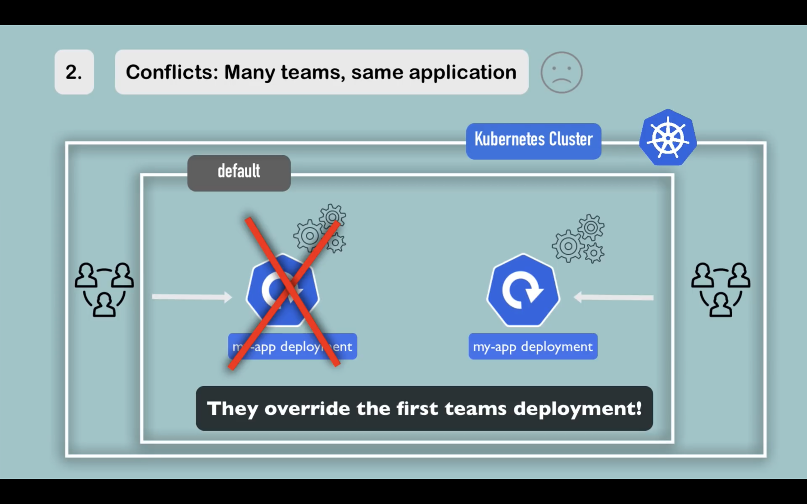
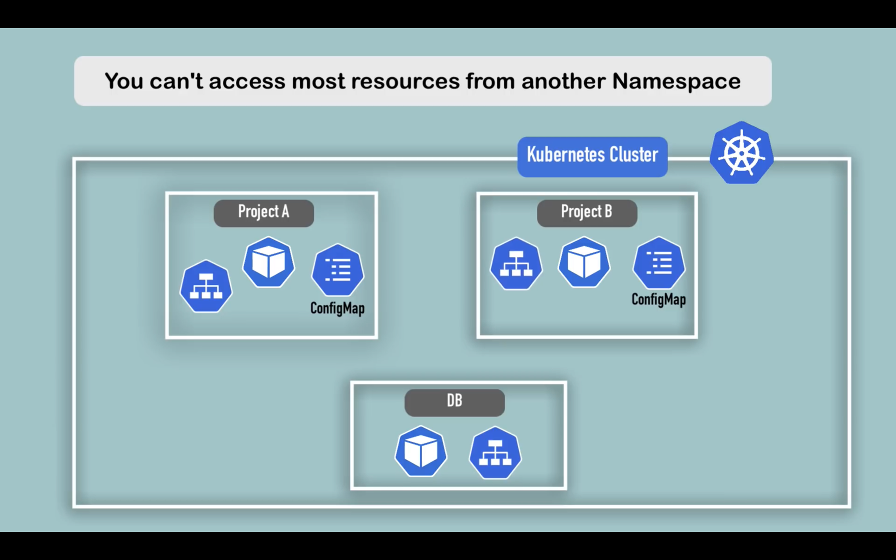
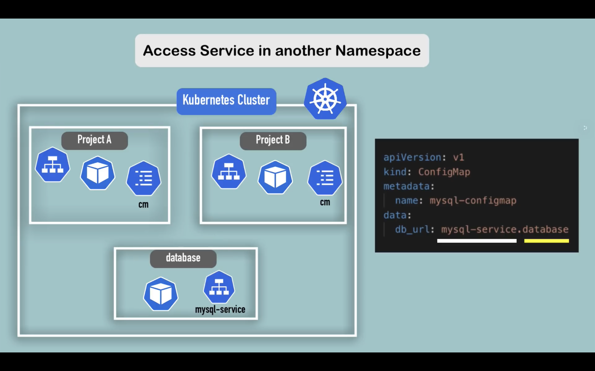
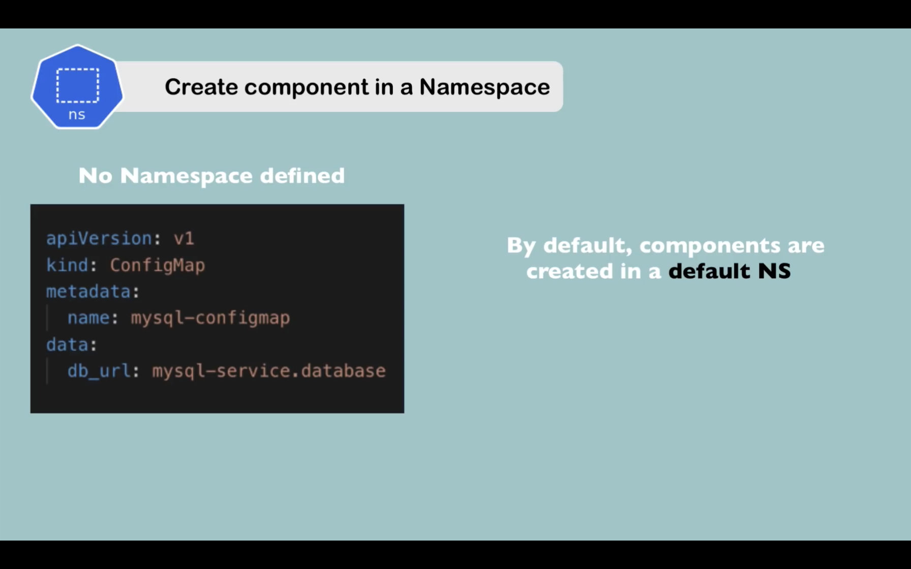
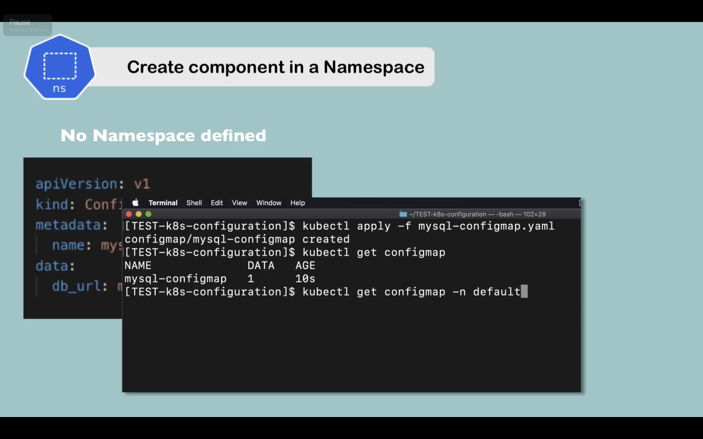

# What is a Namespace?

- Organise resources in namespaces
- Virtual cluster inside a cluster

实际上 kubernetes 启动的时候会创建 4 个 namespace, 执行下面的命令查看:

```
kubectl get namespace
```

- `default` The default namespace for objects with no other namespace
- `kube-system` The namespace for objects created by the Kubernetes system
- `kube-public` This namespace is created automatically and is readable by all users (including those not authenticated). This namespace is mostly reserved for cluster usage, in case that some resources should be visible and readable publicly throughout the whole cluster. The public aspect of this namespace is only a convention, not a requirement.
- `kube-node-lease` This namespace for the lease objects associated with each node which improves the performance of the node heartbeats as the cluster scales.

### 创建 namespace

1. 使用命令

```
kubectl create namespace my-namespace
```

然后输入下面的命令查看所有的 namespace

```
kubectl get namespace
```

2. 通过 ymal 文件查看 namesapce



namespace 用于将同类的资源分组。



namespace 可以解决两个 team 拥有同名资源的问题。并且还可以根据命名空间来分配硬件资源。

### 重要知识

1. 从一个 namespace 无法获取其他 namespace 的大部分资源。比如`configMap`是属于命名空间的，`secret`也是。


但是，`service`是可以跨命名空间共享的，做法是在 service 名称后加上`.命名空间名称`


2. Components，无法在命名空间里创建。这是因为有些组件比如`volume`以及`node`生存在`cluster`里面，无法隔离他们。

使用下面的命令可以查看不属于 namespace 的元素:

```
kubectl api-resources --namespaced=false
```

使用下面的命令可以查看属于 namespace 的元素:

```
kubectl api-resources --namespaced=true
```



由于创建的组件默认是`default`namespace 因此使用`get`命令的时候不带上 `-n + 命名空间`也会 default 命名空间的查询结果。


### kubectx

kubectx 可以快速切换`namespace`

mac 上面使用: `brew install kubectx` 安装 kubectx

然后执行: `kubens`

就能查看所有的 namespaces,并且高亮展示当前的 namespace

如果想要切换 namespace 使用`kubens new-namespace`
