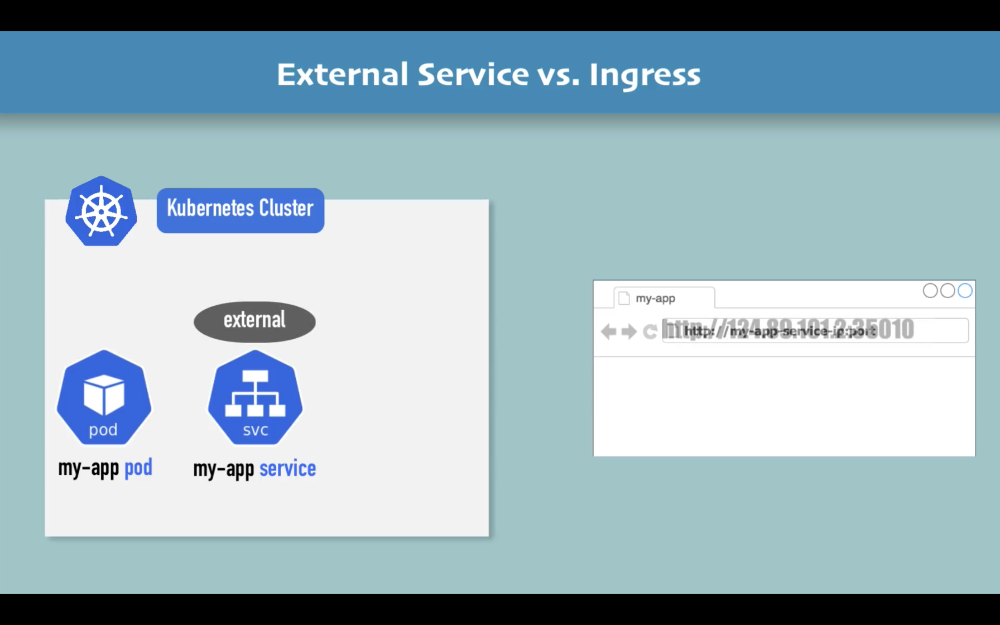
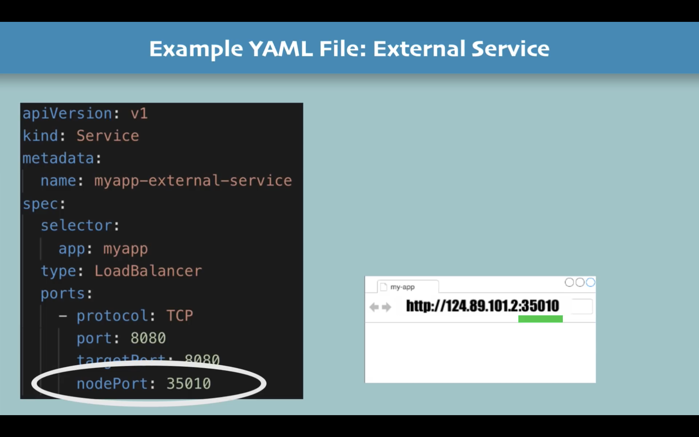
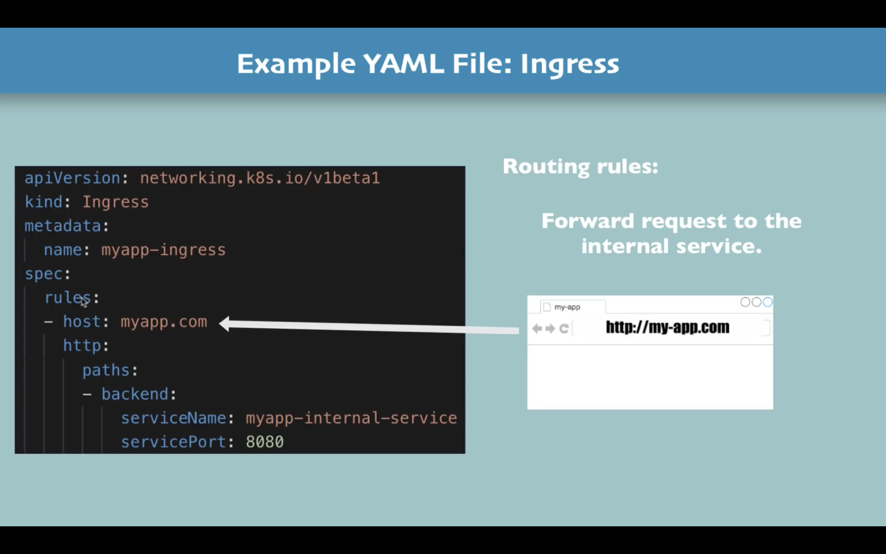
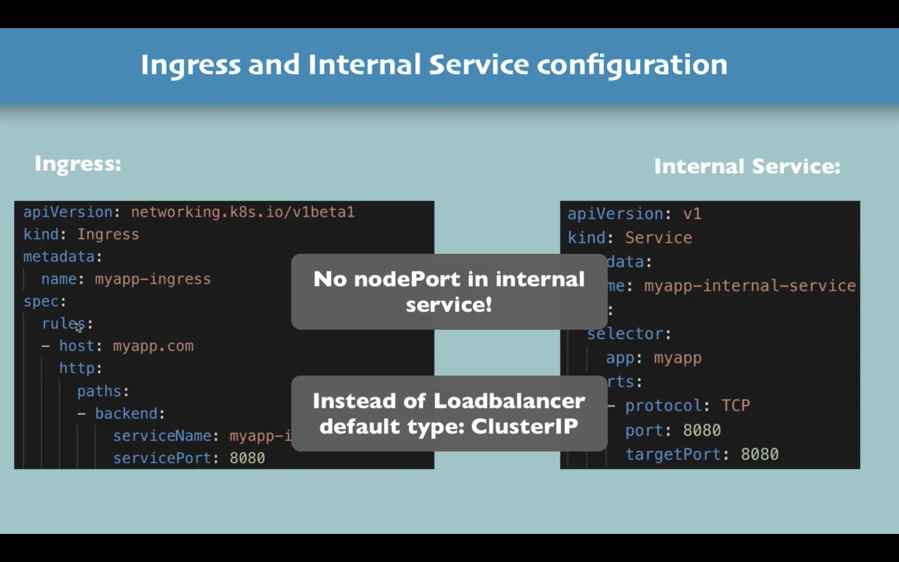
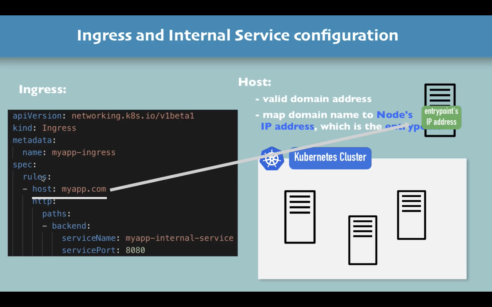
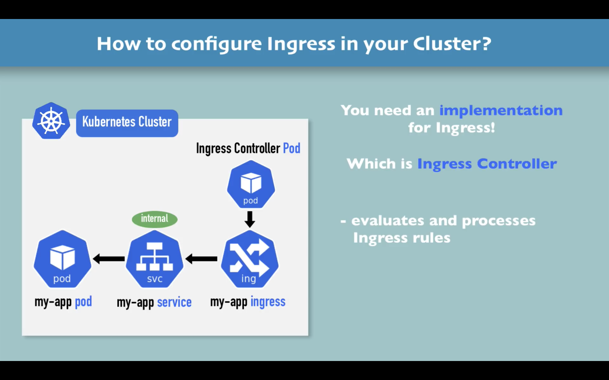
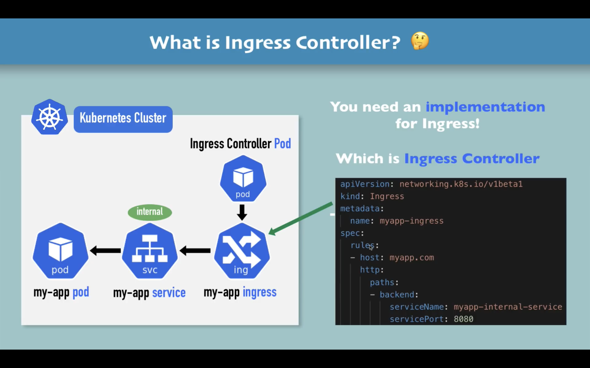
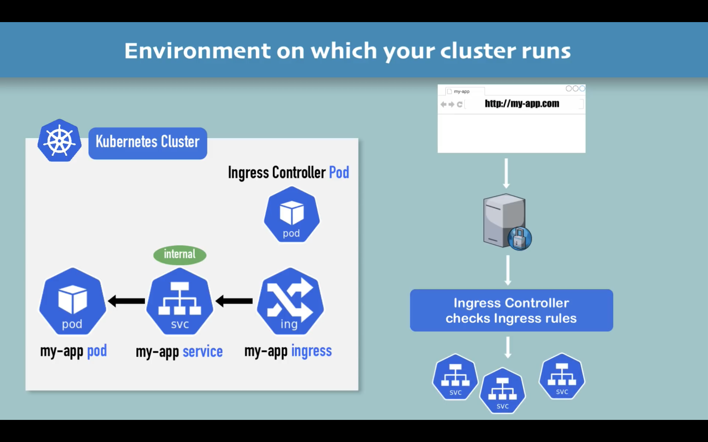
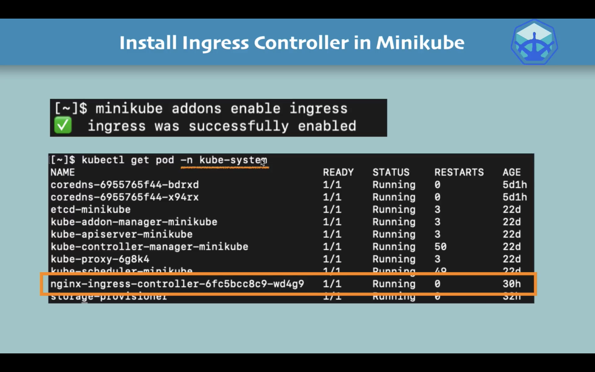

# Ingress

## What is Ingress

通过`external service`外部请求可以访问 kubernete cluster 中的 service.但是这种方式要通过 IP 地址来访问，测试是可以使用的，但是发布后应该是通过域名来访问服务。



Ingress 的作用就是取代`external service`,将其变成`internl service`

使用`external service`:

使用`Ingress`:


- 首先可以看到 kind 从`Service`变成了`Ingress`
- 其次 Ingress 使用了路由的方式，可以看到`spce`里面有`rules`
- host 定义的就是域名，请求将被转发到`inner service`
- paths 用于匹配域名后面的路径
- http 并不表示外部请求只能通过 http 访问，这个符号表示进来的请求将被转发给 internal service




## Ingress YAML Configuration

仅仅写两个 yaml 文件是不够的的，Ingress 需要一个实现，这个实现称为`Ingress Controller`

上面展示的 yaml 文件其实是 my-app ingress 这一部分而不是 ingress controller 这部分


### Ingress Controller 的作用

- evaluates all the rules
- manages redirections
- entrypoint to cluster
- many third-party implementations
- K8s Nginx Ingress Controller



## When do you need Ingress

## Ingress Controller

## Minikube 实践

执行下面的命令使用 Ingress

```sh
minikube addons enable ingress
```

上面的命令将开启 用 K8s Nginx 实现的 Ingress Controller


有了 Ingress Controller 后要做的是`Create Ingress rule`

用 kubernetes dashboard 作为例子:

1. 安装 kubernetes dashboard:

```
kubectl apply -f https://raw.githubusercontent.com/kubernetes/dashboard/v2.2.0/aio/deploy/recommended.yaml
```

2. 获取 dashboard 的服务名称:

```
kubectl get all -n kubernetes-dashboard
```

打印结果:
下面的 `service/kubernetes-dashboard` 中的`kubernetes-dashboard`就是服务的名称

```
NAME                                             READY   STATUS             RESTARTS   AGE
pod/dashboard-metrics-scraper-78f5d9f487-2txsd   0/1     ImagePullBackOff   0          35s
pod/kubernetes-dashboard-577bd97bc-tttbl         0/1     ImagePullBackOff   0          35s

NAME                                TYPE        CLUSTER-IP      EXTERNAL-IP   PORT(S)    AGE
service/dashboard-metrics-scraper   ClusterIP   10.106.1.208    <none>        8000/TCP   35s
service/kubernetes-dashboard        ClusterIP   10.100.78.149   <none>        443/TCP    36s

NAME                                        READY   UP-TO-DATE   AVAILABLE   AGE
deployment.apps/dashboard-metrics-scraper   0/1     1            0           35s
deployment.apps/kubernetes-dashboard        0/1     1            0           35s

NAME                                                   DESIRED   CURRENT   READY   AGE
replicaset.apps/dashboard-metrics-scraper-78f5d9f487   1         1         0       35s
replicaset.apps/kubernetes-dashboard-577bd97bc         1         1         0       35s

```

3. 编写 ingress rule:

```yaml
apiVersion: networking.k8s.io/v1beta1
kind: Ingress
metadata:
  name: dashboard-ingress
  namespace: kubernetes-dashboard
spec:
  rules:
    - host: dashboard.com
      http:
        paths:
          - backend:
              serviceName: kubernetes-dashboard
              servicePort: 443
```

4. 启用 ingress rule

```
kubectl apply -f dashboard-ingress.yaml
```
