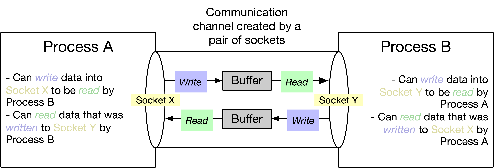
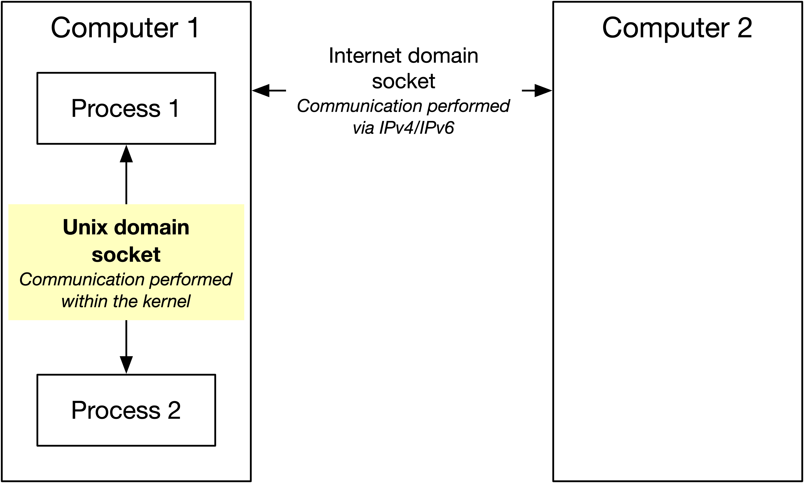
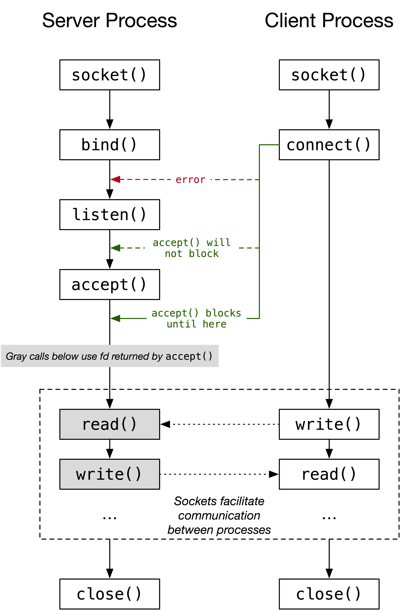

Sockets provide a means of communication between processes, i.e. a way for them to exchange data. The way it usually works is that `process_a` has `socket_x`, `process_b` has `socket_y`, and the two sockets are connected. Each process can then use its socket to receive data from the other process and/or send data to the other  process. One way to think about sockets is that they open up a  communication channel where both sides can read and write.

A connected pair of sockets creates a communication channel between two processes.

Why do we need sockets? Well, because one process can’t normally talk to  another process; this is true when the processes are on the same  computer or on different computers. On a related note, there are two main domains of sockets: *Unix domain sockets*, which allow processes on the same computer to communicate (IPC), and *Internet domain sockets*, which allow processes to communicate over a network. If that’s  confusing, just think of “Unix domain” and “Internet domain” as  adjectives that describe the communication range of a socket.

A simplified overview of socket communication domains. We’re going to focus on Unix domain sockets.

In this post, we’re going to focus on Unix domain sockets, and I’ll try to keep it simple.

- First, we’ll take a look at how clients and servers typically communicate via  sockets. Specifically, we’ll go over the system calls involved, and how  they’re generally used.
- Second, we’ll take a look at some actual code. Of course, you’ll be able to run this code yourself.

Let’s get started.

*Note: Each socket has two important attributes: a communication domain and a  type. There are two main types, stream and datagram. In this post, I’m  going to focus on the former. That is, I’m going to focus on streaming  Unix domain sockets.*

# Socket Lifecycle

Let’s say we want to use sockets to send some data from one process to  another. What are the main steps required for each process?

**Server Process (AKA the server)**

This process binds its socket to a known location and accepts incoming  connection requests from clients. For each connection request that is  received, a new socket is created that is used to communicate with the  peer socket (*peer socket* = the socket at the other end of the connection, in this case the socket created by some client process).

1. The server creates a new socket using the `socket()` system call. This returns a file descriptor that can be used to refer to the socket in future system calls.
2. The server uses the `bind()` system call to bind the socket to a well-known address, so that the client can connect to it (more on that below).
3. The server calls the `listen()` system call to mark the socket as *passive*, i.e. as a socket that will accept incoming connection requests.
4. The server calls the `accept()` system call to accept an incoming connection. This call blocks until a  connection request arrives. Note that this function will error out if `listen()` is not called beforehand. Importantly, *this call creates a new socket that is connected to the peer socket and returns a file descriptor associated with it*. So, if you want to communicate with the peer socket, you should use the file descriptor returned from `accept()`, not the file descriptor returned from the call to `socket()` in step #1. The latter socket remains open and is used to accept further connection requests.
5. After this, the `read()` and `write()` system calls can be used to communicate with the peer socket (i.e. to communicate with the client).
6. Finally, when the server is done with the socket, it should call `close()`.

**Client Process (AKA the client)**

This process connects its socket to a passive socket, after which it is free to communicate with the peer socket. Again, note that these two sockets — the passive socket and the peer socket — are different. The former is the one created by calling `socket()` in step #1 above, the latter is the one returned by calling `accept()` in step #4 above.

1. This is the same as #1 above — the process creates a new socket using the `socket()` system call, which returns a file descriptor that can be used to refer  to the socket in future system calls. Note that by default, a socket  created using `socket()` is marked as *active*, and can be used in a `connect()` call to connect to a *passive* socket.
2. The client calls the `connect()` system call, which connects to a passive socket. Remember that the  server bound its socket to a well-known address — this is the address  that should be used for `connect()`. Note that `connect()` should be called after `listen()` is called on the server socket, otherwise it will error. However, it can be called before `accept()`.

The lifecycle of sockets in a client/server model. This depicts a single  client for simplicity, but you should note that the server socket can  accept many client connections.