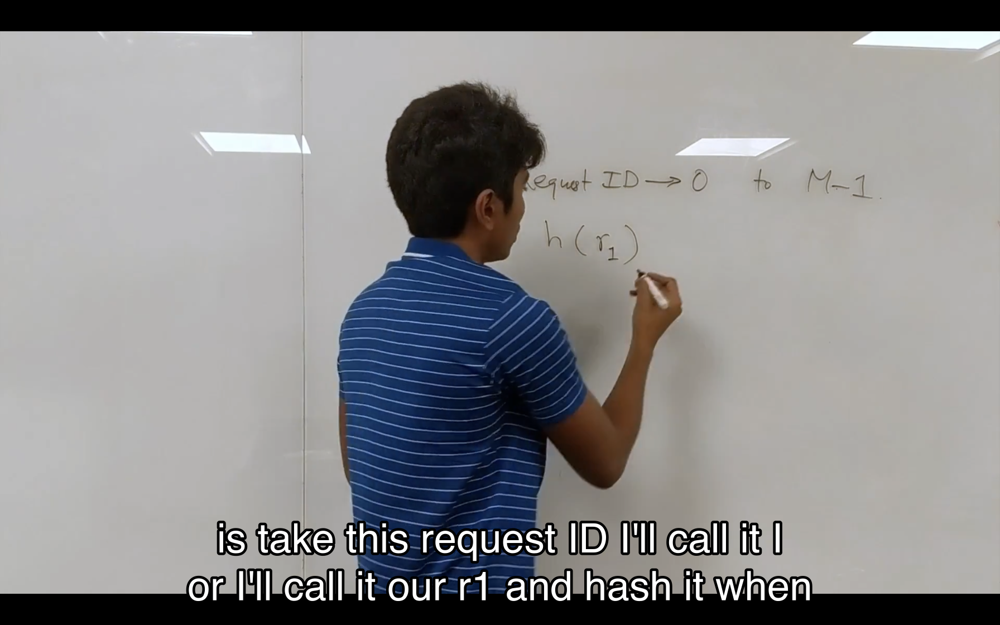
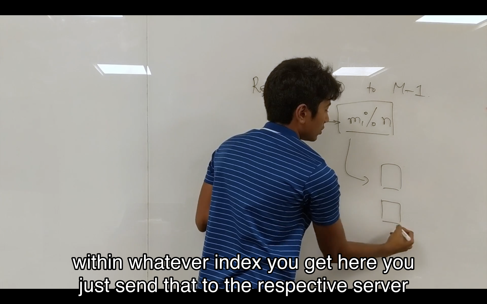

## Normal load balance

发送到服务器的请求将经过哈希函数的处理得到请求 ID

请求 ID 结果哈希函数处理得到一个值，用这个值去取服务器数量的模，就能得知应该将请求交给哪一个服务器处理。

如果这个时候增加了一台服务器，取模运算原本 15%4=3 分配到 S3 设备，但是现在 15%5=0 将分配到 S0 设备，因此这种情况下请求将被错误的分配。

## Consistent Hashing

请求 ID 仍然会被 hash 函数处理，现在的服务器从一个数组变成了 0 到 M-1 的环。

接下来对 0 到 4 的服务器 id 进行哈希函数处理。
然后将处理结果对 M 取余。

比如请求 0 结果哈希函数处理得到 49，M=20，49%30=19,用红色的区域表示服务器处理请求的区域。蓝色的来自客户端的请求将就近被红色区域的服务器处理。

由于哈希函数的计算结果是均匀分布的，因此请求与服务器在环上的分布也是均匀的，那么就实现了负载均衡。这时候负载均衡因子就是`1/N`。

如果比如S1下线了，所有原本分配给S1的请求将分配给S2，但是分配给S2 S3...的请求将不受任何影响。

如果服务器的数量不够导致一台机器下线后，某一台服务器的负载过高，可以使用**虚拟服务器**

虚拟服务器通过**多重哈希函数**来实现。