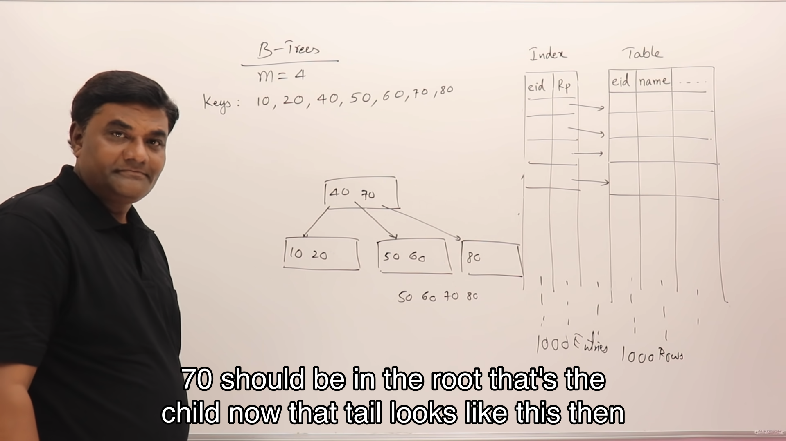

## Disk Structure

只要磁盘旋转，Section 就会改变，通过前后移动磁头改变 track 就能访问不同的 block

## What is indexing

下面的 Employee 表一条数据有 128Bytes,假设一个磁盘的 Block 是 512 字节，那么一个 block 可以存储 4 条数据。如果有 100 条数据那么最多需要访问 25 个 blocks,要解决这个问题我们得使用 Index.

接下来也要把索引存储到磁盘中，跟索引指向的数据相比，索引占用的空间非常小。

添加索引后，最多查找 4blocks 就能找到所需要的数据所在的 block,于是最多需要查找 5 次我们就能得到想要的数据。

## What is multi-level indexing

但是如果有 1000 条数据，那么索引就有 40 个 block,于是我们想到可以给索引加上索引。
如何实现这一点？

通过增加一层索引，我们可以更快的访问数据。这就是 B 以及 B+树的原始思想。

## M-way search trees

如果把多层索引的方向转一下就会发现他看起来像是树。

如果一个结点最多有 M 个子结点那么它就是 M-Way 搜索树

它最多有 M-1 个 keys
M-Way search tree 就是二叉搜索树的更普遍的形式，二叉搜索树是它的 M=2 的例子。

### M-Way search tree 的存储

除了 child pointer 还应该有 record pointer

## B Trees

如果插入的时候发现无法插入那么就要将其中一个元素上移

如果有 10,20,40,50,60,70,80 如何插入？

继续添加 30 35 发现无法加入更多，那么继续进行`split`的操作

## Insection B-Trees

每一个结点除了有子结点的指针，还有 record 的指针。

## B+Trees

跟 B tree 相比,B+ TREE 的父节点在子节点中会被拷贝，并且底层的叶子结点有链接
跟 B TREE 相比, B+树更像 Multilevel indexing

