# Red Black Tree

## Basics

### Binary Search Trees

1. Ordered, or sorted, binary trees.
2. Nodes can have 2 subtrees.
3. Items to the left of a given node are smaller.
4. Items to the right of a given node are larger.

A balanced binary search tree:

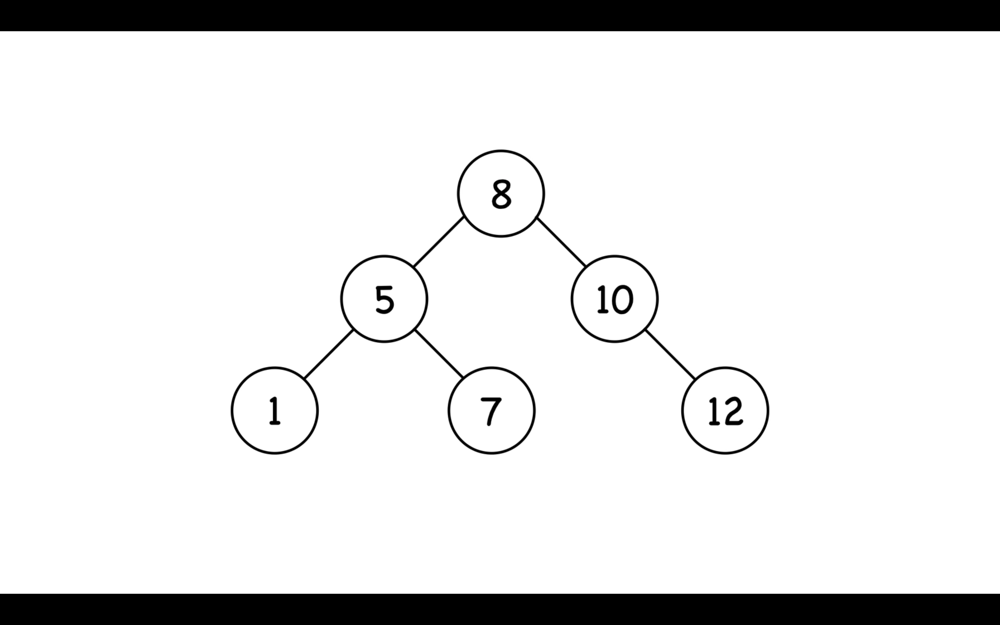

A unbalanced binary search tree:
下面的二叉查找树跟列表没有区别
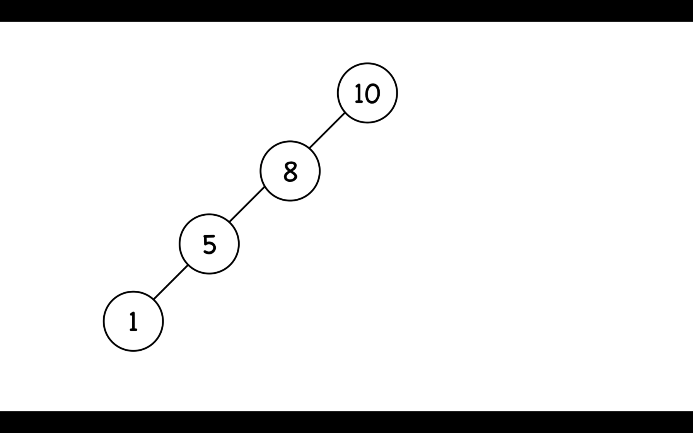

### Balanced Search Trees

平衡搜索树保证了对于`n`个元素它的高度一定是`O(log n)`

### Red Black Tree

1. A node is either red 🔴 or black ⚫️
2. The **root** and **leaves(NIL)** are black ⚫️
3. If a node is red 🔴, then its children are black ⚫️
4. All paths from a node to its NIL descendants contain the same number of black nodes.

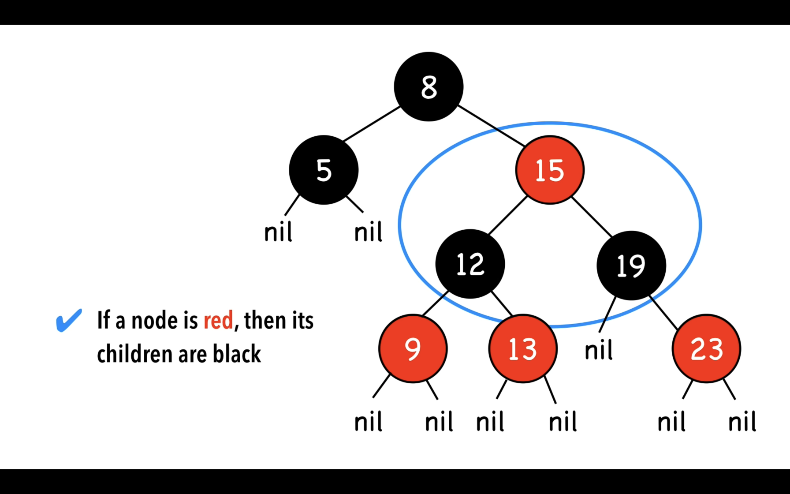

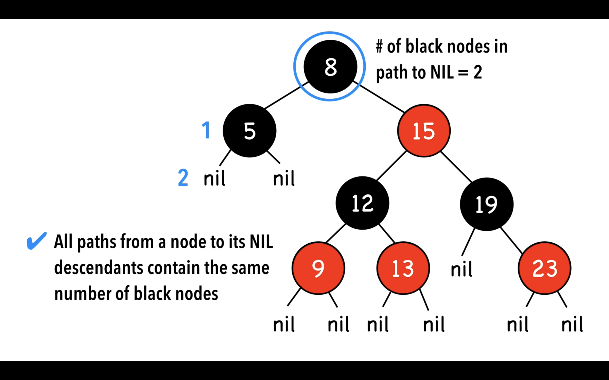

#### Extra Notes

1. Nodes require **one storage bit** to keep track of color
2. The longest path (root farthest NIL) is no more than twice the length of
   the shortest path ( root to nearest NIL)

   - Shortest path: all black nodes
   - Longest path: alternating red and black

#### Operations

- Search
- Insert
- Remove

search 跟普通的二叉搜索树没有区别，但是 Insert 跟 Remove 需要通过旋转来恢复被打破的红黑树规则。(Insert and Remove may result in violation of red-black tree properties)

#### Time Complexity

- Search O(log n)
- Insert O(log n)
- Remove O(log n)

#### Space Complexity

- O(n)

由于只是额外用了一个 storage bit 来存储颜色，因此空间复杂度是 O(n)

## Rotation

1. alters the structure of a tree by rearranging subtrees
2. goal is to decrease the height of the tree
    - red-black trees: maximum height of O(log n)
    - larger subtrees up, smaller subtrees down
3. does not affect the order of elements    

### Two types of rotations

#### Left Rotation

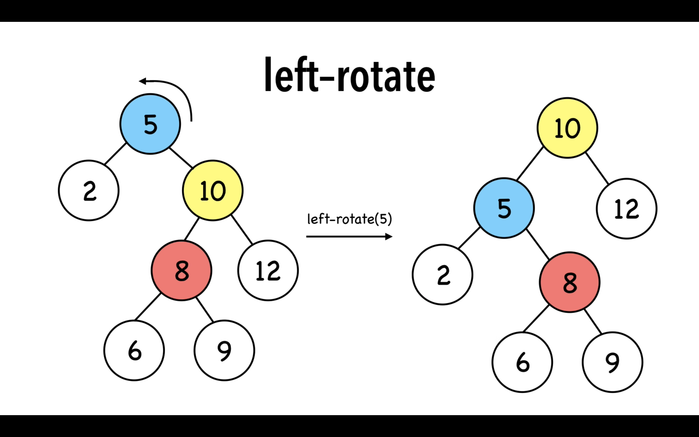

#### Right Rotation

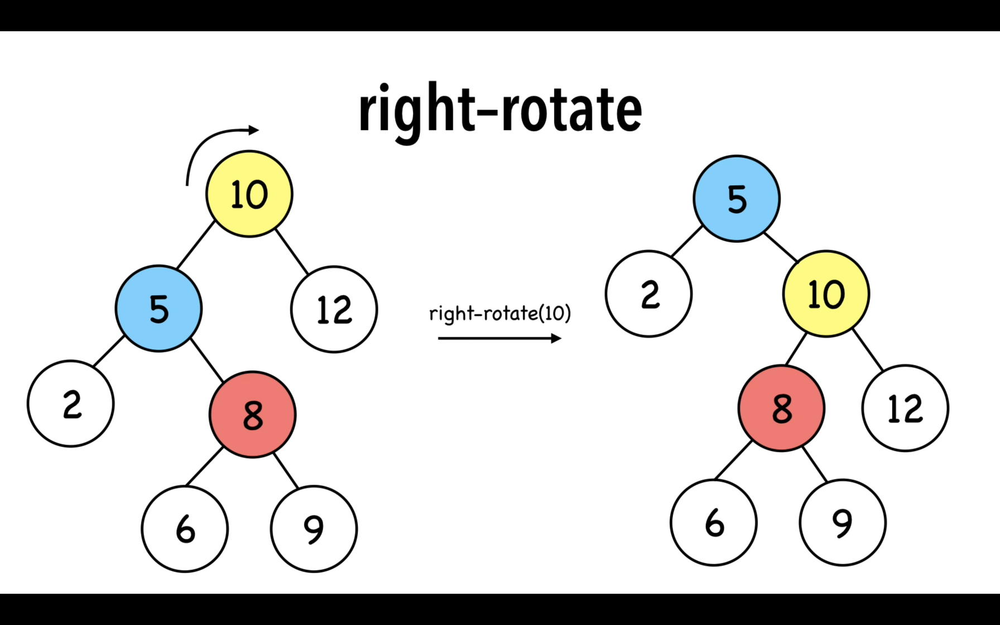

### Rotation's Time Complexicity

O(1)

## Insertion Strategy

red-black-tree = self balancing binary search tree

### Relationships

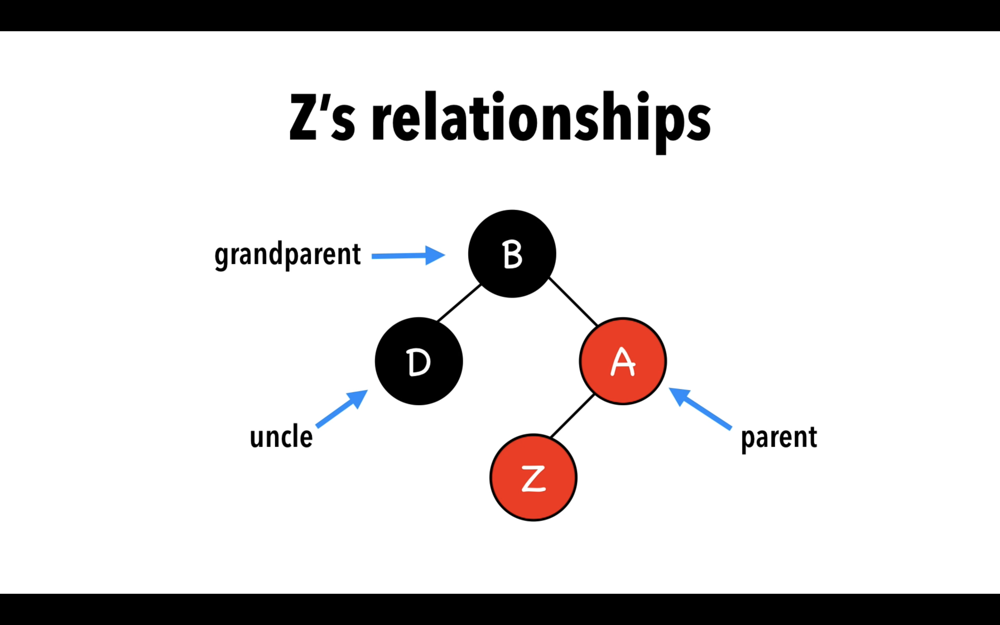

### Strategy

采取的策略为两项:

1. Insert Z and color it red 🔴
2. Recolor and rotate nodes to fix  violatin

通过添加红色的节点，将会很容易打破这两条规则:

2. The **root** and **leaves(NIL)** are black ⚫️
3. If a node is red 🔴, then its children are black ⚫️

但是这两条规则比较容易恢复

### 4 Scenarios

1. Z = ROOT
2. Z.uncle = red 🔴
3. Z.uncle = black ⚫️  & triangle
4. Z.uncle = black ⚫️  & line

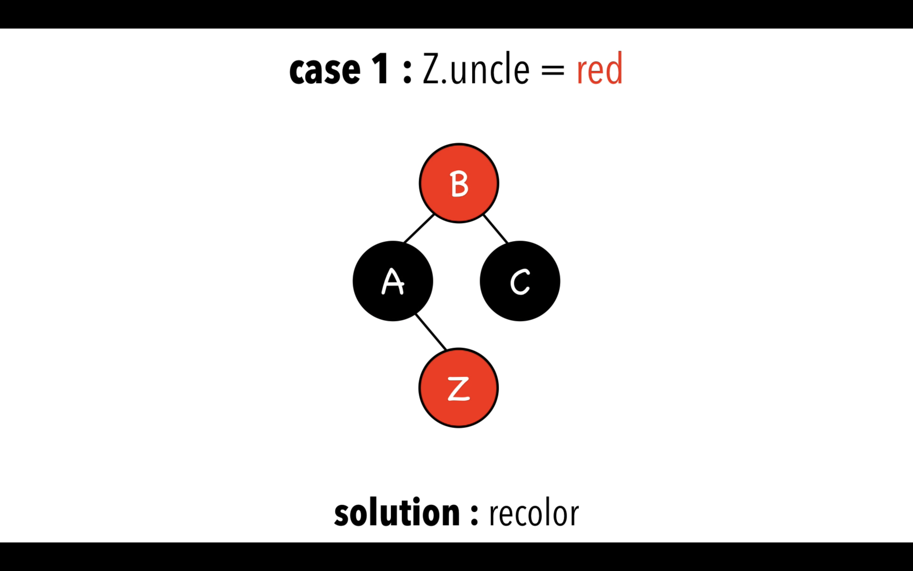

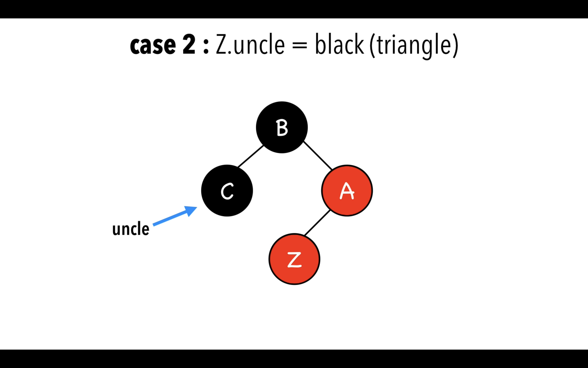

Z AND Z's parent AND z's grandparent form a triangle

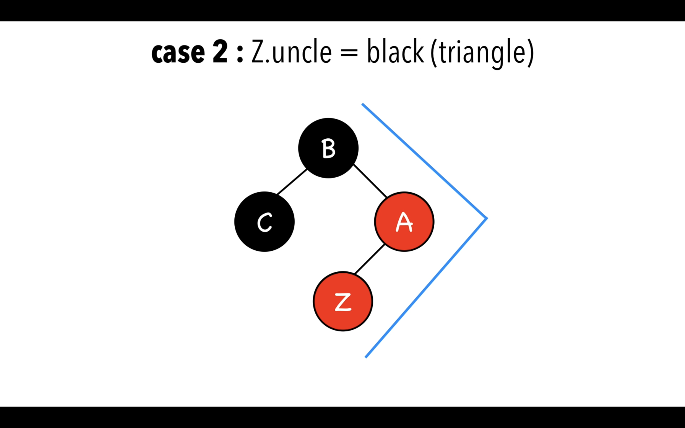

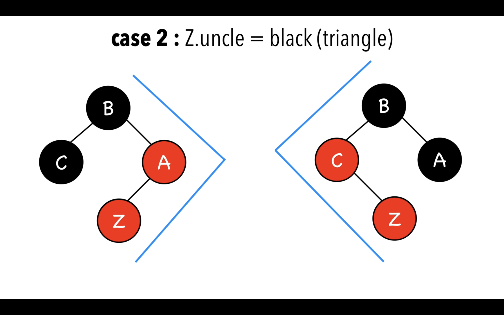

将Z的父亲以Z相反的方向旋转
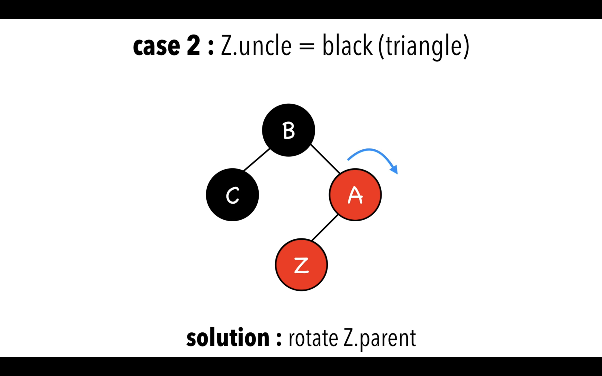

当Z跟他的父亲都是右节点或者左节点就形成了一条line

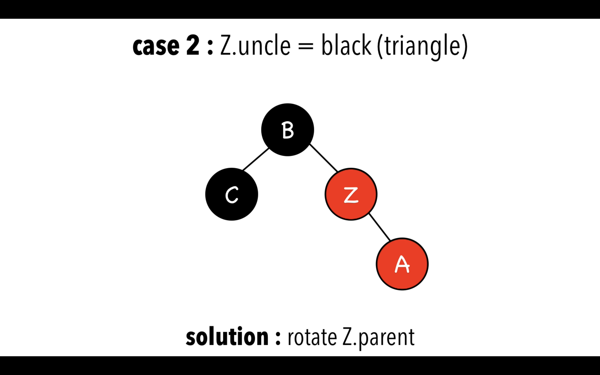
将祖父节点以与Z相反的方向旋转
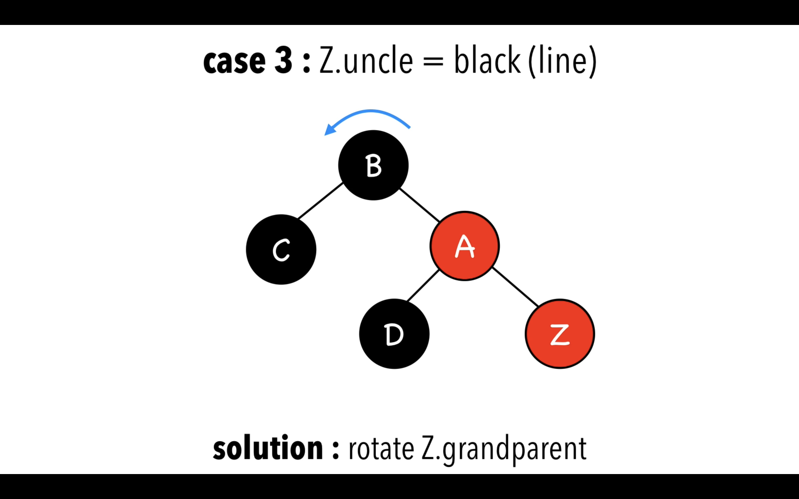

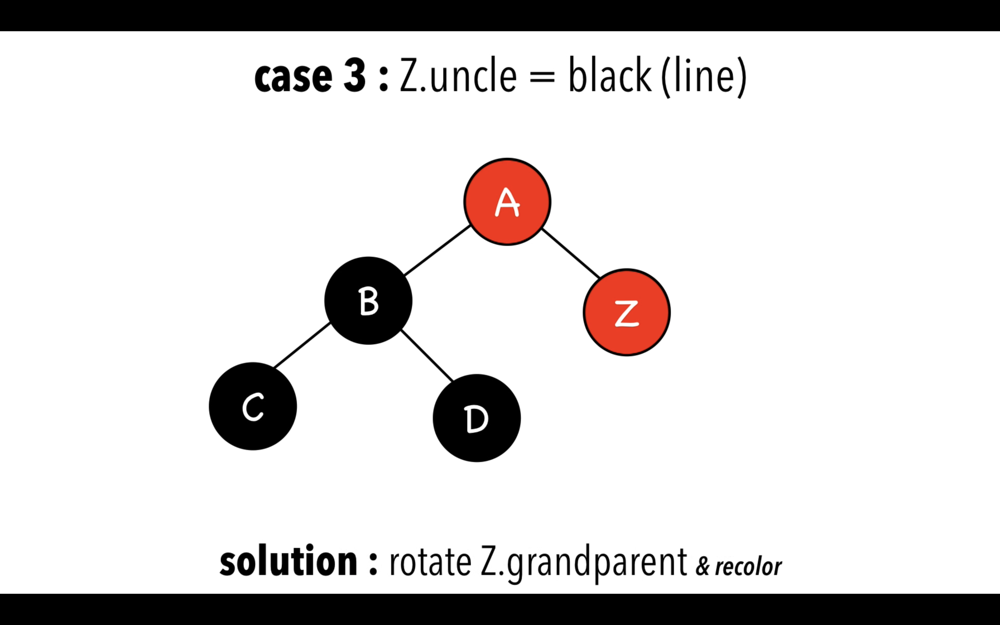
然后重新涂色
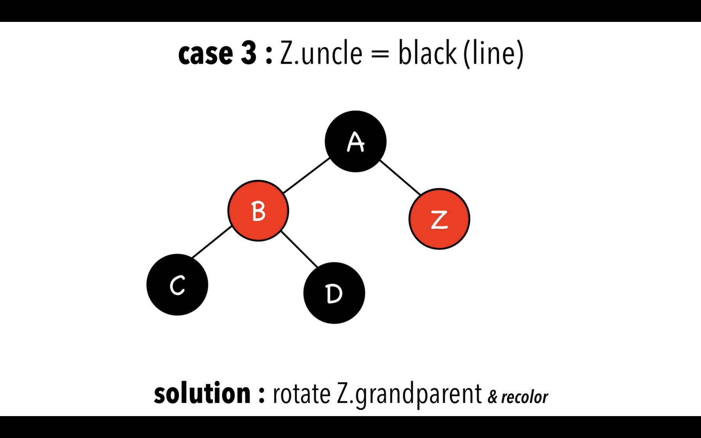

## Insertion