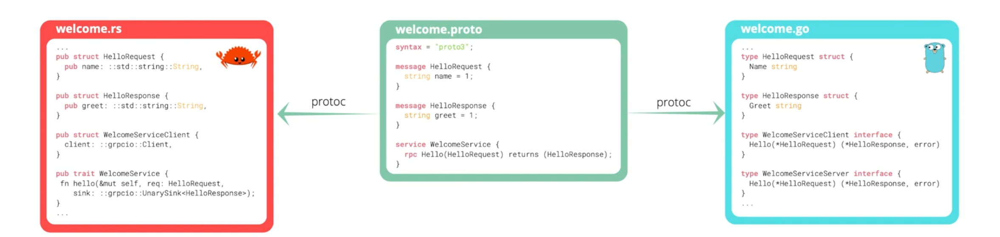

### API Contract

- API contracts description
  - 服务以及消息载体(payload)通过`Protocol Buffer`来定义
- 服务器以及客户端的存根通过`Protocol Buffer compiler`以及各个语言的 gRPC 插件生成。

比如创建一个 welcome.proto

```go
syntax = "proto3"

message HelloRequest{
    string name = 1
}

message HelloRequest{
    string greet = 1
}

service WelcomeService{
    rpc Hello(HelloRequest) returns (HelloRequest)
}
```



### 为什么 grpc 使用 Protocol Buffer

- 人类可读的接口定义语言(IDL)
- 语言可操作性(有着多种语言的代码生成器)
- 二进制数据表示
  - 更小的大小
  - 更易于传输
  - 更加高效的序列化以及反序列化
- 强类型的规约
- 便于 API 升级

下一章介绍[http2](./3.http2 and grpc.md)
