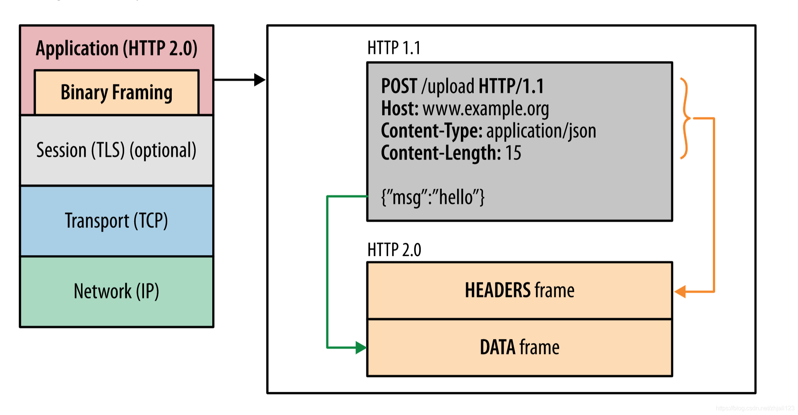

- Binary framing

  - 更强的性能以及健壮性
  - 传输轻量，解码安全
  - 与 Protocol Buffer 更好的结合

- 使用 HPACK 来压缩请求头

  - 减少了开销提升了性能

- 多路复用

  - 发送多个请求，然后通过单一的 TCP 连接来同时响应
  - 减少了延迟提高了网络利用率

- 服务器推送
  - 一个客户端请求，多个响应
  - 减少了环形延迟

## HTTP2 的工作机制

- 单一的 TCP 连接承担了多个双向的数据流

- 每一个数据流都有一个唯一的 ID 并且携带了多个双向的消息(Response Message & Request Message)

- 每个消息(request/response)都被分解为多个二进制帧

- 帧是最小的传输单元，他携带了多种不同类型的数据: HEADERS,SETTINGS,PRIORITY,DATA,etc.
- 来自不同数据流的帧是不相关的然后在接收端重新组装

HTTP/2 使用`binary framing layer`来支持多路复用数据流

## 跟 HTTP/1 的对比

- HTTP/2 是二进制传输协议，传输的数据经过了压缩。而 HTTP/1 是文本传输协议，传输原始文本。

- HTTP/2 支持多路复用，只建立一次 tcp 连接就能发送多次请求。而 HTTP/1 每发送一次请求都要建立 TCP 连接。

- HTTP/2 支持服务器推送，而 HTTP/1 不支持服务器推送。

下一节[grpc 与 rest 对比](../4.grpc使用例子以及与rest比较.md)
