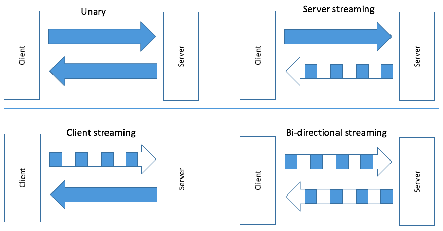

## 4 种 gRPC

- UNARY

  是简单的 RPC 调用，一个请求对象对应一个返回对象。

- Client Streaming
- Server Streaming
- Bi-directional Streaming



## 什么时候使用 grpc?

- 微服务
- 多语言环境
- 点对点的实时通信
- 网络情况不好的环境

## 如何定义一个 protocol message

- message 的名称要驼峰命名(UpperCamelCase)
- field 的命名要 lower_snake_case
- 一些单一数据类型(scalar-value,与复合类型对立):
  - string,bool,bytes
  - float,double
  - int32,int64,uint32,uint64,sint32,sint64,etc
- 数据类型可以是用户定义的枚举类或者其他消息
- 标签比 field 名称更重要
  - 标签是一个任意的整型值
    - 从 1 到 2^29-1
    - 19,000 到 19,999 除外，是保留值
  - 从 1 到 15 需要 1 个字节
  - 从 16 到 2047 要 2 个字节
  - 不需要按照顺序
  - 对于同级别的字段必须是唯一的

```proto
syntax = "proto3"

message <NameOfTheMessage>{
    <data-type> name_of_field_1 = tag_1;
    <data-type> name_of_field_2 = tag_2;
    ...
    <data-type> name_of_field_N = tag_N;
}
```

创建一个 grpc 目录以及`pb`跟`proto`目录以及一个`Makefile`，
在 proto 目录创建一个`processor_message.proto`文件：

```proto
syntax = "proto3";
//在当前路径(grpc目录)生成.pb.go文件，并且包名取名为pb
option go_package = ".;pb";
message CPU{
    string brand = 1;
    string name = 2;
    uint32 number_cores = 3;
    uint32 number_threads = 4;
    double min_ghz = 5;
    double max_ghz = 6;
}
```

```
option go_package = "aaa;bbb";
aaa 表示生成的go文件的存放地址，会自动生成目录的。
bbb 表示生成的go文件所属的包名
```

创建下面的 Makefile:

其中`--go_out=plugins=grpc:`后面跟的是输出目录

```makefile
gen:
	protoc --proto_path=proto proto/*.proto --go_out=plugins=grpc:pb
clean:
	rm pb/*.go
```

执行命令: `gen`就能在 pb 目录下生成`processor_message.pb.go文件`

下一节[go 包配置](../5.go包配置.md)
